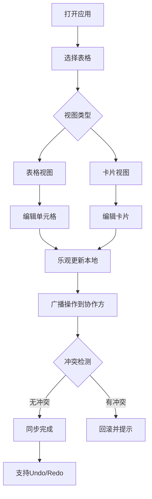

# Airtable-like 多人协作表格系统 PRD

## 1. 产品概述

一个类似 Airtable/Notion Database 的网页版多人协作数据管理系统，支持灵活的列类型系统、高性能数据操作和实时协作编辑。

- 核心目标：提供比传统电子表格更结构化的数据管理能力，同时保持轻量级和易用性
- 目标用户：需要管理项目、任务、库存等结构化数据的团队和个人
- 市场价值：填补 Excel 重型工具与简单 Todo 应用之间的空白

## 2. 核心功能

### 2.1 用户角色

| 角色 | 注册方式 | 核心权限 |
|------|----------|----------|
| 协作用户 | 模拟登录 | 创建/编辑表格、视图切换、实时协作 |

### 2.2 功能模块

1. **表格视图**：虚拟滚动表格、列类型编辑器、行操作
2. **卡片视图**：卡片式展示、拖拽排序、分组展示
3. **数据操作**：排序、筛选、分组、搜索
4. **列类型系统**：文本、数字、单选、多选、日期、附件、关联
5. **多人协作**：实时同步、乐观更新、冲突处理、编辑状态提示
6. **状态管理**：Undo/Redo、批量操作、视图状态持久化

### 2.3 页面详情

| 页面名称 | 模块名称 | 功能描述 |
|-----------|-------------|---------------------|
| 主工作台 | 顶部导航栏 | 表格切换、视图切换、用户状态显示 |
| 主工作台 | 侧边栏 | 表格列表、新建表格、表格设置 |
| 主工作台 | 表格/卡片视图 | 数据展示、编辑、排序筛选 |
| 主工作台 | 列类型编辑器 | 列配置、类型切换、选项设置 |
| 主工作台 | 关联记录卡片 | 跨表数据查看、快速编辑 |
| 主工作台 | 协作状态提示 | 在线用户、编辑中单元格提示 |

## 3. 核心流程

用户打开应用 → 选择/创建表格 → 配置列类型 → 在表格/卡片视图中编辑数据 → 与其他协作者实时同步 → 使用排序筛选分组管理数据

## 4. 用户界面设计

### 4.1 设计风格

- **主色调**：深蓝渐变 (#1e3a8a → #3b82f6)，传达专业可靠的感觉
- **辅助色**：翠绿 (#10b981) 用于成功状态，琥珀色 (#f59e0b) 用于警告，红色 (#ef4444) 用于错误
- **中性色**：基于 slate 色系，从 slate-50 到 slate-900 构建层次感
- **按钮风格**：圆润边角 (8px)、微妙阴影、悬停时轻微上浮效果
- **字体**：标题使用 Inter Semibold，正文使用 Inter Regular，建立清晰的视觉层级
- **布局风格**：左侧边栏 + 顶部工具栏 + 主内容区的经典三栏布局
- **图标风格**：统一使用 Lucide 图标库，保持 20px 尺寸

### 4.2 页面设计概述

| 页面名称 | 模块名称 | UI 元素 |
|-----------|-------------|-------------|
| 主工作台 | 顶部导航栏 | 面包屑导航、视图切换按钮、用户头像、在线人数指示器 |
| 主工作台 | 侧边栏 | 表格列表（带图标）、新建按钮、折叠动画 |
| 主工作台 | 表格视图 | 固定表头、斑马纹行、悬停高亮、编辑中边框动画 |
| 主工作台 | 卡片视图 | 响应式网格、卡片阴影、分组标题粘性定位 |
| 主工作台 | 编辑器弹窗 | 模糊背景、滑入动画、表单分组 |

### 4.3 响应性

- **桌面优先**：1200px+ 完整布局，三栏展示
- **平板适配**：768-1200px 侧边栏可折叠，卡片网格调整为 2 列
- **触控优化**：可点击区域最小 44px， swipe 手势支持

### 4.4 动效设计

- **页面加载**：内容区域淡入 + 轻微上移 (20px → 0px, 300ms ease-out)
- **单元格编辑**：边框颜色过渡 + 轻微缩放 (1.02x)
- **协作提示**：其他用户编辑时，边框脉冲动画 (pulse)
- **视图切换**：交叉淡入淡出效果，保持滚动位置
