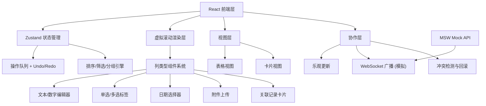
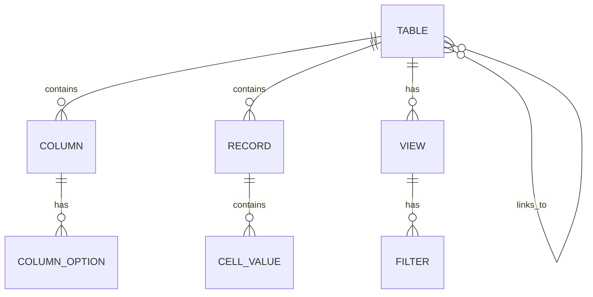

# Airtable-like 多人协作表格系统 技术架构文档

## 1. 架构设计



## 2. 技术栈描述

- **前端框架**：React@18 + TypeScript@5
- **构建工具**：Vite@5
- **样式方案**：TailwindCSS@3
- **状态管理**：Zustand@4 + Immer (支持 undo/redo)
- **虚拟滚动**：@tanstack/react-virtual
- **日期处理**：date-fns
- **图标库**：lucide-react
- **Mock 服务**：MSW@2
- **模拟 WebSocket**：BrowserChannel (基于 BroadcastAPI 模拟)

## 3. 目录结构

```
src/
├── components/
│   ├── table/              # 表格视图组件
│   │   ├── VirtualTable.tsx
│   │   ├── TableHeader.tsx
│   │   └── TableRow.tsx
│   ├── card/               # 卡片视图组件
│   │   ├── CardView.tsx
│   │   └── RecordCard.tsx
│   ├── columns/            # 列类型组件
│   │   ├── TextCell.tsx
│   │   ├── NumberCell.tsx
│   │   ├── SelectCell.tsx
│   │   ├── MultiSelectCell.tsx
│   │   ├── DateCell.tsx
│   │   ├── AttachmentCell.tsx
│   │   └── LinkRecordCell.tsx
│   ├── common/             # 通用组件
│   │   ├── Modal.tsx
│   │   ├── Dropdown.tsx
│   │   └── Button.tsx
│   └── collaboration/      # 协作相关组件
│       ├── UserPresence.tsx
│       └── EditingIndicator.tsx
├── store/
│   ├── useTableStore.ts    # 主状态管理
│   ├── undoMiddleware.ts   # Undo/Redo 中间件
│   └── types.ts            # 类型定义
├── hooks/
│   ├── useVirtualScroll.ts
│   ├── useCollaboration.ts
│   └── useFilterSort.ts
├── utils/
│   ├── columnTypes.ts      # 列类型注册系统
│   ├── operations.ts       # 操作队列处理
│   └── conflictResolver.ts # 冲突解决
├── mocks/
│   ├── browser.ts          # MSW 入口
│   └── handlers.ts         # API 模拟
└── pages/
    └── Workspace.tsx       # 主工作区
```

## 4. 核心数据模型

### 4.1 类型定义

```typescript
// 列类型枚举
type ColumnType = 'text' | 'number' | 'select' | 'multiSelect' | 'date' | 'attachment' | 'linkRecord';

// 列配置
interface Column {
  id: string;
  name: string;
  type: ColumnType;
  options?: ColumnOptions;
  width: number;
  order: number;
}

// 列选项
interface ColumnOptions {
  selectOptions?: SelectOption[];        // 单选/多选选项
  linkTableId?: string;                  // 关联表ID
  linkDisplayColumnId?: string;          // 关联展示列
  numberPrecision?: number;              // 数字精度
  dateFormat?: string;                   // 日期格式
}

// 记录（行）
interface Record {
  id: string;
  tableId: string;
  data: Record<string, unknown>;         // columnId -> value
  createdAt: number;
  updatedAt: number;
}

// 操作（用于协作和 undo/redo）
interface Operation {
  id: string;
  type: 'updateCell' | 'addRecord' | 'deleteRecord' | 'addColumn' | 'modifyColumn' | 'deleteColumn';
  tableId: string;
  payload: unknown;
  timestamp: number;
  userId: string;
  version: number;
}

// 视图状态
interface ViewState {
  type: 'table' | 'card';
  sortBy?: { columnId: string; direction: 'asc' | 'desc' };
  filters?: Filter[];
  groupBy?: string;  // columnId
}

// 筛选条件
interface Filter {
  columnId: string;
  operator: 'equals' | 'contains' | 'greaterThan' | 'lessThan' | 'isEmpty';
  value: unknown;
}
```

### 4.2 ER 图



## 5. 协作机制

### 5.1 乐观更新流程

1. 用户编辑 → 立即更新本地状态 → 生成 Operation
2. Operation 入队 → 通过 BroadcastChannel 广播给其他标签页
3. 接收方应用 Operation → 检测版本冲突
4. 冲突时：本地回滚 → 应用远端操作 → 提示用户

### 5.2 操作队列结构

```typescript
interface OperationQueue {
  pending: Operation[];    // 待同步操作
  applied: Operation[];    // 已应用操作（用于 undo）
  version: number;         // 当前数据版本
}
```

## 6. 性能优化策略

1. **虚拟滚动**：仅渲染可视区域行（10-20 行）
2. **记忆化组件**：React.memo + 精细的 props 比较
3. **选择器优化**：Zustand 中使用细粒度选择器
4. **批量更新**：拖拽填充等操作合并为单个 Operation
5. **防抖筛选**：输入筛选条件时防抖 150ms
