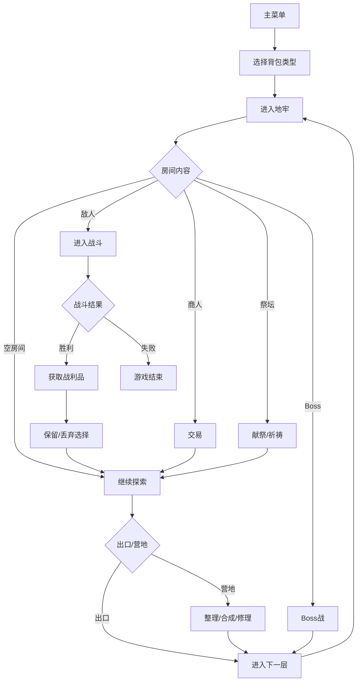

## 1. 产品概述

一款融合背包整理与地牢探险的策略游戏。玩家携带神奇背包深入随机生成的地牢，物品摆放方式直接决定战斗力。核心乐趣在于"空间压力"——如何在有限背包中高效布置物品以最大化战斗效能。

- 目标用户：喜欢规划、优化、拼图类玩法的策略游戏玩家
- 核心价值：将背包整理的满足感与地牢探险的策略性深度结合

## 2. 核心功能

### 2.1 功能模块
1. **主菜单**：角色选择（背包类型）、开始游戏、设置
2. **地牢探索**：回合制地图移动、房间交互、体力消耗
3. **背包界面**：网格背包展示、物品旋转/移动/丢弃、邻接效果预览
4. **战斗界面**：基于可触及物品的战斗系统、技能选择
5. **战利品界面**：战斗后物品获取决策（保留/丢弃）
6. **营地界面**：背包整理、物品合成、装备修理
7. **商人/祭坛**：交易、献祭强化

### 2.2 页面详情
| 页面名称 | 模块名称 | 功能描述 |
|----------|----------|----------|
| 主菜单 | 角色选择 | 选择不同背包类型（战士/药师/盗贼），显示特性预览 |
| 主菜单 | 游戏设置 | 音量、画质等配置 |
| 地牢探索 | 地图视图 | Canvas 渲染地牢地图，显示玩家、房间、敌人 |
| 地牢探索 | 状态栏 | 显示生命、体力、当前层数 |
| 背包界面 | 网格背包 | 可视化网格，拖拽旋转放置物品 |
| 背包界面 | 物品面板 | 显示背包内物品详细属性 |
| 背包界面 | 邻接效果 | 高亮显示物品间的邻接加成 |
| 战斗界面 | 战斗场景 | 敌人展示、玩家状态、可使用技能 |
| 战斗界面 | 技能面板 | 基于背包可触及物品生成的技能列表 |
| 战利品界面 | 物品选择 | 新物品列表，选择保留或丢弃 |
| 营地界面 | 合成台 | 相邻匹配物品可合成新物品 |
| 营地界面 | 背包整理 | 自由整理背包，无时间限制 |

## 3. 核心流程

游戏开始 → 选择背包类型 → 进入地牢第一层 → 探索房间 → 遭遇敌人 → 进入战斗 → 选择技能（基于背包可触及物品）→ 战斗胜利 → 获得战利品 → 决定保留/丢弃 → 继续探索 → 找到出口或Boss → 进入下层 → 到达营地 → 整理背包/合成/修理 → 继续深入

## 4. 用户界面设计

### 4.1 设计风格
- **整体风格**：暗黑奇幻风格，深色调为主，配合发光效果
- **主色调**：深石板灰 `#1a1a2e`，暗金 `#c9a227`，血红 `#e63946`
- **辅助色**：魔法紫 `#9d4edd`，自然绿 `#52b788`，冰霜蓝 `#48cae4`
- **背包网格**：深灰格子 `#2d2d44`，选中高亮 `#c9a227`，有效放置区域 `#52b788`，无效放置 `#e63946`
- **字体**：标题使用 Cinzel（中世纪奇幻风格），正文使用 Cormorant Garamond
- **按钮**：金属质感边框，悬停发光动画
- **布局**：响应式，左侧地图/战斗区，右侧背包面板，底部状态栏

### 4.2 页面设计概览
| 页面名称 | 模块名称 | UI 元素 |
|----------|----------|---------|
| 主菜单 | 标题区域 | 大标题，发光特效，背景为地牢剪影 |
| 主菜单 | 角色选择 | 卡片式展示，悬停放大，显示背包形状预览 |
| 地牢探索 | 地图区域 | Canvas 渲染，像素风瓦片地图，玩家角色发光 |
| 地牢探索 | 背包面板 | 右侧固定面板，网格高亮可触及物品 |
| 背包界面 | 网格区域 | 居中显示，大格子，拖拽交互 |
| 背包界面 | 物品详情 | 点击物品弹出详情卡，显示属性和效果 |
| 战斗界面 | 战斗场景 | 敌人立绘/像素图，HP 条，攻击动画 |
| 战斗界面 | 技能栏 | 底部显示可用技能，点击使用 |
| 战利品界面 | 物品列表 | 网格展示新物品，带勾选框 |
| 营地界面 | 合成区域 | 高亮显示可合成的相邻物品对 |

### 4.3 响应式设计
- 桌面优先设计，最小宽度 1024px
- 背包面板在移动端切换为可折叠抽屉
- 触摸设备支持长按旋转物品
