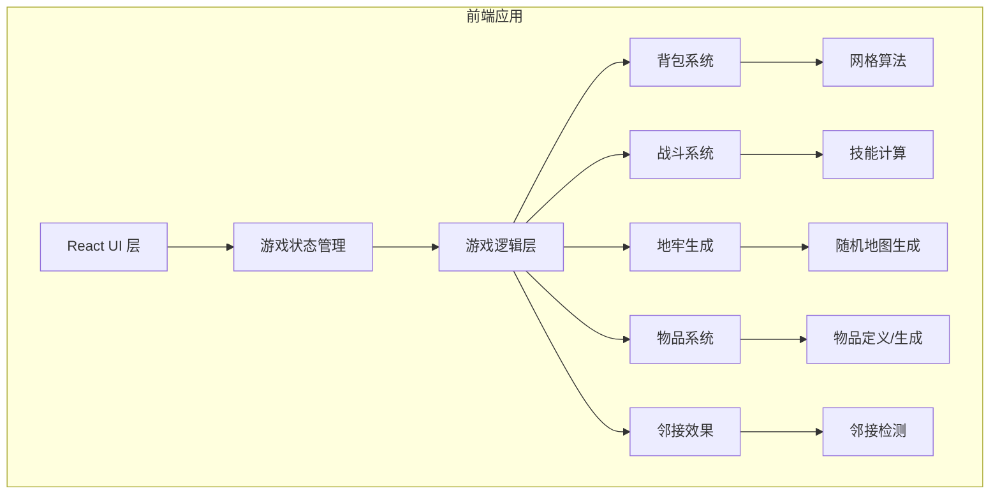

## 1. 架构设计



## 2. 技术说明
- **前端框架**：React 18 + TypeScript
- **构建工具**：Vite
- **样式**：CSS Modules + CSS Variables（主题系统）
- **渲染**：Canvas 2D API（地牢地图、背包网格）
- **状态管理**：Zustand（轻量级状态管理）
- **字体**：Google Fonts（Cinzel + Cormorant Garamond）
- **后端**：无（纯前端游戏，数据存储在 localStorage）
- **测试**：Vitest（单元测试）

## 3. 目录结构

```
src/
├── components/
│   ├── Game.tsx              # 主游戏组件
│   ├── MainMenu.tsx          # 主菜单
│   ├── DungeonView.tsx       # 地牢视图（Canvas）
│   ├── Inventory.tsx         # 背包界面（Canvas + DOM）
│   ├── CombatView.tsx        # 战斗界面
│   ├── LootView.tsx          # 战利品界面
│   ├── CampView.tsx          # 营地界面
│   ├── ShopView.tsx          # 商人界面
│   ├── AltarView.tsx         # 祭坛界面
│   ├── StatusBar.tsx         # 状态栏
│   ├── SkillPanel.tsx        # 技能面板
│   └── ItemTooltip.tsx       # 物品提示
├── game/
│   ├── types.ts              # 类型定义
│   ├── items.ts              # 物品定义和生成
│   ├── inventory.ts          # 背包系统（网格算法）
│   ├── adjacency.ts          # 邻接效果系统
│   ├── combat.ts             # 战斗系统
│   ├── dungeon.ts            # 地牢生成
│   ├── crafting.ts           # 合成系统
│   ├── backpacks.ts          # 背包类型定义
│   └── constants.ts          # 游戏常量
├── store/
│   └── gameStore.ts          # Zustand 状态管理
├── utils/
│   ├── canvas.ts             # Canvas 绘制工具
│   ├── random.ts             # 随机数工具
│   └── storage.ts            # localStorage 封装
├── styles/
│   ├── theme.css             # CSS 变量主题
│   ├── global.css            # 全局样式
│   └── animations.css        # 动画定义
├── App.tsx
├── main.tsx
└── index.css
```

## 4. 核心数据模型

### 4.1 物品类型定义
```typescript
// 物品形状 - 使用相对坐标数组表示
type ItemShape = { dx: number; dy: number }[];

// 物品属性
interface Item {
  id: string;
  name: string;
  description: string;
  shape: ItemShape;        // 占用格子坐标
  rotation: number;        // 0, 90, 180, 270
  rarity: 'common' | 'uncommon' | 'rare' | 'epic' | 'legendary';
  type: 'weapon' | 'armor' | 'potion' | 'ring' | 'gem' | 'food' | 'material' | 'scroll';
  element?: 'fire' | 'ice' | 'lightning' | 'poison' | 'holy' | 'dark';
  stats: {
    attack?: number;
    defense?: number;
    hp?: number;
    stamina?: number;
    critChance?: number;
  };
  effects: ItemEffect[];   // 独立效果
  adjacencyEffects?: AdjacencyEffect[];  // 邻接效果
  position?: { x: number; y: number } | null;  // 背包位置
}

// 邻接效果
interface AdjacencyEffect {
  targetType: string;      // 目标物品类型
  targetElement?: string;  // 目标元素
  effect: 'enchant' | 'boost' | 'corrupt' | 'stabilize';
  value: number;
  description: string;
}
```

### 4.2 背包类型定义
```typescript
interface Backpack {
  id: string;
  name: string;
  description: string;
  width: number;
  height: number;
  specialSlots: SpecialSlot[];  // 特殊插槽
  baseStats: {
    hp: number;
    stamina: number;
    attack: number;
    defense: number;
  };
  specialAbility: string;
}

interface SpecialSlot {
  id: string;
  type: 'weapon' | 'potion' | 'quick-access';
  x: number;
  y: number;
  width: number;
  height: number;
  effect: string;
}
```

### 4.3 地牢/战斗定义
```typescript
interface DungeonFloor {
  level: number;
  rooms: Room[];
  connections: Connection[];
  playerPos: { roomId: string; x: number; y: number };
}

interface Enemy {
  id: string;
  name: string;
  hp: number;
  maxHp: number;
  attack: number;
  defense: number;
  skills: EnemySkill[];
  loot: string[];  // 物品ID
}

interface CombatState {
  player: {
    hp: number;
    maxHp: number;
    accessibleItems: Item[];  // 可触及的物品
  };
  enemy: Enemy;
  turn: 'player' | 'enemy';
  log: string[];
}
```

## 5. 核心算法

### 5.1 背包放置算法
```
1. 计算物品旋转后的占用区域
2. 检查边界（物品是否超出背包）
3. 检查重叠（物品是否与已有物品重叠）
4. 检查特殊插槽兼容性
5. 返回是否可放置及放置位置
```

### 5.2 邻接效果计算
```
1. 遍历背包网格中每个已放置物品
2. 对每个物品，检查四个方向（上/下/左/右）的相邻格子
3. 如果相邻格子有物品，检查是否匹配邻接效果条件
4. 累加所有邻接效果到物品最终属性
5. 返回所有物品的实际属性
```

### 5.3 可触及物品判定
```
1. 从背包顶部边缘开始，向下扫描
2. 找到第一个被占用的格子
3. 对该物品，检查其所有格子上方是否为空
4. 如果上方全部为空，则该物品可触及
5. 继续扫描下一个物品
```

### 5.4 地牢生成算法
```
1. 生成随机房间位置（避免重叠）
2. 使用最小生成树连接房间
3. 添加额外连接增加路径多样性
4. 随机放置敌人、商人、祭坛、Boss
5. 设置起点和出口
```
