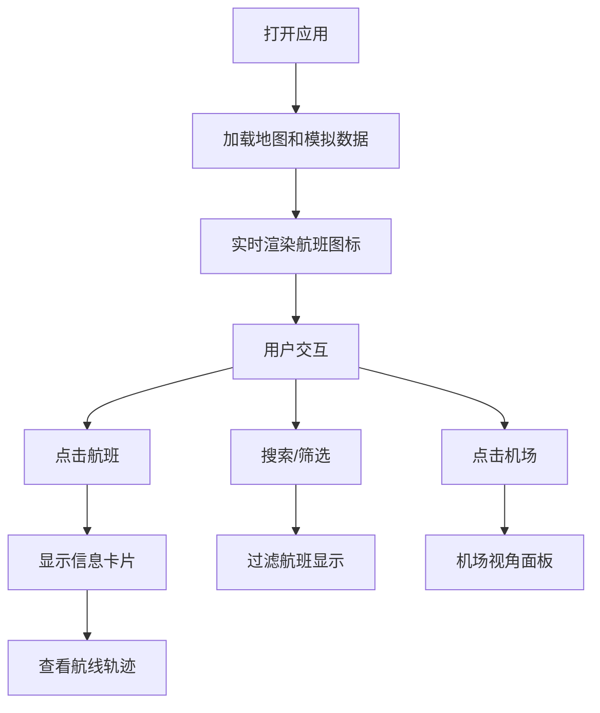

# FlyTrack - 航班追踪应用产品需求文档

## 1. 产品概述
FlyTrack 是一个类似 FlightRadar24 的全球实时航班追踪应用，通过可视化地图展示全球飞行中的航班位置和状态。
- 主要目的：提供直观的航班实时位置追踪、航线信息查询、机场航班动态查看功能
- 目标用户：航空爱好者、旅行规划者、需要追踪航班的普通用户
- 产品价值：以高质量的可视化体验，让用户轻松获取全球航班动态信息

## 2. 核心功能

### 2.1 功能模块
1. **地图主界面**：深色风格世界地图，实时显示数百个航班图标
2. **航班信息卡片**：点击航班弹出详细信息面板
3. **筛选搜索系统**：航空公司筛选、区域筛选、航班号搜索
4. **航线轨迹展示**：选中航班显示完整航线路径和历史轨迹
5. **机场视角**：查看机场到达/出发航班列表和延误情况

### 2.3 页面详情

| 页面名称 | 模块名称 | 功能描述 |
|---------|---------|---------|
| 主页面 | 地图视图 | Mapbox 深色底图，Canvas 绘制航班图标和尾迹，支持缩放平移 |
| 主页面 | 顶部导航栏 | 搜索框、筛选按钮、当前航班统计 |
| 主页面 | 航班信息卡片 | 显示航班号、航司、出发地、目的地、高度、速度、预计到达时间 |
| 主页面 | 筛选面板 | 航空公司多选筛选、区域选择、状态筛选 |
| 主页面 | 航线展示 | 选中航班显示虚线弧形航线、历史轨迹、剩余路程 |
| 主页面 | 机场视角面板 | 显示机场信息、到达航班列表、出发航班列表、延误统计 |

## 3. 核心流程

### 3.1 主要用户流程
1. 用户打开应用 → 加载深色世界地图 → 数百个航班图标实时显示并移动
2. 用户点击航班 → 显示航班信息卡片 → 可选查看完整航线
3. 用户使用搜索 → 输入航班号 → 地图定位到对应航班
4. 用户使用筛选 → 选择航空公司/区域 → 地图只显示符合条件的航班
5. 用户点击机场 → 切换到机场视角 → 查看该机场的到达/出发航班

## 4. 用户界面设计

### 4.1 设计风格
- **主题色调**：深空黑 (#0a0e1a) 为主背景，藏蓝 (#1a1f35) 为面板背景，青蓝 (#00d4ff) 为主色，琥珀橙 (#ff9500) 为强调色
- **地图风格**：深色极简风格，弱化地理细节，突出航班图标
- **字体**：JetBrains Mono 作为数字和代码显示，Inter 作为正文
- **布局风格**：沉浸式全屏地图，浮动半透明面板，玻璃拟态效果
- **动效**：航班平滑移动，尾迹渐隐效果，面板滑入滑出动画

### 4.2 页面设计概览

| 页面名称 | 模块名称 | UI 元素 |
|---------|---------|---------|
| 主页面 | 地图视图 | 全屏深色 Mapbox 地图，航班为白色带航向旋转的飞机图标，青色尾迹 |
| 主页面 | 顶部栏 | 左侧 Logo + 实时航班计数，右侧搜索框 + 筛选按钮 |
| 主页面 | 航班卡片 | 右侧滑出面板，航班号大字显示，信息网格布局，航线可视化 |
| 主页面 | 筛选面板 | 左侧滑出，航空公司列表带复选框，区域快速选择按钮 |
| 主页面 | 机场面板 | 底部滑出，机场名称 + IATA 代码，分栏显示到达/出发列表 |

### 4.3 响应式设计
- 桌面端：全屏地图，左右侧滑面板，底部机场视图
- 平板端：优化面板尺寸，支持触控手势
- 移动端：简化布局，底部导航，全屏卡片切换

### 4.4 视觉体验要点
- 飞机图标根据航向实时旋转
- 每架飞机尾部拖曳渐隐的青色尾迹线
- 选中航班高亮显示，航线为虚线弧形
- 航班状态颜色区分：巡航（白色）、爬升（绿色）、下降（橙色）
- 数字信息使用等宽字体，增强科技感
