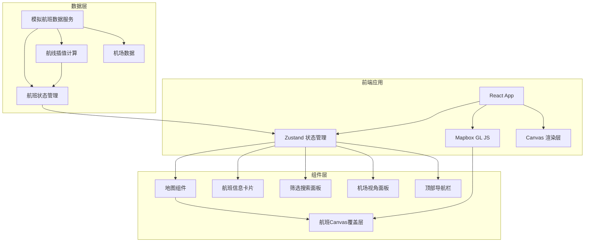

# FlyTrack - 技术架构文档

## 1. 架构设计



## 2. 技术选型说明

### 2.1 核心技术栈
- **前端框架**: React 18 + TypeScript
- **构建工具**: Vite 5
- **样式方案**: Tailwind CSS 3
- **状态管理**: Zustand
- **地图引擎**: Mapbox GL JS
- **图标库**: Lucide React

### 2.2 关键技术决策
1. **Mapbox GL JS** - 提供高性能矢量地图渲染，支持自定义深色样式
2. **Canvas 自定义图层** - 避免数百个 DOM 元素导致的性能问题，直接在 Canvas 上绘制航班
3. **Zustand** - 轻量级状态管理，适合高频更新的航班数据
4. **模拟数据服务** - 使用 setInterval 模拟 WebSocket 实时推送
5. **航线插值算法** - 使用球面线性插值 (Slerp) 计算大圆航线

## 3. 目录结构

```
src/
├── components/
│   ├── map/
│   │   ├── MapboxMap.tsx        # Mapbox 地图容器
│   │   ├── FlightCanvas.tsx     # Canvas 航班渲染层
│   │   └── RouteLayer.tsx       # 航线覆盖层
│   ├── panels/
│   │   ├── FlightInfoPanel.tsx  # 航班信息面板
│   │   ├── FilterPanel.tsx      # 筛选面板
│   │   └── AirportPanel.tsx     # 机场视角面板
│   ├── ui/
│   │   ├── TopBar.tsx           # 顶部导航栏
│   │   └── SearchInput.tsx      # 搜索输入框
│   └── common/
│       └── Badge.tsx            # 通用徽章组件
├── hooks/
│   ├── useFlightSimulator.ts    # 航班模拟 Hook
│   ├── useMapInteraction.ts     # 地图交互 Hook
│   └── useFilter.ts             # 筛选逻辑 Hook
├── store/
│   └── useFlightStore.ts        # Zustand 状态管理
├── utils/
│   ├── geo.ts                   # 地理计算工具
│   ├── flightData.ts            # 模拟数据生成
│   └── canvas.ts                # Canvas 绘制工具
├── types/
│   └── index.ts                 # TypeScript 类型定义
├── data/
│   ├── airlines.ts              # 航空公司数据
│   └── airports.ts              # 机场数据
├── App.tsx
├── main.tsx
└── index.css
```

## 4. 数据模型定义

### 4.1 核心类型

```typescript
// 航班状态枚举
enum FlightStatus {
  DEPARTING = 'departing',    // 起飞阶段
  CRUISING = 'cruising',      // 巡航阶段
  DESCENDING = 'descending',  // 下降阶段
  ARRIVED = 'arrived'         // 已到达
}

// 位置点
interface Position {
  lat: number;      // 纬度
  lng: number;      // 经度
  timestamp: number;
}

// 航班数据
interface Flight {
  id: string;
  flightNumber: string;      // 航班号: CA1234
  airline: Airline;          // 航空公司
  departure: Airport;        // 出发机场
  arrival: Airport;          // 到达机场
  departureTime: Date;       // 起飞时间
  arrivalTime: Date;         // 到达时间
  estimatedArrivalTime: Date; // 预计到达时间
  currentPosition: Position; // 当前位置
  altitude: number;          // 高度 (米)
  speed: number;             // 速度 (km/h)
  heading: number;           // 航向 (度 0-360)
  status: FlightStatus;
  route: Position[];         // 完整航线路径点
  trail: Position[];         // 历史轨迹点
  delay?: number;            // 延误分钟数
}

// 机场
interface Airport {
  id: string;
  iata: string;         // IATA 代码: PEK
  icao: string;         // ICAO 代码: ZBAA
  name: string;
  city: string;
  country: string;
  lat: number;
  lng: number;
  timezone: string;
}

// 航空公司
interface Airline {
  id: string;
  name: string;
  iata: string;         // 2字代码
  icao: string;         // 3字代码
  color: string;        // 品牌色
}

// 筛选条件
interface FilterOptions {
  airlines: string[];   // 航空公司 ID 列表
  regions: string[];    // 区域
  status: FlightStatus[];
  searchQuery: string;
}
```

## 5. 核心算法

### 5.1 航班位置插值
- 使用大圆航线计算两点间最短路径
- 根据飞行阶段调整速度：起飞爬升 > 巡航 > 下降
- 高度随阶段变化：起飞爬升→巡航高度→下降

### 5.2 Canvas 性能优化
- 仅渲染视口内的航班
- 使用 requestAnimationFrame 同步地图渲染
- 离屏 Canvas 缓存飞机图标
- 尾迹点池化复用

### 5.3 地图坐标系转换
- 经纬度 → 屏幕像素坐标转换
- 航向角度计算与图标旋转
- 缩放级别适配图标大小

## 6. 性能指标
- 同时渲染航班数：≥ 500 架
- 帧率：≥ 60 FPS
- 交互响应延迟：< 100ms
- 内存占用：< 200MB

## 7. 依赖包列表

```json
{
  "dependencies": {
    "react": "^18.2.0",
    "react-dom": "^18.2.0",
    "mapbox-gl": "^3.0.0",
    "zustand": "^4.4.0",
    "lucide-react": "^0.294.0"
  },
  "devDependencies": {
    "@types/react": "^18.2.0",
    "@types/react-dom": "^18.2.0",
    "@types/mapbox-gl": "^2.7.0",
    "@vitejs/plugin-react": "^4.2.0",
    "vite": "^5.0.0",
    "tailwindcss": "^3.3.0",
    "postcss": "^8.4.0",
    "autoprefixer": "^10.4.0",
    "typescript": "^5.3.0"
  }
}
```
