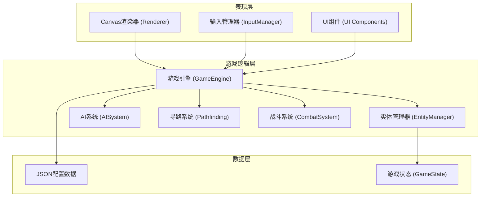
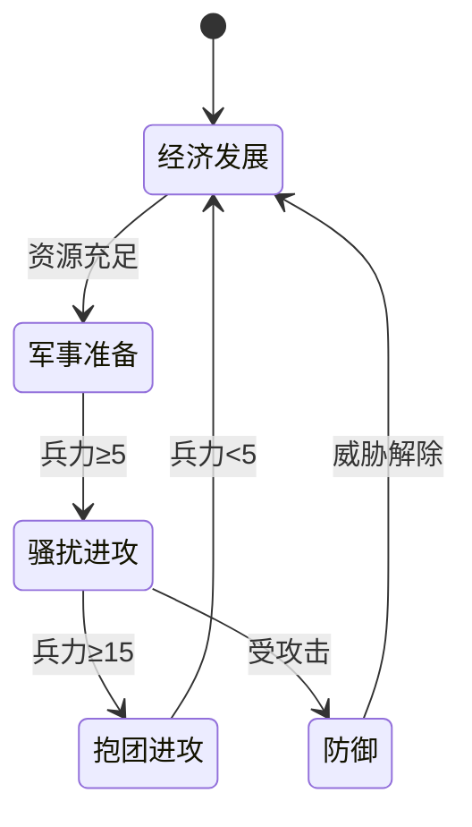

# 俯视角即时战略游戏 - 技术架构文档

## 1. 整体架构设计



## 2. 技术栈说明

- **前端框架**: 原生 TypeScript + Vite (无React，追求性能)
- **渲染引擎**: Canvas 2D API
- **构建工具**: Vite 5.x
- **编程语言**: TypeScript 5.x
- **数据格式**: JSON 配置驱动
- **无后端**: 纯前端实现，游戏状态内存存储

## 3. 目录结构设计

```
src/
├── config/                  # JSON配置文件
│   ├── units.json        # 单位属性配置
│   ├── buildings.json     # 建筑属性配置
│   ├── map.json          # 地图数据
│   └── tech-tree.json     # 科技树配置
├── engine/               # 游戏引擎核心
│   ├── GameEngine.ts    # 主游戏引擎
│   ├── EntityManager.ts   # 实体管理
│   ├── Pathfinding.ts  # A*寻路算法
│   └── SpatialGrid.ts # 空间分区（性能优化）
├── systems/            # 系统模块
│   ├── ResourceSystem.ts   # 资源系统
│   ├── BuildingSystem.ts # 建筑系统
│   ├── UnitSystem.ts     # 单位系统
│   ├── CombatSystem.ts   # 战斗系统
│   └── FogSystem.ts      # 战争迷雾系统
├── ai/                 # AI系统
│   ├── AISystem.ts       # AI主系统
│   ├── EconomyAI.ts      # 经济AI
│   ├── MilitaryAI.ts   # 军事AI
│   └── StateMachine.ts # 状态机
├── render/             # 渲染层
│   ├── Renderer.ts       # Canvas渲染器
│   ├── MiniMap.ts      # 小地图
│   └── UIRenderer.ts  # UI渲染
├── input/              # 输入处理
│   └── InputManager.ts   # 输入管理器
├── types/              # TypeScript类型定义
│   └── index.ts
├── utils/              # 工具函数
│   ├── math.ts
│   └── collision.ts
├── main.ts            # 入口文件
└── index.html
```

## 4. 核心数据模型

### 4.1 实体基类

```typescript
interface Entity {
  id: string;
  type: 'unit' | 'building';
  x: number;
  y: number;
  width: number;
  height: number;
  owner: 'player' | 'ai';
  health: number;
  maxHealth: number;
}

interface Unit extends Entity {
  type: 'unit';
  unitType: 'worker' | 'infantry' | 'archer' | 'cavalry';
  speed: number;
  attack: number;
  range: number;
  attackSpeed: number;
  state: UnitState;
  path: PathPoint[];
  target: Entity | null;
  carryingResource: { type: 'gold' | 'wood'; amount: number } | null;
}

interface Building extends Entity {
  type: 'building';
  buildingType: 'base' | 'barracks' | 'tower' | 'blacksmith';
  isComplete: boolean;
  buildProgress: number;
  productionQueue: ProductionItem[];
}
```

### 4.2 游戏状态

```typescript
interface GameState {
  map: MapData;
  units: Unit[];
  buildings: Building[];
  resources: {
    player: { gold: number; wood: number; population: number; maxPopulation: number };
    ai: { gold: number; wood: number; population: number; maxPopulation: number };
  };
  selectedUnits: string[];
  groups: Map<number, string[]>;
  fogOfWar: FogData;
  camera: { x: number; y: number; zoom: number };
}
```

## 5. 核心系统设计

### 5.1 寻路系统 (A*算法)

- **网格尺寸**: 64x64 网格，每格 32x32 像素
- **算法**: A* 算法，曼哈顿距离启发函数
- **性能优化**: 
  - 空间分区 (Spatial Grid)
  - 路径平滑 (Path Smoothing)
  - 批量路径请求队列

### 5.2 碰撞检测系统

- **静态碰撞**: 建筑、树木、矿石
- **动态碰撞**: 单位之间的分离 (Separation)
- **实现方式**: 空间网格 + 圆形碰撞检测
- **性能优化**: 仅检测邻近网格查询

### 5.3 战争迷雾系统

- **实现方式**: 双缓冲Canvas
  - 探索层 (已探索区域)
  - 可见层 (当前可见区域)
- **视野计算**: 圆形视野范围，Bresenham算法视线检测
- **更新策略**: 视野变化时增量更新

### 5.4 AI系统 (有限状态机)



## 6. 渲染架构

### 6.1 渲染管线

```
游戏逻辑 (update) → 状态更新 → 渲染 (render)
     ↑                          ↓
  60 FPS 同步                   Canvas 绘制
```

- **逻辑帧率**: 60 FPS 固定更新
- **渲染帧率**: 与显示器刷新率同步 (requestAnimationFrame)
- **双缓冲**: 离屏Canvas预渲染战争迷雾

### 6.2 渲染层次 (从下到上)

1. 地面/地形层
2. 资源点 (金矿、树木)
3. 建筑层
4. 单位层
5. 选中高亮/血条层
6. 战争迷雾层
7. UI层

## 7. 性能优化策略

### 7.1 渲染优化

- 视锥剔除 (Frustum Culling)
- 空间分区查询
- 静态元素批量绘制缓存
- 离屏Canvas预渲染

### 7.2 逻辑优化

- 空间网格加速碰撞/寻路查询
- 单位分帧更新 (Spread update
- 事件驱动而非轮询
- 对象池复用单位

## 8. 输入系统设计

| 输入 | 功能 |
|------|------|
| 左键单击 | 选中单位/建筑 |
| 左键拖拽 | 框选多个单位 |
| 右键单击 | 移动/攻击/采集命令 |
| Shift + 右键 | 追加命令 |
| Shift + 1-0 | 设置编队 |
| 1-0 | 选择编队 |
| 滚轮 | 缩放视角 |
| WASD/方向键 | 移动视角 |

## 9. JSON配置文件结构

### units.json
```json
{
  "worker": {
    "name": "农民",
    "health": 50,
    "speed": 2,
    "attack": 5,
    "range": 1,
    "cost": { "gold": 50, "wood": 0 },
    "buildTime": 5
  }
}
```

### buildings.json
```json
{
  "barracks": {
    "name": "兵营",
    "health": 500,
    "size": { "width": 3, "height": 3 },
    "cost": { "gold": 200, "wood": 150 },
    "buildTime": 30,
    "produces": ["infantry", "archer"]
  }
}
