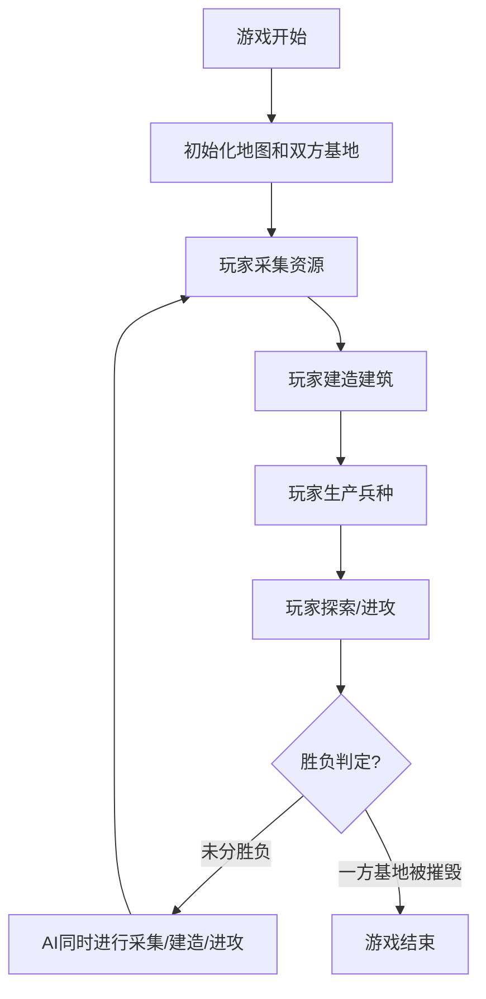
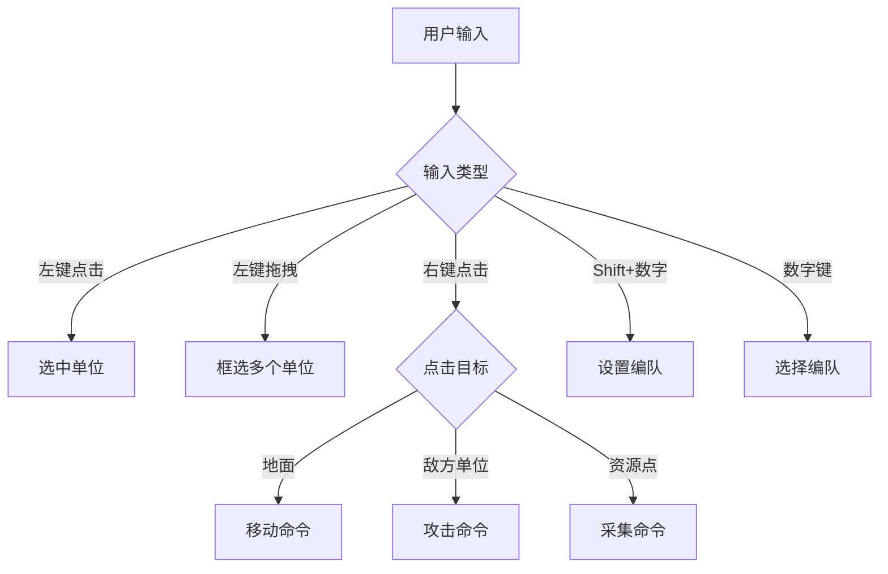

# 俯视角即时战略游戏 (RTS) - 产品需求文档

## 1. 产品概述

基于Canvas 2D的浏览器即时战略游戏，玩家通过采集资源、建造建筑、生产兵种与AI对手进行对战。游戏采用网格地图和战争迷雾机制，支持完整的RTS核心玩法循环。

- **核心玩法**: 资源采集 → 建筑建造 → 兵种生产 → 战略对抗
- **目标用户**: 经典RTS游戏爱好者、浏览器休闲游戏玩家
- **技术特点**: 纯前端实现、TypeScript逻辑、JSON数据驱动

## 2. 核心功能

### 2.1 用户角色

| 角色 | 进入方式 | 核心权限 |
|------|----------|----------|
| 玩家 | 直接进入游戏 | 控制所有己方单位、建造建筑、生产兵种 |
| AI对手 | 游戏自动生成 | 自动采集资源、建造建筑、生产兵种并进攻玩家 |

### 2.2 功能模块

1. **游戏主界面**: Canvas游戏画布、资源面板、建筑面板、单位信息面板、小地图
2. **资源系统**: 金矿采集、木材采集、资源显示与消耗
3. **建筑系统**: 主基地、兵营、箭塔、铁匠铺建造与功能
4. **单位系统**: 农民、步兵、弓箭手、骑兵的移动、攻击、生产
5. **战斗系统**: 近战/远程攻击、伤害计算、单位死亡
6. **控制机制**: 单位选中、框选、右键移动/攻击、Shift编队
7. **地图系统**: 网格地图、障碍物、战争迷雾
8. **AI系统**: 资源采集、建筑建造、骚扰、抱团进攻

### 2.3 功能详情

| 模块名称 | 子模块 | 功能描述 |
|---------|--------|----------|
| 资源系统 | 金矿采集 | 农民移动到金矿自动采集，返回主基地存储 |
| 资源系统 | 木材采集 | 农民砍伐树木，返回主基地存储 |
| 建筑系统 | 主基地 | 初始建筑，生产农民，存储资源 |
| 建筑系统 | 兵营 | 生产步兵、弓箭手 |
| 建筑系统 | 箭塔 | 自动攻击范围内敌人 |
| 建筑系统 | 铁匠铺 | 解锁骑兵生产，提升攻击力 |
| 单位系统 | 农民 | 采集资源、建造建筑 |
| 单位系统 | 步兵 | 便宜、近战、血量中等 |
| 单位系统 | 弓箭手 | 远程、脆弱、射程远 |
| 单位系统 | 骑兵 | 速度快、攻击力高、昂贵 |
| 控制机制 | 单位选中 | 左键点击选中单位，显示状态 |
| 控制机制 | 框选 | 左键拖拽框选多个单位 |
| 控制机制 | 右键操作 | 右键地面移动，右键敌人攻击 |
| 控制机制 | Shift编队 | Shift+数字键编队，数字键选择编队 |
| 地图系统 | 网格地图 | 64x64网格，每格32像素 |
| 地图系统 | 战争迷雾 | 未探索区域隐藏，视野范围动态计算 |
| AI系统 | 经济AI | 自动分配农民采集资源 |
| AI系统 | 建造AI | 根据资源和需求建造建筑 |
| AI系统 | 军事AI | 生产兵种、骚扰、抱团进攻 |

## 3. 核心流程

### 3.1 游戏流程



### 3.2 单位控制流程



## 4. 用户界面设计

### 4.1 设计风格

- **主色调**: 深灰色背景 (#1a1a2e) 搭配军事风格的橄榄绿 (#4a5d23) 和金色 (#d4af37)
- **辅助色**: 玩家蓝色 (#3498db)、AI红色 (#e74c3c)、资源黄色 (#f1c40f)
- **UI风格**: 像素风边框、简洁硬朗的军事风格
- **字体**: 使用 'Courier New' 等宽字体，营造复古游戏氛围
- **按钮风格**: 方形带像素边框，悬停时有高亮效果

### 4.2 界面布局

```
┌─────────────────────────────────────────────────────────────┐
│  资源栏: 金 1200  木 800  人口 12/20                       │
├──────────────────┬──────────────────────────┬───────────────┤
│                  │                          │               │
│                  │                          │  小地图       │
│                  │                          │               │
│   Canvas游戏画布 │                          ├───────────────┤
│                  │                          │               │
│                  │                          │  单位信息     │
│                  │                          │               │
├──────────────────┴──────────────────────────┼───────────────┤
│  建筑建造面板                                  单位生产面板  │
└─────────────────────────────────────────────────────────────┘
```

### 4.3 界面模块详情

| 模块名称 | UI元素 | 交互设计 |
|---------|--------|----------|
| 资源栏 | 金币图标+数值、木材图标+数值、人口数值 | 静态显示 |
| 小地图 | 200x200像素缩略图，显示视野和单位位置 | 点击跳转视野 |
| 单位信息 | 选中单位的头像、血量、攻击力、速度 | 静态显示 |
| 建筑面板 | 各建筑图标、所需资源、建造按钮 | 点击选择建造位置 |
| 单位面板 | 各单位图标、所需资源、生产按钮 | 点击生产单位 |

### 4.4 响应式设计

- **主画布**: 自适应窗口大小，保持宽高比
- **UI面板**: 固定像素尺寸，确保在各种分辨率下可用性
- **触摸支持**: 长按替代右键，双指缩放地图

### 4.5 视觉特效

- **单位选中**: 蓝色圆形高亮光环
- **移动指示**: 右键点击时显示目标点标记
- **攻击效果**: 红色攻击线、爆炸粒子
- **战争迷雾**: 渐变黑色遮罩，边缘柔和过渡
- **建筑建造**: 建造进度条、半透明预览
