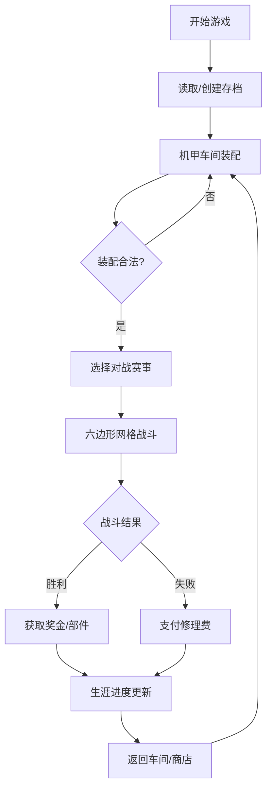

## 1. 产品概述
机甲自定义与回合制战斗游戏，玩家从基础骨架开始组装专属机甲，在六边形网格战场上进行策略对战，通过生涯模式逐步升级装备、参与顶级联赛。
- 核心玩法：深度机甲组装系统 + 策略回合制战斗
- 目标用户：喜爱机甲文化、策略游戏和自定义创造的玩家

## 2. 核心功能

### 2.1 用户角色
| 角色 | 注册方式 | 核心权限 |
|------|----------|----------|
| 玩家 | 本地存档 | 组装机甲、进行战斗、生涯模式进度 |

### 2.2 功能模块
1. **主菜单**：开始游戏、加载存档、设置
2. **机甲车间**：3D机甲预览、部件装配、属性面板
3. **部件商店**：购买部件、出售多余零件
4. **战斗系统**：六边形网格战场、回合制战斗、AI对战
5. **生涯模式**：地下格斗场→顶级联赛、经济系统、修理机制

### 2.3 页面详情
| 页面名称 | 模块名称 | 功能描述 |
|---------|---------|----------|
| 主菜单 | 导航模块 | 新游戏/继续游戏/设置选项，动态背景 |
| 机甲车间 | 3D预览区 | Three.js渲染机甲模型，部件换装实时显示 |
| 机甲车间 | 部件列表 | 六类部件分类展示，稀有度筛选 |
| 机甲车间 | 属性面板 | 实时计算总重量、能量、护甲、技能槽 |
| 部件商店 | 商品展示 | 可购买部件列表，价格/稀有度显示 |
| 战斗场景 | 六边形网格 | 俯视视角，可移动/攻击范围高亮 |
| 战斗场景 | 行动面板 | 移动/攻击/防御/技能按钮，行动点数显示 |
| 战斗场景 | 信息面板 | 双方机甲状态、回合信息 |
| 生涯模式 | 赛事地图 | 各级别赛事解锁进度 |
| 生涯模式 | 机库管理 | 机甲修理、部件维护 |

## 3. 核心流程

用户进入游戏 → 选择新游戏/读取存档 → 进入机甲车间装配机甲 → 确认装配合法性 → 选择赛事/对战 → 进入六边形网格战斗 → 回合制行动直至胜负判定 → 返回生涯模式 → 获取奖金/部件奖励 → 修理机甲/购买新部件 → 解锁更高级赛事

## 4. 用户界面设计

### 4.1 设计风格
- **主色调**：深灰蓝(#1a1a2e) + 霓虹青(#00f5d4) + 警示红(#f72585)，赛博朋克工业风
- **按钮风格**：棱角分明的工业风按钮，带发光边框和按下凹陷效果
- **字体**：Orbitron（标题，科技感） + Rajdhani（正文，清晰易读）
- **布局风格**：模块化卡片布局，金属质感边框，故障艺术点缀
- **图标风格**：线性几何图标，带霓虹发光效果

### 4.2 页面设计概述
| 页面名称 | 模块名称 | UI元素 |
|---------|---------|--------|
| 主菜单 | 英雄区域 | 动态机甲3D背景，霓虹标题，故障艺术动画 |
| 机甲车间 | 3D预览区 | 暗室环境，聚光灯效果，机甲可拖拽旋转 |
| 机甲车间 | 部件面板 | 分类标签页，稀有度颜色边框，部件卡片悬停放大 |
| 战斗场景 | 网格区域 | 深色六边形网格，高亮可移动范围，掩体半透明效果 |
| 战斗场景 | HUD面板 | 实时血条/能量条，行动点数发光指示器 |

### 4.3 响应性
- 桌面端优先，支持1920×1080及以上分辨率
- 战斗区域保持正方形比例，自适应窗口大小
- UI面板可折叠，最大化战斗视野

### 4.4 3D场景指导
- **环境**：暗金属工业风车间，霓虹灯条点缀，轻微体积雾
- **光照**：主聚光灯+环境光，机甲金属材质PBR渲染
- **相机**：车间用轨道相机可360°旋转，战斗用固定俯视正交相机
- **交互**：部件换装时的装配动画，战斗时攻击/受击特效
- **后处理**：轻微 bloom 效果，色彩分级增强科技感
