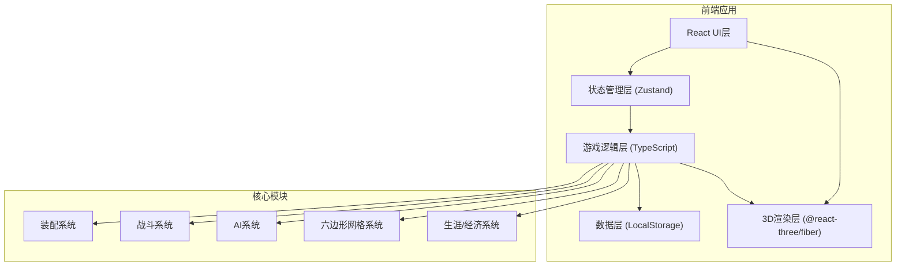
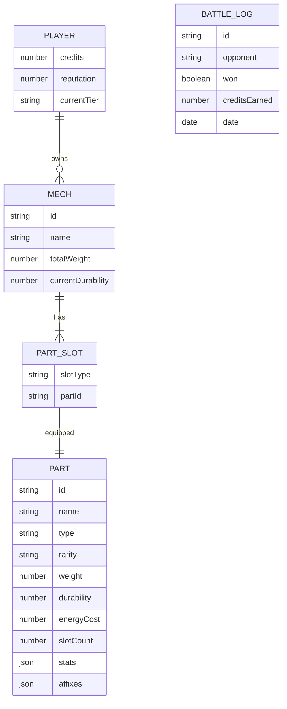

## 1. 架构设计



## 2. 技术描述

- **前端框架**：React@18 + TypeScript@5
- **构建工具**：Vite@5
- **样式方案**：TailwindCSS@3 + PostCSS
- **3D渲染**：Three@0.160 + @react-three/fiber@8 + @react-three/drei@9
- **状态管理**：Zustand@4（轻量级，游戏状态集中管理）
- **路由**：React Router@6
- **数据持久化**：LocalStorage + 自定义序列化
- **动画**：Framer Motion@10

## 3. 路由定义

| 路由 | 页面 | 用途 |
|------|------|------|
| / | MainMenu | 主菜单页面 |
| /workshop | Workshop | 机甲车间装配页面 |
| /shop | Shop | 部件商店页面 |
| /battle | Battle | 战斗场景页面 |
| /career | Career | 生涯模式页面 |
| /hangar | Hangar | 机库/修理页面 |

## 4. 数据模型

### 4.1 实体关系图



### 4.2 核心类型定义

```typescript
// 部件类型
type PartType = 'head' | 'torso' | 'leftArm' | 'rightArm' | 'legs' | 'core';
type Rarity = 'common' | 'uncommon' | 'rare' | 'epic' | 'legendary';
type DamageType = 'kinetic' | 'energy' | 'thermal';

// 部件接口
interface Part {
  id: string;
  name: string;
  type: PartType;
  rarity: Rarity;
  weight: number;
  durability: number;
  maxDurability: number;
  energyCost: number;
  slotCount: number;
  stats: {
    armor?: number;
    damage?: number;
    accuracy?: number;
    range?: number;
    mobility?: number;
    evasion?: number;
    maxEnergy?: number;
    shield?: number;
  };
  affixes: Affix[];
  setBonus?: SetBonus;
  price: number;
}

// 词缀效果
interface Affix {
  id: string;
  name: string;
  description: string;
  effect: (stats: MechStats) => MechStats;
}

// 机甲状态
interface Mech {
  id: string;
  name: string;
  parts: Record<PartType, Part | null>;
  currentHealth: number;
  maxHealth: number;
  currentShield: number;
  maxShield: number;
  currentEnergy: number;
  maxEnergy: number;
  totalWeight: number;
  actionPoints: number;
  maxActionPoints: number;
}

// 六边形坐标
interface HexCoord {
  q: number;
  r: number;
}

// 战斗单位
interface BattleUnit {
  mech: Mech;
  position: HexCoord;
  team: 'player' | 'enemy';
  hasMoved: boolean;
  hasAttacked: boolean;
}

// 玩家存档
interface PlayerSave {
  id: string;
  credits: number;
  reputation: number;
  currentTier: number;
  ownedParts: string[];
  currentMech: Mech;
  battleHistory: BattleLog[];
  unlockedTiers: number[];
}
```

## 5. 核心模块设计

### 5.1 装配系统
- 合法性校验：能量平衡、插槽占用检查
- 属性实时计算：合并所有部件属性+词缀效果
- 重量惩罚计算：超重降低机动性

### 5.2 六边形网格系统
- 轴向坐标系统 (q, r)
- A*寻路算法实现
- 射程/移动范围计算
- 掩体/高低地效果

### 5.3 战斗系统
- 回合顺序：基于机动性+重量的行动队列
- 伤害计算：伤害类型×护甲减免×距离衰减
- 状态效果：护盾、灼烧、过载等

### 5.4 AI系统
- 效用评估函数：距离、掩体、血量、武器克制
- 决策树：移动→攻击→防御的优先级判断
- 难度分级：不同AI决策权重

### 5.5 存档系统
- 自动序列化/反序列化
- 多存档槽位
- 版本兼容处理
