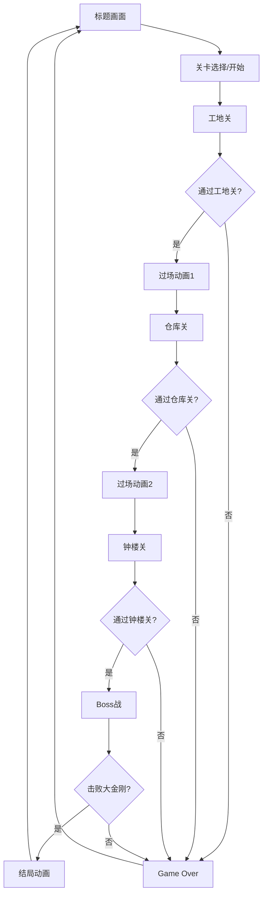

## 1. 产品概述
一款致敬FC《大金刚》的逐屏攀爬跳跃游戏，采用Phaser 3 + TypeScript构建，画面呈现鲜艳饱满的像素风格。玩家操控木匠在七层工地脚手架上攀爬，躲避大金刚扔下的木桶和铁球，穿越火焰、矿车、升降梯等障碍，最终击败大金刚通关。

## 2. 核心功能

### 2.1 玩家角色
| 动作 | 说明 |
|------|------|
| 左右移动 | 沿横梁行走 |
| 跳跃 | 微蹲预备帧→滞空衣角飘起→落地硬直缓冲 |
| 爬梯 | 靠近梯子时上下攀爬 |
| 拾取锤子 | 短暂无敌，可砸碎木桶 |
| 拉控制杆 | Boss战终局触发脚手架坍塌 |

### 2.2 关卡结构

#### 2.2.1 工地关（主关）
- 七层倾斜钢铁横梁，方向交替
- 垂直梯子连接各层
- 大金刚站顶层扔木桶
- 木桶沿横梁滚动，遇梯子随机选择继续滚或爬下
- 火焰蔓延：横梁上随机出现油火，从左向右扩散
- 锤子道具：横梁间散布，拾取后短暂无敌
- 矿车：沿横梁自动滑行，可搭乘但需在断崖前跳离
- 升降梯：悬挂铁钩木板，上下循环，需精确跳跃

#### 2.2.2 仓库关（额外关卡）
- 堆满滚动圆木和摇晃货箱
- 推倒货箱阻挡滚木，创造安全路径

#### 2.2.3 钟楼关（额外关卡）
- 巨大齿轮不断旋转
- 踩着齿轮齿缝往上跳
- 躲避钟摆撞击

### 2.3 Boss战
- 大金刚拆下梯子左右甩动
- 配合甩动节奏跳上更高平台
- 躲避铁桶和拳头攻击
- 冲向控制杆拉下，脚手架坍塌，大金刚坠落

### 2.4 大金刚AI行为
| 行为 | 说明 |
|------|------|
| 基础扔桶 | 每隔几秒扔一个木桶 |
| 动态频率 | 根据关卡进度加快扔桶频率 |
| 假动作 | 后期假装扔桶骗玩家起跳 |
| 交叉火力 | 连续快扔两只桶 |
| 暴怒模式 | 连续滚动三只木桶 |

### 2.5 视觉效果
| 效果 | 说明 |
|------|------|
| 木桶碎裂 | 木屑飞溅，油迸火星 |
| 画面震动 | 锤子砸桶时短暂震动 |
| 火焰蔓延 | 油火从左向右扩散动画 |
| 脚手架坍塌 | 钢梁断裂，烟尘弥漫 |
| 大金刚怒吼 | 捶胸动画配合特效 |
| 过场动画 | 像素默剧风格幽默片段 |

### 2.6 音效
| 音效 | 说明 |
|------|------|
| 木桶滚动 | 隆隆声循环 |
| 锤子砸碎 | 脆响+碎片声 |
| 跳跃 | 短促"嘿"声 |
| 大金刚怒吼 | 低沉咆哮采样 |
| 火焰 | 噼啪燃烧声 |
| 背景音乐 | 街机风格紧张BGM |

## 3. 核心流程

## 4. 用户界面设计

### 4.1 设计风格
- **主色调**：鲜艳的街机红(#E53935)、钢铁蓝(#1565C0)、工地黄(#FDD835)
- **辅助色**：脚手架灰(#757575)、火焰橙(#FF6D00)、像素绿(#00C853)
- **画面风格**：16x16像素精灵，CRT扫描线滤镜，饱和度拉满的FC色板
- **字体**：像素风格8bit字体（Press Start 2P）
- **布局**：固定4:3竖屏比例（480x640），居中显示，两侧黑边

### 4.2 页面设计概览
| 页面 | 模块 | UI元素 |
|------|------|--------|
| 标题画面 | Logo | 大像素字体标题，闪烁的"PRESS START" |
| 标题画面 | 背景 | 大金刚捶胸动画，木桶滚过 |
| 游戏画面 | HUD | 顶部：分数、生命、关卡、锤子计时 |
| 游戏画面 | 游戏区域 | 480x640像素游戏视口 |
| Game Over | 结算 | 分数统计，闪烁重新开始提示 |
| 过场动画 | 像素默剧 | 角色幽默表演，自动播放 |

### 4.3 响应式
- 桌面优先，游戏画面固定480x640
- 小屏幕自动缩放，保持4:3比例
- 支持键盘（方向键+空格）和触屏虚拟按钮

### 4.4 像素美术规格
- 角色精灵：16x24像素，4帧行走动画，3帧跳跃动画
- 木桶精灵：16x16像素，4帧旋转动画
- 大金刚精灵：32x32像素，闲置/扔桶/捶胸动画
- 横梁图块：16x16像素钢梁纹理
- 梯子图块：8x16像素铁梯纹理
- 火焰精灵：16x16像素，4帧动画
- 锤子精灵：16x16像素
