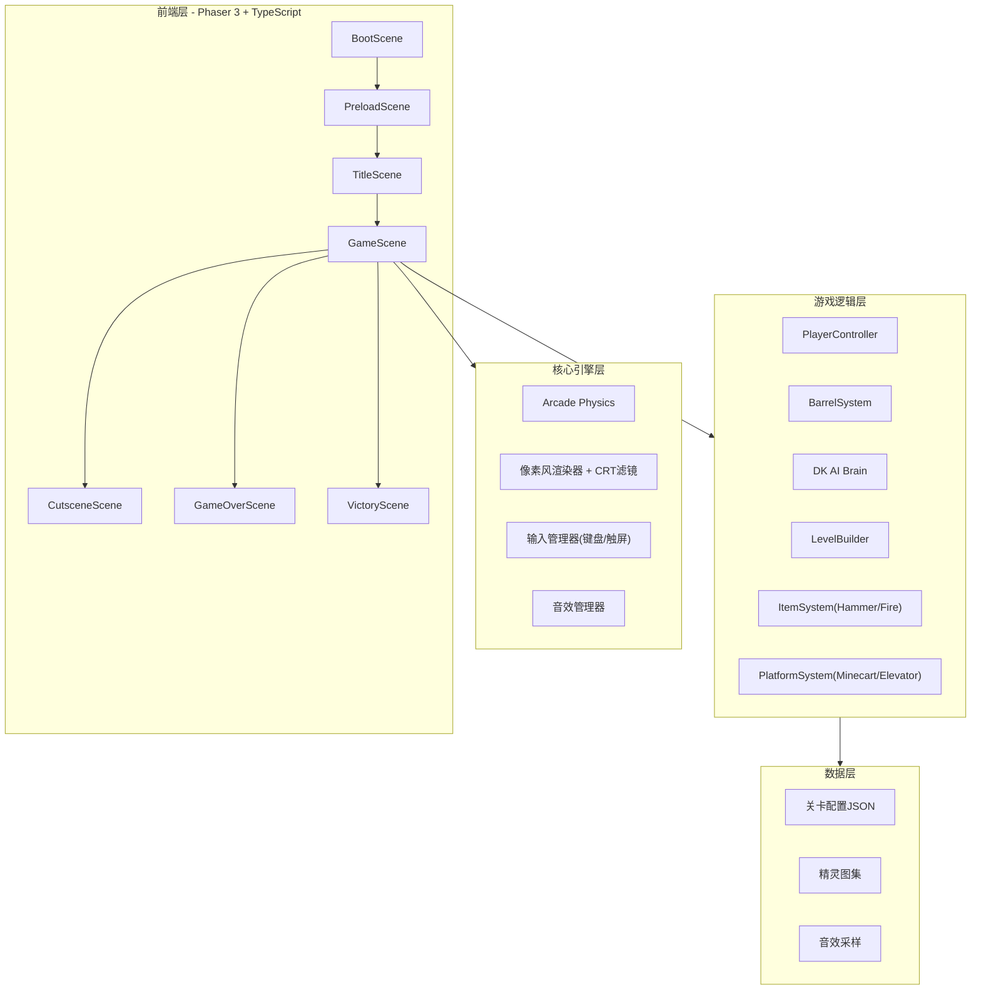

## 1. 架构设计



## 2. 技术说明
- **前端框架**：Phaser 3 + TypeScript（纯前端游戏，无后端）
- **构建工具**：Vite + TypeScript
- **渲染**：Phaser Canvas渲染器，PIXEL_ART缩放模式，CRT扫描线后处理
- **物理**：Phaser Arcade Physics
- **动画**：Phaser Tween + 自定义Sprite动画
- **状态管理**：Phaser Scene内置状态 + 全局GameState单例
- **输入**：Phaser Input（键盘 + 触屏虚拟按键）

## 3. 场景定义
| 场景 | 用途 |
|------|------|
| BootScene | 初始化Phaser配置，加载最小资源 |
| PreloadScene | 加载所有精灵图集、音效、关卡数据 |
| TitleScene | 标题画面，闪烁"PRESS START" |
| GameScene | 主游戏场景，包含所有游戏逻辑 |
| CutsceneScene | 过场动画播放 |
| GameOverScene | 游戏结束，分数统计 |
| VictoryScene | 通关结局动画 |

## 4. 核心类设计

### 4.1 PlayerController
```
- sprite: Phaser.Physics.Arcade.Sprite
- state: IDLE | WALKING | JUMPING | LANDING | CLIMBING | HAMMER | DEAD
- jump(): 微蹲2帧→起跳→滞空→落地硬直3帧
- climb(direction): 梯子攀爬逻辑
- grabHammer(): 切换锤子状态，5秒计时
- takeDamage(): 死亡处理
```

### 4.2 BarrelSystem
```
- barrels: Barrel[]
- spawnTimer: Phaser.Time.TimerEvent
- spawn(): 从DK位置生成木桶
- update(): 更新所有木桶
  - 沿横梁滚动（根据横梁倾斜方向设置vx）
  - 到达横梁末端→下落到下一层
  - 到达梯子节点→random() * difficulty决定是否爬梯
  - 碰撞检测：与玩家、锤子
```

### 4.3 DKAI
```
- state: IDLE | THROWING | FAKE_THROW | RAGE | BOSS
- throwInterval: 根据关卡动态调整
- throwBarrel(): 扔桶动画+生成木桶
- fakeThrow(): 假装扔桶骗玩家
- rageMode(): 连续三桶
- bossAttack(): 拆梯甩动+铁桶+拳头
```

### 4.4 LevelBuilder
```
- buildLevel(levelId): 根据JSON配置生成关卡
  - 创建横梁（倾斜Platform，方向交替）
  - 创建梯子（静态碰撞体+攀爬区域）
  - 放置锤子道具
  - 放置矿车轨道
  - 放置升降梯
  - 生成火焰触发器
```

### 4.5 PlatformSystem
```
- Minecart: 沿横梁自动滑行的移动平台
  - 在横梁上来回移动
  - 玩家跳上后跟随移动
  - 到达断崖前需跳离
- Elevator: 上下循环的升降平台
  - 铁钩+木板组合
  - 上下循环移动
  - 玩家需精确跳跃上下
```

### 4.6 ItemSystem
```
- Hammer: 拾取后无敌5秒
  - 碰撞检测：锤子范围内木桶→碎裂
  - 碎裂效果：木屑粒子+火星+画面震动
- Fire: 横梁上蔓延的油火
  - 计时器触发
  - 横向移动碰撞体
  - 接触即伤害
```

## 5. 关卡数据结构
```typescript
interface LevelConfig {
  id: string;
  type: 'construction' | 'warehouse' | 'clocktower';
  width: number;
  height: number;
  beams: BeamConfig[];
  ladders: LadderConfig[];
  hammers: { x: number; y: number }[];
  minecarts: MinecartConfig[];
  elevators: ElevatorConfig[];
  fireTriggers: FireTriggerConfig[];
  dkPosition: { x: number; y: number };
  dkConfig: DKConfig;
}

interface BeamConfig {
  x: number;
  y: number;
  width: number;
  angle: number; // 倾斜角度
  direction: 'left' | 'right'; // 倾斜方向
}

interface LadderConfig {
  x: number;
  y: number;
  height: number;
  isBarrelPath: boolean; // 木桶是否会选择此梯子
}
```

## 6. 项目结构
```
src/
├── main.ts                 # 入口，Phaser游戏配置
├── config/
│   └── gameConfig.ts       # Phaser配置常量
├── scenes/
│   ├── BootScene.ts
│   ├── PreloadScene.ts
│   ├── TitleScene.ts
│   ├── GameScene.ts
│   ├── CutsceneScene.ts
│   ├── GameOverScene.ts
│   └── VictoryScene.ts
├── entities/
│   ├── Player.ts
│   ├── Barrel.ts
│   ├── DonkeyKong.ts
│   ├── Hammer.ts
│   ├── Fire.ts
│   ├── Minecart.ts
│   └── Elevator.ts
├── systems/
│   ├── BarrelSystem.ts
│   ├── LevelBuilder.ts
│   ├── PlatformSystem.ts
│   ├── ItemSystem.ts
│   └── InputManager.ts
├── data/
│   ├── levels/
│   │   ├── construction.json
│   │   ├── warehouse.json
│   │   └── clocktower.json
│   └── animations.ts
├── utils/
│   ├── PixelFactory.ts     # 像素精灵生成器
│   └── CRTFilter.ts        # CRT扫描线效果
└── types/
    └── index.ts            # TypeScript类型定义
```

## 7. 像素精灵生成策略
由于不使用外部图片资源，所有精灵通过代码生成：
- **PixelFactory**: 使用Phaser Graphics动态绘制像素精灵，生成纹理后缓存
- 每个精灵由像素数组定义（颜色+位置），运行时渲染到Canvas纹理
- 动画帧通过多组像素数组切换实现
- CRT扫描线效果通过Phaser后处理管线实现
