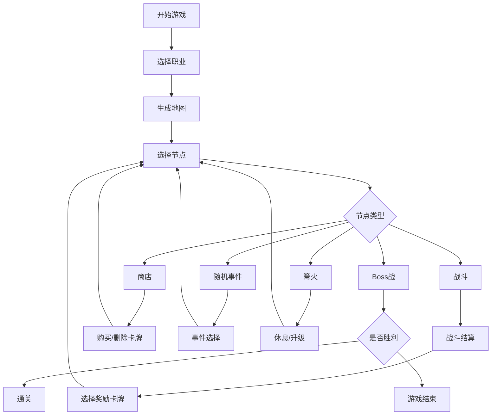

## 1. 产品概述

一款类似《杀戮尖塔》的卡牌构筑爬塔游戏，玩家在随机生成的地图上选择路线，遭遇战斗、商店、随机事件和篝火营地。通过回合制卡牌对战击败敌人，收集卡牌和遗物构建强力牌组，最终挑战Boss通关。

- 核心玩法：卡牌构筑策略 + Roguelike 随机元素
- 目标用户：卡牌游戏爱好者、策略游戏玩家
- 产品价值：提供高重玩价值的策略深度体验

## 2. 核心功能

### 2.1 用户角色

| 角色 | 注册方式 | 核心权限 |
|------|---------|---------|
| 玩家 | 本地存档 | 游戏游玩、存档管理 |

### 2.2 功能模块

1. **主菜单**：开始游戏、继续游戏、职业选择、设置
2. **地图界面**：地图展示、节点选择、进度显示
3. **战斗场景**：回合制卡牌对战、动画效果、状态显示
4. **奖励界面**：卡牌选择、遗物获取
5. **商店界面**：购买卡牌、删除卡牌、购买遗物
6. **篝火界面**：休息恢复、升级卡牌
7. **事件界面**：随机事件选择
8. **牌组查看**：牌组管理、遗物查看

### 2.3 页面详情

| 页面名称 | 模块名称 | 功能描述 |
|---------|---------|---------|
| 主菜单 | 职业选择 | 战士/法师/盗贼三职业，各有专属卡池和初始遗物 |
| 主菜单 | 存档系统 | 本地存储游戏进度，支持中途退出继续 |
| 地图界面 | 地图生成 | 多层多岔路结构，节点类型随机分布 |
| 地图界面 | 节点选择 | 玩家从底部爬向顶部，路线不可回头 |
| 战斗场景 | 卡牌系统 | 抽牌、出牌、弃牌、能量管理 |
| 战斗场景 | 敌人AI | 意图提示系统，根据怪物类型生成出招 |
| 战斗场景 | 状态效果 | 虚弱、易伤、护甲、力量等堆叠效果 |
| 战斗场景 | 卡牌效果 | 直接伤害、护甲、抽牌、弃牌、能力牌 |
| 奖励界面 | 卡牌奖励 | 战斗胜利后三选一卡牌加入牌组 |
| 商店界面 | 商店功能 | 买牌、删牌、买药水、买遗物 |
| 篝火界面 | 休息功能 | 恢复生命或升级卡牌 |
| 事件界面 | 随机事件 | 各种随机事件影响牌组和资源 |
| 遗物系统 | 被动效果 | 全局被动加成，遗物间协同效应 |

## 3. 核心流程

玩家选择职业开始新游戏 → 生成地图 → 选择节点前进 → 遭遇战斗/商店/事件/篝火 → 战斗胜利获得奖励 → 继续前进直到击败Boss通关

## 4. 用户界面设计

### 4.1 设计风格

- **主色调**：深紫/暗蓝底色配合金色/红色高光，营造暗黑奇幻风格
- **辅助色**：红色（攻击）、蓝色（防御）、绿色（技能）、紫色（能力）
- **按钮风格**：圆角矩形，带边框和悬浮发光效果
- **字体**：标题使用 Cinzel 装饰性字体，正文使用 Lato 清晰易读
- **布局风格**：卡片式布局，多层叠加设计
- **视觉元素**：卡牌边框、能量宝珠、血条、状态图标

### 4.2 页面设计概览

| 页面名称 | 模块名称 | UI 元素 |
|---------|---------|---------|
| 战斗场景 | 战斗区域 | Canvas 2D 渲染战场背景、角色立绘、攻击动画 |
| 战斗场景 | 卡牌手牌区 | 底部横向排列卡牌，悬浮放大效果 |
| 战斗场景 | 状态面板 | 玩家和敌人的生命值、护甲、状态效果图标 |
| 战斗场景 | 意图显示 | 敌人头顶显示下回合行动意图 |
| 战斗场景 | 能量显示 | 能量宝珠动画，当前/最大能量 |
| 地图界面 | 地图节点 | 不同颜色区分节点类型，连线显示路径 |
| 地图界面 | 进度显示 | 当前层数、已完成节点 |
| 卡牌界面 | 卡牌详情 | 卡牌名称、消耗、类型、效果描述 |
| 遗物界面 | 遗物展示 | 网格布局，悬浮显示效果描述 |

### 4.3 响应式

- 桌面端优先，支持 1280x720 以上分辨率
- 战斗场景自适应窗口大小
- 触控设备支持点击操作

### 4.4 动画与动效

- **抽牌动画**：卡牌从牌库飞向手牌区，带弧线和旋转
- **出牌动画**：卡牌向上飞出，命中目标时产生特效
- **伤害数字**：飘字动画，颜色区分伤害类型
- **血条变化**：平滑过渡动画
- **状态图标**：添加/移除时的淡入淡出
- **战斗胜利**：慢镜头效果 + 胜利粒子
