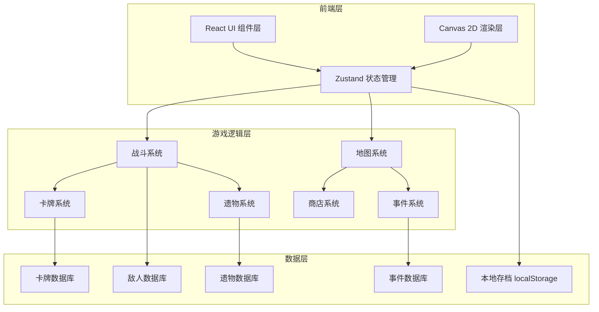
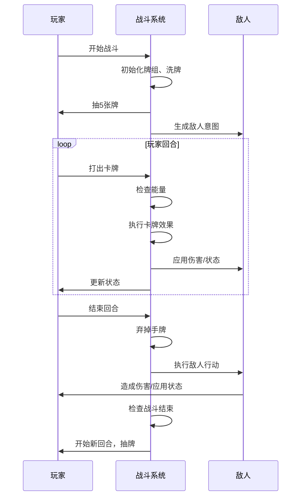

## 1. 架构设计



## 2. 技术描述

- **前端框架**: React@18 + TypeScript
- **构建工具**: Vite@5
- **样式方案**: TailwindCSS@3
- **状态管理**: Zustand
- **渲染引擎**: Canvas 2D API
- **动画库**: Framer Motion
- **图标**: Lucide React
- **数据持久化**: localStorage

## 3. 目录结构

```
src/
├── components/          # React 组件
│   ├── ui/             # 通用 UI 组件
│   ├── battle/         # 战斗相关组件
│   ├── map/            # 地图相关组件
│   ├── shop/           # 商店组件
│   ├── campfire/       # 篝火组件
│   ├── event/          # 事件组件
│   └── reward/         # 奖励组件
├── game/               # 游戏核心逻辑
│   ├── types/          # TypeScript 类型定义
│   ├── data/           # 游戏数据（卡牌、敌人、遗物）
│   ├── systems/        # 游戏系统
│   │   ├── CombatSystem.ts
│   │   ├── CardSystem.ts
│   │   ├── MapSystem.ts
│   │   ├── RelicSystem.ts
│   │   └── SaveSystem.ts
│   └── utils/          # 工具函数
├── store/              # Zustand 状态管理
│   └── useGameStore.ts
├── hooks/              # 自定义 Hooks
├── styles/             # 全局样式
└── App.tsx
```

## 4. 路由定义

| 路由 | 页面 | 功能 |
|------|------|------|
| / | 主菜单 | 开始游戏、继续游戏、职业选择 |
| /map | 地图界面 | 选择前进路径 |
| /battle | 战斗场景 | 回合制卡牌战斗 |
| /shop | 商店界面 | 购买/删除卡牌 |
| /campfire | 篝火界面 | 休息或升级卡牌 |
| /event | 事件界面 | 随机事件选择 |
| /reward | 奖励界面 | 选择卡牌奖励 |
| /deck | 牌组查看 | 查看当前牌组和遗物 |

## 5. 核心数据模型

### 5.1 卡牌数据模型

```typescript
interface Card {
  id: string;
  name: string;
  type: 'attack' | 'skill' | 'power';
  cost: number;
  rarity: 'basic' | 'common' | 'uncommon' | 'rare';
  description: string;
  upgradedDescription?: string;
  effects: CardEffect[];
  target: 'self' | 'single' | 'all' | 'none';
  exhausts?: boolean;
  isInnate?: boolean;
  isEthereal?: boolean;
}

interface CardEffect {
  type: 'damage' | 'block' | 'draw' | 'discard' | 'applyStatus' | 'exhaust' | 'energy';
  value: number;
  statusType?: 'weak' | 'vulnerable' | 'strength' | 'dexterity' | 'poison';
  target?: 'self' | 'enemy';
  condition?: Condition;
}
```

### 5.2 战斗实体模型

```typescript
interface CombatEntity {
  id: string;
  name: string;
  maxHp: number;
  currentHp: number;
  block: number;
  statusEffects: StatusEffect[];
}

interface Player extends CombatEntity {
  energy: number;
  maxEnergy: number;
  deck: Card[];
  hand: Card[];
  drawPile: Card[];
  discardPile: Card[];
  exhaustPile: Card[];
  relics: Relic[];
}

interface Enemy extends CombatEntity {
  intent: EnemyIntent;
  moveHistory: string[];
}
```

### 5.3 地图数据模型

```typescript
interface MapNode {
  id: string;
  type: 'enemy' | 'elite' | 'boss' | 'shop' | 'event' | 'campfire' | 'rest';
  x: number;
  y: number;
  connections: string[];
  completed: boolean;
  accessible: boolean;
}

interface GameMap {
  layers: MapNode[][];
  currentLayer: number;
  currentNodeId: string | null;
}
```

### 5.4 遗物数据模型

```typescript
interface Relic {
  id: string;
  name: string;
  rarity: 'common' | 'uncommon' | 'rare' | 'boss' | 'starter';
  description: string;
  effect: RelicEffect;
  counters?: number;
}

interface RelicEffect {
  trigger: 'onBattleStart' | 'onCardPlayed' | 'onDamageDealt' | 'onTurnStart' | 'onTurnEnd';
  action: RelicAction;
  condition?: Condition;
}
```

## 6. 战斗系统流程



## 7. 状态管理设计

### 7.1 游戏全局状态

```typescript
interface GameState {
  gamePhase: 'menu' | 'map' | 'battle' | 'shop' | 'campfire' | 'event' | 'reward' | 'deck' | 'victory' | 'defeat';
  playerCharacter: Character | null;
  currentMap: GameMap | null;
  currentBattle: BattleState | null;
  gold: number;
  potions: Potion[];
  relics: Relic[];
  deck: Card[];
  currentFloor: number;
}
```

### 7.2 战斗状态

```typescript
interface BattleState {
  turn: number;
  phase: 'player' | 'enemy';
  player: Player;
  enemies: Enemy[];
  selectedCard: Card | null;
  selectedEnemy: string | null;
  battleLog: string[];
  isAnimating: boolean;
}
```

## 8. 卡牌效果解释器

使用 DSL 风格的效果定义，通过解释器执行：

```typescript
// 卡牌效果示例 - 打击
{
  id: 'strike',
  name: '打击',
  type: 'attack',
  cost: 1,
  effects: [
    { type: 'damage', value: 6, target: 'enemy' }
  ]
}

// 卡牌效果示例 - 带条件的复杂卡牌
{
  id: 'cleave',
  name: '横扫',
  type: 'attack',
  cost: 1,
  effects: [
    { type: 'damage', value: 8, target: 'allEnemies' }
  ]
}
```

## 9. 存档系统

使用 localStorage 序列化游戏状态：

```typescript
interface SaveData {
  version: string;
  timestamp: number;
  gameState: GameState;
  seed: number;
}
```

支持自动保存和手动保存槽位。

## 10. 性能优化

- Canvas 渲染分层：静态背景层 + 动态角色层 + 特效层
- 对象池管理：重复使用动画粒子和伤害数字
- 虚拟滚动：牌组查看时只渲染可见区域
- 状态 memoization：使用 Zustand 的选择器优化重渲染
