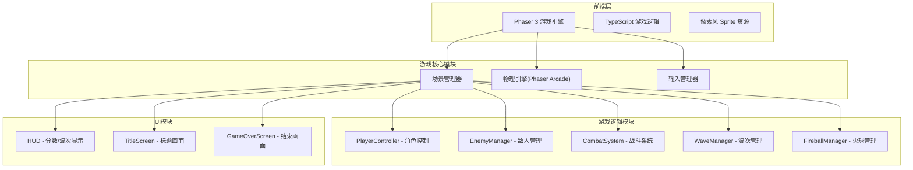

## 1. 架构设计



## 2. 技术说明

- 前端框架：Phaser 3 + TypeScript
- 构建工具：Vite
- 物理引擎：Phaser Arcade Physics（轻量2D物理）
- 状态管理：Phaser Scene 内置状态管理
- 无后端需求

## 3. 路由定义

| 场景(Phaser Scene) | 用途 |
|-----|------|
| BootScene | 加载资源、初始化配置 |
| TitleScene | 游戏标题画面 |
| GameScene | 主游戏场景 |
| GameOverScene | 游戏结束画面 |

## 4. 核心类设计

### 4.1 Player 类
- 属性：位置、速度、加速度、状态（idle/run/jump/headbutt/kick）
- 惯性系统：加速度/减速度缓冲、空中微调系数
- 顶板判定：跳跃时头部碰到平台触发

### 4.2 Enemy 基类及子类
- EnemyBase：位置、方向、状态（walk/flipped/sliding）、翻转计时器
- Turtle：低速、随机变向、翻转恢复5秒
- Crab：中速、追击AI、翻转恢复3秒
- FlyBug：空中飘移、上下波动、翻转恢复2秒

### 4.3 Platform 类
- 类型：普通平台（有顶面碰撞）、薄平台（可从下方穿过）
- 顶板反馈：抖动动画、碎片粒子效果

### 4.4 Fireball 类
- 沿平台水平滚动
- 碰墙反弹
- 速度随机变化

### 4.5 WaveManager 类
- 波次配置：出怪水管、敌人类型组合、出怪间隔
- 难度递增：水管数量、刷新速度、火球频率

## 5. 物理与碰撞设计

| 碰撞对 | 碰撞行为 |
|--------|---------|
| 玩家 vs 平台顶面 | 站立/行走 |
| 玩家头部 vs 平台底面 | 顶板判定 |
| 敌人 vs 平台 | 行走/站立 |
| 玩家 vs 翻倒敌人 | 踢飞判定 |
| 滑行敌人 vs 行走敌人 | 连锁消灭 |
| 玩家 vs 行走敌人 | 玩家受伤 |
| 玩家 vs 火球 | 玩家受伤 |
| 火球 vs 墙壁 | 反弹 |
| 火球 vs 平台边缘 | 掉落/继续滚动 |

## 6. 场景布局

```
┌─────────────────────────────────────┐
│  🟢水管        HUD        🟢水管   │  ← 顶部：两根水管+HUD
│═════════════════════════════════════│  ← 平台层4
│                                     │
│═════════════╗     ╔════════════════│  ← 平台层3（中间断开）
│             ║     ║                │
│════╗     ╔═══════════╗     ╔══════│  ← 平台层2（三段式）
│    ║     ║           ║     ║      │
│════════════════════════════════════│  ← 平台层1（地面）
└─────────────────────────────────────┘
```

## 7. 项目结构

```
src/
├── main.ts              # 入口文件，Phaser游戏配置
├── scenes/
│   ├── BootScene.ts     # 资源加载
│   ├── TitleScene.ts    # 标题画面
│   ├── GameScene.ts     # 主游戏场景
│   └── GameOverScene.ts # 游戏结束
├── entities/
│   ├── Player.ts        # 玩家角色
│   ├── Enemy.ts         # 敌人基类
│   ├── Turtle.ts        # 乌龟
│   ├── Crab.ts          # 螃蟹
│   ├── FlyBug.ts        # 飞虫
│   └── Fireball.ts      # 火球
├── systems/
│   ├── WaveManager.ts   # 波次管理
│   ├── CombatSystem.ts  # 战斗系统
│   └── InputManager.ts  # 输入管理
├── config/
│   └── gameConfig.ts    # 游戏常量配置
└── utils/
    └── helpers.ts       # 工具函数
```
