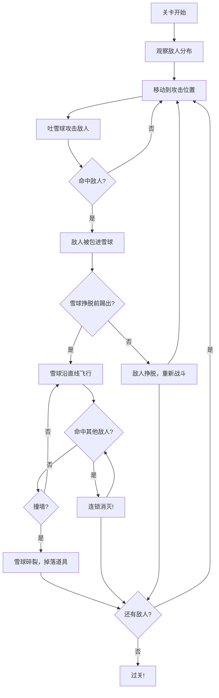

## 1. 产品概述

《雪人兄弟》单人动作平台游戏——忠实还原经典街机玩法的网页版。玩家操控圆滚滚的雪人，在固定单屏冰雪关卡中通过吐雪球包裹敌人、踢出雪球连锁消灭敌人的核心战斗机制，体验在冰雪世界里滚雪球清怪的爽快感。

- 目标用户：怀旧游戏玩家、休闲动作游戏爱好者
- 核心价值：规则简单但操作上限高，反复刷关追求更完美的连锁路线

## 2. 核心功能

### 2.1 玩家角色
| 能力 | 描述 |
|------|------|
| 左右移动 | 在平台上的基本移动 |
| 跳跃 | 跨越平台间隙和障碍 |
| 吐雪球 | 远程攻击，将敌人包裹进雪球 |
| 踢雪球 | 踢出成型的雪球，沿直线飞出打击其他敌人 |

### 2.2 核心战斗系统
| 机制 | 描述 |
|------|------|
| 雪球包裹 | 吐出雪球命中敌人后，敌人被包进雪球原地滚动无法行动 |
| 挣脱计时 | 被包住的敌人会在数秒后挣脱，雪球碎掉 |
| 踢出雪球 | 玩家靠近成型雪球时踢出，雪球沿踢出方向直线飞行 |
| 连锁反应 | 飞行中的雪球命中其他敌人，该敌人也被包进雪球继续滚动 |
| 墙壁碎裂 | 雪球撞墙会碎裂并掉落道具 |

### 2.3 敌人种类
| 敌人类型 | 行为特征 | 包裹难度 |
|----------|----------|----------|
| 基础巡逻怪 | 沿平台来回巡逻 | 挣脱时间长，反应窗口充足 |
| 跳跃怪 | 会跳跃躲避雪球 | 需要预判位置 |
| 投掷怪 | 会扔雪块反击，造成硬直 | 需要躲避攻击后反击 |
| 快速挣脱怪 | 被包住后挣扎极短 | 必须马上踢出 |
| Boss | 体型巨大，不会被完全包住 | 雪球命中后短暂晕眩，需连续攻击 |

### 2.4 道具系统
| 道具 | 效果 | 持续时间 |
|------|------|----------|
| 红色药水 | 提升移动速度 | 限时 |
| 蓝色药水 | 吐出更大雪球，更容易包住敌人 | 限时 |
| 黄色药水 | 踢出的雪球穿透敌人不碎裂 | 限时 |

### 2.5 关卡系统
- 固定单屏关卡，逐屏推进
- 平台类型：冰块平台、斜坡、浮动碎冰
- 后期关卡加入不可破坏的冰柱障碍
- Boss每几关出现一次

## 3. 核心流程

玩家进入游戏后从第一关开始，在单屏关卡中消灭所有敌人即可过关。核心战斗循环如下：

1. 玩家在关卡中移动，观察敌人分布和平台布局
2. 瞄准敌人吐出雪球，命中后敌人被包裹成雪球
3. 在雪球挣脱前跑过去踢出雪球
4. 雪球沿直线飞行，尝试穿过更多敌人形成连锁
5. 清除所有敌人后进入下一关

## 4. 用户界面设计

### 4.1 设计风格
- 可爱像素风格，忠实原作画风
- 主色调：冰蓝(#B8E8F8)、雪白(#F0F8FF)、深蓝(#1A3A5C)
- 强调色：暖橙(#FF8C42)用于重要UI元素
- 按钮风格：圆角像素按钮，3D凸起效果
- 字体：像素字体（如 Press Start 2P），小尺寸用于HUD
- 布局：全屏Canvas游戏画面，HUD叠加显示

### 4.2 页面设计概述
| 页面名称 | 模块名称 | UI元素 |
|----------|----------|--------|
| 标题画面 | 游戏标题 | 像素风大标题、飘雪背景、开始按钮 |
| 游戏画面 | HUD | 生命值、分数、关卡数、道具效果倒计时图标 |
| 游戏画面 | 游戏区域 | 固定单屏Canvas，平台、雪人、敌人、雪球 |
| 过关画面 | 过关提示 | 关卡完成动画、分数统计、下一关按钮 |
| 游戏结束 | 结束画面 | Game Over文字、最终分数、重新开始按钮 |

### 4.3 响应式
- 桌面优先，Canvas固定16:9比例，居中显示
- 支持键盘操控（方向键移动、Z吐雪球、X踢雪球）
- 游戏区域根据窗口大小等比缩放
