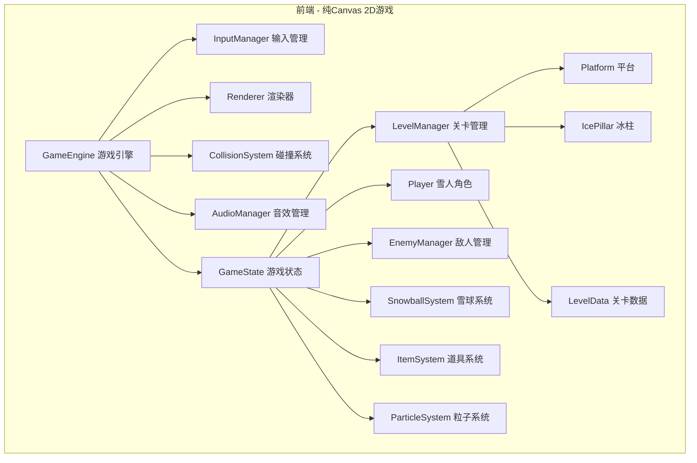
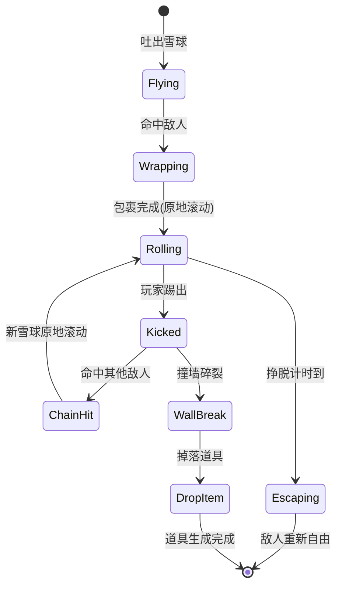

## 1. 架构设计



## 2. 技术说明
- 前端：纯 Canvas 2D + TypeScript + Vite
- 初始化工具：Vite
- 后端：无（纯前端游戏）
- 数据存储：localStorage（高分记录、进度存档）
- 音效：Web Audio API（程序化生成音效，无需外部音频文件）

## 3. 项目结构

```
src/
├── main.ts              # 入口文件，初始化游戏
├── engine/
│   ├── GameEngine.ts    # 游戏主循环
│   ├── InputManager.ts  # 键盘输入管理
│   ├── Renderer.ts      # Canvas渲染封装
│   ├── CollisionSystem.ts # 碰撞检测
│   └── Camera.ts        # 摄像机（单屏无需滚动）
├── entities/
│   ├── Player.ts        # 雪人角色
│   ├── Enemy.ts         # 敌人基类
│   ├── PatrolEnemy.ts   # 巡逻怪
│   ├── JumpEnemy.ts     # 跳跃怪
│   ├── ThrowEnemy.ts    # 投掷怪
│   ├── FastEnemy.ts     # 快速挣脱怪
│   └── Boss.ts          # Boss敌人
├── systems/
│   ├── SnowballSystem.ts # 雪球系统
│   ├── EnemyManager.ts  # 敌人管理
│   ├── ItemSystem.ts    # 道具系统
│   ├── LevelManager.ts  # 关卡管理
│   ├── ParticleSystem.ts # 粒子特效
│   └── AudioManager.ts  # 音效系统
├── data/
│   └── levels.ts        # 关卡数据定义
├── ui/
│   ├── HUD.ts           # 游戏HUD
│   ├── TitleScreen.ts   # 标题画面
│   ├── GameOverScreen.ts # 结束画面
│   └── StageClearScreen.ts # 过关画面
├── utils/
│   ├── Sprite.ts        # 像素精灵绘制工具
│   ├── Animation.ts     # 帧动画系统
│   └── Constants.ts     # 游戏常量
└── types.ts             # 类型定义
```

## 4. 核心系统设计

### 4.1 游戏循环
- 使用 requestAnimationFrame 驱动
- 固定时间步长物理更新（60fps）
- 渲染与逻辑分离

### 4.2 碰撞系统
- AABB矩形碰撞检测
- 平台碰撞使用单向平台（仅从上方着陆）
- 雪球与敌人碰撞触发包裹逻辑
- 踢出雪球与敌人碰撞触发连锁逻辑

### 4.3 雪球系统状态机


### 4.4 音效系统
- 使用 Web Audio API 程序化生成所有音效
- 吐雪球："噗"声（短促低频脉冲）
- 雪球滚动："咕噜咕噜"（周期性低频振荡）
- 碎裂声：清脆碎冰声（白噪音+高频衰减）
- 连锁消灭：音阶上升（逐次升高的短音）
- 踢出雪球："嘭"声（中频冲击）

### 4.5 渲染系统
- 所有图形使用Canvas 2D API程序化绘制像素风精灵
- 雪人：圆润身体+胡萝卜鼻子+礼帽，约24x32像素
- 敌人：不同颜色和形状的像素角色
- 雪球：白色圆形，带雪花拖尾粒子
- 平台：冰蓝色块状，带冰晶纹理
- 粒子效果：雪花拖尾、碎冰飞溅、挣扎表情气泡

### 4.6 关卡数据结构
```typescript
interface LevelData {
  id: number;
  platforms: Array<{x: number; y: number; w: number; h: number; type: 'ice' | 'slope' | 'float'}>;
  icePillars: Array<{x: number; y: number; h: number}>;
  enemies: Array<{type: EnemyType; x: number; y: number}>;
  isBoss: boolean;
}
```
