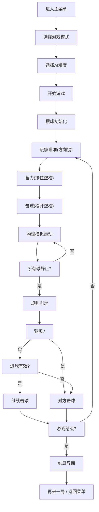

## 1. 产品概述

《花式撞球》是一款复古街机风格的俯视角台球游戏，通过纯手写物理引擎实现真实的击球体验。玩家使用方向键瞄准、蓄力击球，支持8球制、9球制及不规则球桌等多种玩法，搭配AI对手提供单人对战乐趣。

- 核心价值：在浏览器中重现街机厅台球的经典体验，融合精准物理模拟与策略性走位
- 目标用户：喜欢休闲竞技游戏、怀念街机台球的玩家

## 2. 核心功能

### 2.1 功能模块

1. **主菜单界面**：游戏模式选择、难度设置、规则说明
2. **游戏主界面**：台球桌渲染、球体运动、球杆瞄准、物理模拟
3. **游戏规则系统**：8球制、9球制、得分计算、犯规判定
4. **AI对手系统**：新手/中等/高级三种难度，模拟真实瞄准误差
5. **音效系统**：击球、库边反弹、进袋、胜利旋律
6. **UI系统**：比分显示、局数统计、蓄力条、犯规提示、辅助瞄准线

### 2.2 页面详情

| 页面名称 | 模块名称 | 功能描述 |
|-----------|-------------|---------------------|
| 主菜单 | 模式选择 | 8球制/9球制/不规则球桌三种模式切换 |
| 主菜单 | 难度设置 | 新手/中等/高级AI难度选择 |
| 主菜单 | 规则说明 | 展示各模式游戏规则 |
| 游戏界面 | 台球桌渲染 | 深绿色绒毛台面、原木色库边、六个袋口 |
| 游戏界面 | 球体系统 | 16个带编号的纯色球、母球高光、旋转动画 |
| 游戏界面 | 球杆控制 | 方向键旋转瞄准、蓄力键后拉蓄力、松开击球 |
| 游戏界面 | 物理引擎 | 碰撞检测、动量守恒、摩擦衰减、库边反弹、进袋判定 |
| 游戏界面 | 辅助系统 | 虚线瞄准线、力度条、击球预测 |
| 游戏界面 | 规则引擎 | 8球/9球规则判定、得分统计、犯规检测 |
| 游戏界面 | AI系统 | 自动瞄准、力度计算、误差模拟 |
| 游戏界面 | UI显示 | 比分、局数、当前玩家、犯规闪烁提示 |
| 游戏结束 | 结算界面 | 胜负显示、再来一局、返回菜单 |

## 3. 核心流程

## 4. 用户界面设计

### 4.1 设计风格

- **主色调**：深绿色(#0B5D1E)台面、原木色(#8B4513)库边、黑色(#1a1a1a)背景、金色(#FFD700)高光点缀
- **字体**：复古街机风格像素字体 + 清晰的无衬线字体组合
- **视觉风格**：复古街机质感，颗粒感噪点纹理，柔和的阴影层次
- **按钮风格**：圆角矩形、轻微3D凸起效果、悬停时发光反馈

### 4.2 页面设计概述

| 页面名称 | 模块名称 | UI元素 |
|-----------|-------------|-------------|
| 主菜单 | 标题区 | 大号复古字体"花式撞球"，带霓虹发光效果 |
| 主菜单 | 模式选择 | 三个卡片式按钮，悬停放大，选中高亮 |
| 主菜单 | 难度选择 | 横向滑动切换，三个等级图标化展示 |
| 游戏界面 | 台面 | 居中显示，深绿色带细腻噪点纹理 |
| 游戏界面 | 球体 | 纯色填充带编号，母球明显高光，碰撞时微变形 |
| 游戏界面 | 球杆 | 浅棕色木纹质感，蓄力时后拉动画 |
| 游戏界面 | 辅助线 | 白色虚线，蓄力时长度随力度变化 |
| 游戏界面 | 蓄力条 | 屏幕底部横向进度条，绿→黄→红渐变 |
| 游戏界面 | 顶部UI | 比分牌、局数显示、当前玩家标识 |
| 游戏结束 | 结算 | 大号胜负文字，庆祝动画，操作按钮 |

### 4.3 响应性

- 桌面端优先，Canvas自适应窗口大小，保持16:9比例
- 键盘操作：方向键瞄准，空格蓄力，ESC暂停
- 支持窗口缩放时自动调整渲染比例

## 5. 视觉与交互细节

### 5.1 动画效果
- 球滚动时带旋转动画（根据移动距离计算旋转角度）
- 碰撞瞬间球体微变形+屏幕轻微震动
- 进袋时球体沿袋口滑落的"扑通"动画
- 蓄力时球杆平滑后拉，击球时快速前冲
- 犯规文字闪烁提示（红底白字，闪烁3次）
- 胜利时播放简短的像素风格庆祝动画

### 5.2 音效设计
- 击球声：清脆的"啪"，力度越大音调越高
- 库边反弹：低沉的"咚"
- 进袋声："噗通"的闷响
- 犯规提示：短促的"嘀"警告音
- 胜利旋律：8-bit风格的小乐句
