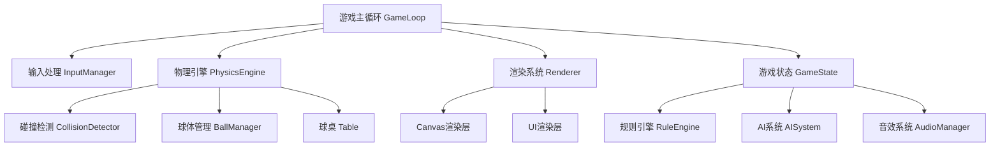

## 1. 架构设计



## 2. 技术描述

- **前端技术栈**：纯 TypeScript + Canvas 2D API + Vite
- **初始化工具**：`npm create vite@latest . -- --template vanilla-ts`
- **构建工具**：Vite 5.x
- **语言**：TypeScript 5.x
- **无后端依赖**，所有逻辑在前端完成
- **无第三方库**，物理引擎、渲染、AI全部手写实现

## 3. 项目结构

```
src/
├── types/              # 类型定义
│   └── game.ts         # 游戏核心类型
├── config/             # 配置常量
│   └── constants.ts    # 物理参数、颜色配置等
├── core/               # 核心引擎
│   ├── GameLoop.ts     # 游戏主循环
│   ├── PhysicsEngine.ts # 物理引擎
│   └── Collision.ts    # 碰撞检测
├── game/               # 游戏对象
│   ├── Ball.ts         # 球体类
│   ├── Cue.ts          # 球杆类
│   ├── Table.ts        # 球桌类
│   └── Pocket.ts       # 袋口类
├── rules/              # 游戏规则
│   ├── RuleEngine.ts   # 规则引擎基类
│   ├── EightBall.ts    # 8球规则
│   └── NineBall.ts     # 9球规则
├── ai/                 # AI系统
│   └── AISystem.ts     # AI对手逻辑
├── audio/              # 音效系统
│   └── AudioManager.ts # Web Audio API封装
├── ui/                 # UI系统
│   ├── UIManager.ts    # UI管理器
│   ├── Menu.ts         # 主菜单
│   └── HUD.ts          # 游戏内UI
├── input/              # 输入处理
│   └── InputManager.ts # 键盘输入管理
├── utils/              # 工具函数
│   ├── math.ts         # 数学工具
│   └── render.ts       # 渲染工具
├── main.ts             # 入口文件
└── style.css           # 全局样式
```

## 4. 核心数据结构

### 4.1 球体数据模型

```typescript
interface Ball {
  id: number;           // 球编号 (0=母球, 1-15=目标球)
  x: number;            // X坐标
  y: number;            // Y坐标
  vx: number;           // X方向速度
  vy: number;           // Y方向速度
  radius: number;       // 半径
  color: string;        // 颜色
  number: number;       // 显示数字
  rotation: number;     // 旋转角度
  isPotted: boolean;    // 是否进袋
  isStriped: boolean;   // 是否为花色球(8球制用)
  type: 'solid' | 'stripe' | 'cue' | 'eight';
}
```

### 4.2 游戏状态

```typescript
interface GameState {
  mode: 'eight-ball' | 'nine-ball' | 'irregular';
  difficulty: 'easy' | 'medium' | 'hard';
  currentPlayer: 1 | 2;
  player1Score: number;
  player2Score: number;
  player1Type: 'solid' | 'stripe' | null;
  player2Type: 'solid' | 'stripe' | null;
  isAiming: boolean;
  isCharging: boolean;
  chargePower: number;  // 0-1
  aimAngle: number;     // 瞄准角度(弧度)
  isGameOver: boolean;
  winner: 1 | 2 | null;
  foul: string | null;  // 犯规类型
  frame: number;        // 当前局数
}
```

### 4.3 物理参数常量

```typescript
const PHYSICS = {
  FRICTION: 0.995,          // 摩擦系数
  RESTITUTION_BALL: 0.95,   // 球之间弹性系数
  RESTITUTION_WALL: 0.85,   // 库边弹性系数
  MIN_VELOCITY: 0.05,       // 最小速度阈值
  BALL_RADIUS: 12,          // 球半径
  TABLE_WIDTH: 800,         // 桌面宽度
  TABLE_HEIGHT: 400,        // 桌面高度
  CUSHION_WIDTH: 20,        // 库边宽度
  POCKET_RADIUS: 22,        // 袋口半径
  MAX_POWER: 18,            // 最大击球力度
  POWER_RATE: 0.02,         // 蓄力速度
}
```

## 5. 核心算法

### 5.1 碰撞检测算法

```typescript
// 球与球碰撞检测
function checkBallCollision(b1: Ball, b2: Ball): boolean {
  const dx = b2.x - b1.x;
  const dy = b2.y - b1.y;
  const distance = Math.sqrt(dx * dx + dy * dy);
  return distance < b1.radius + b2.radius;
}

// 碰撞响应 - 动量守恒 + 能量守恒
function resolveBallCollision(b1: Ball, b2: Ball): void {
  const dx = b2.x - b1.x;
  const dy = b2.y - b1.y;
  const distance = Math.sqrt(dx * dx + dy * dy);
  
  // 法向量
  const nx = dx / distance;
  const ny = dy / distance;
  
  // 切向量
  const tx = -ny;
  const ty = nx;
  
  // 法向速度分量
  const v1n = b1.vx * nx + b1.vy * ny;
  const v2n = b2.vx * nx + b2.vy * ny;
  
  // 切向速度分量
  const v1t = b1.vx * tx + b1.vy * ty;
  const v2t = b2.vx * tx + b2.vy * ty;
  
  // 等质量弹性碰撞 - 交换法向速度
  const v1nAfter = v2n;
  const v2nAfter = v1n;
  
  // 转换回xy分量
  b1.vx = v1nAfter * nx + v1t * tx;
  b1.vy = v1nAfter * ny + v1t * ty;
  b2.vx = v2nAfter * nx + v2t * tx;
  b2.vy = v2nAfter * ny + v2t * ty;
  
  // 位置修正防止重叠
  const overlap = (b1.radius + b2.radius - distance) / 2;
  b1.x -= overlap * nx;
  b1.y -= overlap * ny;
  b2.x += overlap * nx;
  b2.y += overlap * ny;
}
```

### 5.2 库边反弹算法

```typescript
function resolveWallCollision(ball: Ball, table: Table): void {
  const { left, right, top, bottom } = table.playArea;
  
  // 左右库边
  if (ball.x - ball.radius < left) {
    ball.x = left + ball.radius;
    ball.vx = -ball.vx * RESTITUTION_WALL;
  } else if (ball.x + ball.radius > right) {
    ball.x = right - ball.radius;
    ball.vx = -ball.vx * RESTITUTION_WALL;
  }
  
  // 上下库边
  if (ball.y - ball.radius < top) {
    ball.y = top + ball.radius;
    ball.vy = -ball.vy * RESTITUTION_WALL;
  } else if (ball.y + ball.radius > bottom) {
    ball.y = bottom - ball.radius;
    ball.vy = -ball.vy * RESTITUTION_WALL;
  }
}
```

### 5.3 进袋检测算法

```typescript
function checkPocket(ball: Ball, pockets: Pocket[]): boolean {
  for (const pocket of pockets) {
    const dx = ball.x - pocket.x;
    const dy = ball.y - pocket.y;
    const distance = Math.sqrt(dx * dx + dy * dy);
    // 球心进入袋口半径的80%即算进袋
    if (distance < pocket.radius * 0.8) {
      return true;
    }
  }
  return false;
}
```

## 6. AI算法设计

### 6.1 新手级(Easy)
- 瞄准方向随机偏移 ±15°
- 力度随机 ±30% 误差
- 不考虑走位，只瞄准最近的可击球

### 6.2 中等级(Medium)
- 瞄准方向随机偏移 ±5°
- 力度随机 ±15% 误差
- 计算简单库边反弹路径
- 优先瞄准袋口附近的球

### 6.3 高级(Hard)
- 瞄准方向随机偏移 ±1°
- 力度精确控制 ±5%
- 预判母球走位，计算两杆以上的球路
- 会做防守球（斯诺克）

## 7. 性能优化

- **固定时间步长**：物理更新使用固定dt (16ms)，保证不同帧率下物理一致性
- **空间分区**：碰撞检测使用网格空间分区，减少O(n²)检测次数
- **对象池**：球体等游戏对象复用，避免频繁GC
- **离屏Canvas**：台面纹理预渲染到离屏Canvas，每帧直接贴图
- **静止休眠**：速度低于阈值的球标记为休眠，跳过物理更新
