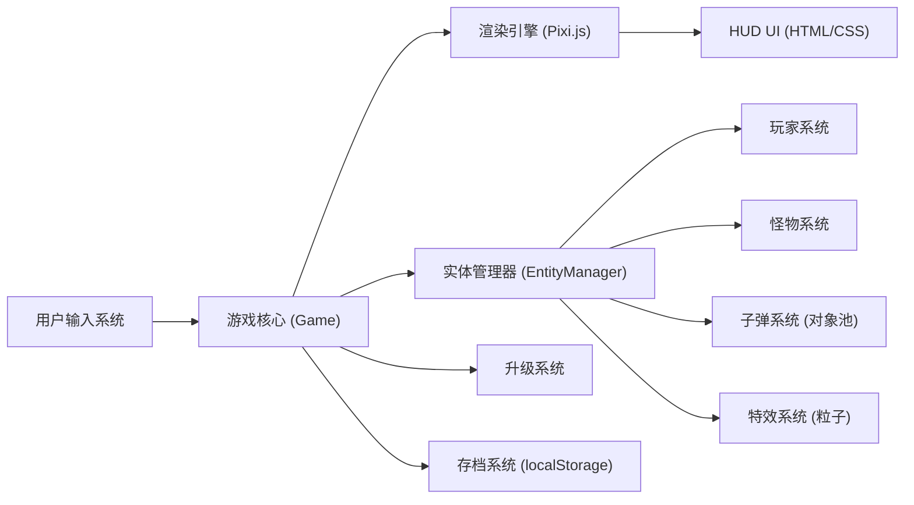

# 吸血鬼幸存者 - 技术架构文档

## 1. 架构设计



## 2. 技术栈

- **前端框架**：原生 TypeScript（无 React/Vue，直接操作 DOM 和 Pixi.js）
- **渲染引擎**：Pixi.js v7
- **打包工具**：Vite v5
- **开发语言**：TypeScript v5
- **样式**：原生 CSS
- **数据持久化**：localStorage

## 3. 项目结构

```
vampire/
├── src/
│   ├── core/              # 核心框架
│   │   ├── Game.ts        # 游戏主循环
│   │   ├── Input.ts       # 输入管理
│   │   ├── Entity.ts      # 实体基类
│   │   └── ObjectPool.ts  # 对象池
│   ├── entities/          # 游戏实体
│   │   ├── Player.ts      # 玩家
│   │   ├── Enemy.ts       # 怪物基类
│   │   ├── Bullet.ts      # 子弹
│   │   ├── ExpOrb.ts      # 经验球
│   │   ├── Chest.ts       # 宝箱
│   │   └── Boss.ts        # Boss
│   ├── systems/           # 游戏系统
│   │   ├── EnemySpawner.ts # 怪物生成器
│   │   ├── UpgradeSystem.ts # 升级系统
│   │   └── ParticleSystem.ts # 粒子系统
│   ├── config/            # 配置文件
│   │   ├── enemyTypes.ts  # 怪物类型配置
│   │   ├── upgrades.ts    # 强化效果配置
│   │   └── weapons.ts     # 武器配置
│   ├── ui/                # UI 组件
│   │   ├── HUD.ts         # 界面显示
│   │   └── UpgradePanel.ts # 升级面板
│   ├── utils/             # 工具函数
│   │   ├── math.ts        # 数学工具
│   │   └── storage.ts     # 存储工具
│   ├── assets/            # 资源
│   │   └── textures/      # 纹理（程序生成）
│   ├── types.ts           # 类型定义
│   └── main.ts            # 入口文件
├── index.html
├── package.json
├── tsconfig.json
└── vite.config.ts
```

## 4. 核心系统设计

### 4.1 实体组件系统 (简化版)

```typescript
// 实体基类
abstract class Entity {
  x: number;
  y: number;
  width: number;
  height: number;
  sprite: PIXI.Container;
  active: boolean;
  
  abstract update(delta: number): void;
  abstract destroy(): void;
}
```

### 4.2 对象池

```typescript
class ObjectPool&lt;T extends { active: boolean }&gt; {
  pool: T[];
  create: () =&gt; T;
  
  get(): T;
  release(item: T): void;
}
```

### 4.3 升级配置

```typescript
interface Upgrade {
  id: string;
  name: string;
  description: string;
  icon: string;
  type: 'attack' | 'defense' | 'speed' | 'special';
  apply: (player: Player) =&gt; void;
}
```

## 5. 关键优化策略

1. **对象池**：子弹、怪物、特效复用，减少 GC
2. **空间分区**：四叉树或网格索引，优化碰撞检测
3. **视锥体剔除**：只渲染屏幕内的实体
4. **纹理图集**：合并小纹理减少 draw call
5. **粒子系统**：使用 Pixi.js ParticleContainer 优化

