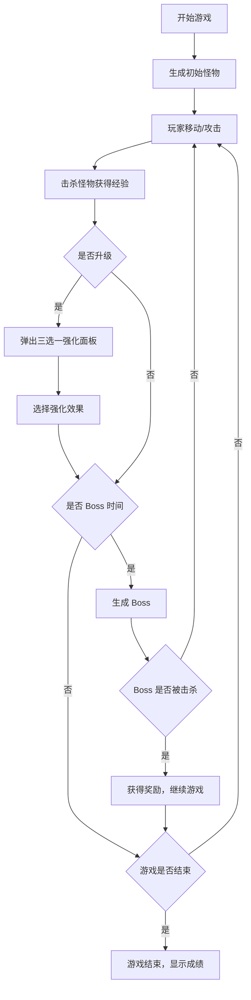

# 吸血鬼幸存者 - 俯视角割草生存游戏 PRD

## 1. 产品概述

一款俯视角的 Roguelike 割草生存游戏，玩家在不断刷新的怪物潮中生存，通过升级选择强化效果构筑独特 Build，击杀 Boss 获得胜利。
- 核心玩法：自动攻击 + 走位躲避 + Build 构筑
- 目标市场：休闲但有深度的 Roguelike 游戏爱好者

## 2. 核心功能

### 2.1 核心玩法模块

1. **游戏主界面**：Pixi.js 渲染的游戏场景，显示玩家、怪物、子弹、特效
2. **升级选择面板**：升级时弹出三选一强化选项
3. **HUD 界面**：显示血量、经验、等级、时间、击杀数
4. **菜单系统**：开始游戏、暂停、结束界面

### 2.2 功能详情

| 模块名称 | 功能描述 |
|----------|----------|
| 玩家系统 | WASD/方向键移动，自动攻击最近敌人 |
| 怪物系统 | 多种类型（近战、远程、分裂、精英），AI 行为树 |
| 攻击系统 | 自动发射子弹/挥动武器，对象池管理 |
| 升级系统 | 经验积累升级，三选一强化选择 |
| 道具系统 | 宝箱掉落一次性道具（清屏、无敌、经验翻倍） |
| Boss 系统 | 定时出现 Boss，独特攻击模式和血条 |
| 存档系统 | 保存最高记录、解锁内容 |

## 3. 核心流程

## 4. 用户界面设计

### 4.1 设计风格

- **主色调**：深色背景（#1a1a2e）+ 霓虹色强调（紫色 #9d4edd、红色 #e63946、青色 #4cc9f0）
- **视觉风格**：复古像素 + 现代霓虹效果，高对比度
- **字体**：像素字体（Press Start 2P）搭配无衬线字体
- **布局**：游戏场景居中，HUD 元素环绕四周

### 4.2 界面设计

| 界面名称 | 模块名称 | UI 元素 |
|----------|----------|---------|
| 游戏主界面 | 游戏场景 | 2000x2000 像素地图，地砖纹理，玩家在中心 |
| 游戏主界面 | HUD | 左上角：等级、经验条；右上角：时间、击杀数；底部：血量条 |
| 升级面板 | 强化选项 | 三个卡片式选项，带图标和描述，悬停动画 |
| Boss 界面 | Boss 血条 | 顶部宽血条，带 Boss 名称 |

### 4.3 响应性

- 桌面端为主，支持 1920x1080 及以上分辨率
- 移动端适配（虚拟摇杆）

