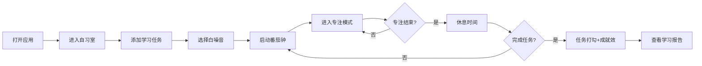

## 1. 产品概述

"同桌"是一个线上虚拟自习室应用，让用户在独自学习时感受到陪伴感，如同在图书馆中与他人共同自习。应用提供专注计时、任务管理、白噪音氛围和学习数据统计功能，帮助用户建立良好的学习习惯。

- **核心目标**：消除独自学习的孤独感，提升用户专注度和学习效率
- **目标用户**：学生、备考人群、远程工作者等需要长时间专注学习/工作的人群
- **产品价值**：通过"虚拟陪伴"+"专注工具"的组合，打造沉浸式的线上自习体验

## 2. 核心功能

### 2.1 用户角色

| 角色 | 注册方式 | 核心权限 |
|------|----------|----------|
| 普通用户 | 无需注册，本地存储 | 使用全部功能，数据存储在浏览器本地 |

### 2.2 功能模块

1. **自习室主页面**：在线人数显示、任务列表、番茄钟、白噪音控制
2. **专注模式**：极简全屏界面，仅显示倒计时和当前任务
3. **学习报告**：每日学习数据统计、一周专注时长趋势图表

### 2.3 页面详情

| 页面名称 | 模块名称 | 功能描述 |
|----------|----------|----------|
| 自习室主页 | 在线人数 | 模拟显示当前在线自习人数，营造陪伴感 |
| 自习室主页 | 任务列表 | 添加/删除/完成今日学习目标，完成时有成就感动效 |
| 自习室主页 | 番茄钟 | 默认25分钟专注+5分钟休息，可自定义时长 |
| 自习室主页 | 白噪音 | 提供雨声、图书馆、篝火、咖啡馆四种背景音 |
| 专注模式 | 极简界面 | 全屏沉浸模式，隐藏其他元素，避免分心 |
| 学习报告 | 数据统计 | 显示今日专注时长、完成任务数、周同比 |
| 学习报告 | 趋势图表 | ECharts展示近一周专注时长趋势 |

## 3. 核心流程

用户打开应用 → 看到自习室界面（显示在线人数）→ 添加今日学习任务 → 选择白噪音 → 启动番茄钟 → 进入专注模式 → 完成专注后休息 → 完成任务打勾 → 查看学习报告

## 4. 界面设计

### 4.1 设计风格

- **设计理念**：极简、安静、柔和，适合长时间停留
- **主色调**：柔和的米色/浅褐色背景 (#FAF8F5)，营造温暖安静的氛围
- **强调色**：柔和的苔绿色 (#7D9D8D) 作为主要强调色，用于按钮和交互元素
- **辅助色**：淡珊瑚色 (#E8A598) 用于休息状态和完成提示
- **字体**：使用系统无衬线字体，标题字重500，正文字重400，行高1.6
- **按钮风格**：圆角矩形 (8px)，轻微阴影，悬停时有微妙的颜色变化
- **布局风格**：大量留白，卡片式布局，元素间距宽松
- **图标风格**：线性简约图标，避免过于花哨

### 4.2 页面设计概览

| 页面名称 | 模块名称 | UI元素 |
|----------|----------|--------|
| 自习室主页 | 头部 | 应用名称"同桌"，学习报告入口 |
| 自习室主页 | 在线人数 | 小图标+人数数字，轻微呼吸动画 |
| 自习室主页 | 任务列表 | 卡片式任务项，复选框，删除按钮 |
| 自习室主页 | 番茄钟 | 大尺寸倒计时显示，开始/暂停/重置按钮 |
| 自习室主页 | 白噪音 | 四个音效图标按钮，音量滑块 |
| 专注模式 | 全屏界面 | 黑色背景，居中倒计时，当前任务名，退出按钮 |
| 学习报告 | 数据卡片 | 三个数据指标卡片 |
| 学习报告 | 图表区域 | ECharts折线图，显示一周数据 |

### 4.3 响应式设计

- **设计策略**：桌面端优先，移动端自适应
- **桌面端**：三栏布局（任务列表在左，番茄钟居中，白噪音在右）
- **平板端**：两栏布局（任务列表在上半部分，番茄钟和白噪音在下半部分）
- **移动端**：单列垂直布局，各模块堆叠
- **专注模式**：在所有设备上都启用全屏，移动端支持横屏沉浸体验
- **触控优化**：移动端按钮最小高度48px，足够的触控间距

### 4.4 动效设计

- 任务完成时：微妙的缩放动画 + 彩色纸屑效果（克制不夸张）
- 番茄钟切换：淡入淡出过渡
- 页面元素加载：轻微的上移+淡入动画（staggered效果）
- 在线人数：缓慢的呼吸动画（透明度变化）
- 专注模式进入/退出：平滑的背景色过渡
