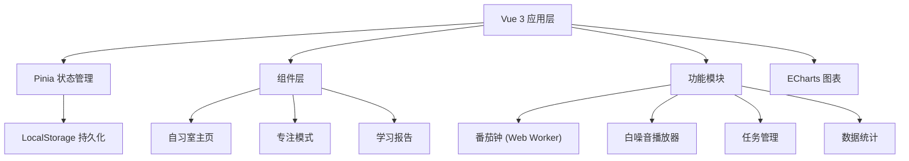

## 1. 架构设计



## 2. 技术选型

- **前端框架**: Vue 3 + Composition API + TypeScript
- **构建工具**: Vite
- **状态管理**: Pinia
- **样式方案**: Tailwind CSS 3
- **路由管理**: Vue Router
- **图表库**: ECharts
- **图标库**: Lucide Vue
- **数据持久化**: LocalStorage (Pinia plugin)

## 3. 路由定义

| 路由 | 页面 | 说明 |
|------|------|------|
| / | StudyRoom | 自习室主页面 |
| /focus | FocusMode | 专注模式页面 |
| /report | StudyReport | 学习报告页面 |

## 4. 数据模型

### 4.1 状态管理数据结构

```typescript
// 任务
interface Task {
  id: string
  title: string
  completed: boolean
  createdAt: number
  completedAt?: number
}

// 番茄钟状态
interface PomodoroState {
  mode: 'focus' | 'break'
  duration: number
  remaining: number
  isRunning: boolean
  startTime?: number
  endTime?: number
}

// 白噪音
interface WhiteNoise {
  id: 'rain' | 'library' | 'fire' | 'cafe'
  name: string
  icon: string
  active: boolean
  volume: number
}

// 学习记录
interface StudyRecord {
  date: string
  focusMinutes: number
  completedTasks: number
}

// 应用全局状态
interface AppState {
  tasks: Task[]
  pomodoro: {
    focusDuration: number
    breakDuration: number
  }
  whiteNoise: WhiteNoise[]
  records: StudyRecord[]
  onlineCount: number
}
```

### 4.2 Pinia Store 结构

```typescript
// stores/task.ts - 任务管理
// stores/pomodoro.ts - 番茄钟状态
// stores/noise.ts - 白噪音控制
// stores/statistics.ts - 学习统计
```

## 5. 核心组件结构

```
src/
├── components/
│   ├── OnlineCounter.vue      # 在线人数显示
│   ├── TaskList.vue           # 任务列表
│   ├── TaskItem.vue           # 单个任务项
│   ├── PomodoroTimer.vue      # 番茄钟
│   ├── WhiteNoisePanel.vue    # 白噪音面板
│   ├── ConfettiEffect.vue     # 成就动效
│   └── WeeklyChart.vue        # 周数据图表
├── pages/
│   ├── StudyRoom.vue          # 自习室主页
│   ├── FocusMode.vue          # 专注模式页
│   └── StudyReport.vue        # 学习报告页
├── composables/
│   ├── usePomodoro.ts         # 番茄钟逻辑
│   ├── useWhiteNoise.ts       # 白噪音播放
│   └── useLocalStorage.ts     # 本地存储
├── stores/
│   ├── task.ts                # 任务状态
│   ├── pomodoro.ts            # 番茄钟状态
│   └── statistics.ts          # 统计数据
└── utils/
    └── time.ts                # 时间工具函数
```

## 6. 番茄钟实现方案

### 6.1 后台计时准确性保证

```typescript
// composables/usePomodoro.ts
// 使用 Date.now() 计算时间差，而非 setInterval 累计
export function usePomodoro() {
  let startTime: number
  let totalDuration: number
  
  function start() {
    startTime = Date.now()
    // 每秒更新显示，但实际剩余时间通过时间差计算
    timer = setInterval(() => {
      const elapsed = Date.now() - startTime
      remaining = Math.max(0, totalDuration * 1000 - elapsed)
    }, 1000)
  }
  
  // 页面可见性变化时重新校准
  document.addEventListener('visibilitychange', () => {
    if (!document.hidden && isRunning) {
      const elapsed = Date.now() - startTime
      remaining = Math.max(0, totalDuration * 1000 - elapsed)
    }
  })
}
```

## 7. 本地存储方案

- 使用 Pinia plugin 自动持久化状态到 LocalStorage
- 关键数据：任务列表、番茄钟设置、学习记录、白噪音偏好
- 每天自动归档学习数据到历史记录

## 8. 性能优化点

1. 番茄钟使用 requestAnimationFrame 或 setInterval(1000) 避免高频更新
2. 白噪音音频资源按需加载，使用 Audio 对象复用
3. ECharts 图表懒加载，只在报告页面初始化
4. 专注模式页面简化 DOM 结构，减少重绘
