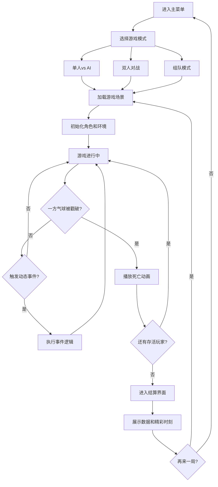

## 1. 产品概述

本项目是一款致敬FC经典《气球大战》的空中对决游戏，采用Phaser 3 + TypeScript技术栈开发。玩家操控头戴充气气球帽的角色，在固定单屏场景中通过"扑腾"式移动与对手展开浮空缠斗，通过碰撞戳破对方气球获得胜利。

- **核心玩法**：按键充气上升、松手下落的独特物理手感，碰撞攻击，道具策略
- **目标用户**：休闲游戏玩家、多人派对游戏爱好者、FC经典游戏怀旧玩家
- **产品价值**：提供快节奏、易上手、富有策略性的本地多人对战体验，强调嬉笑怒骂的游戏氛围

## 2. 核心功能

### 2.1 用户角色

| 角色 | 注册方式 | 核心权限 |
|------|----------|----------|
| 玩家1 | 本地键盘WASD+空格 | 操控蓝色角色进行游戏 |
| 玩家2 | 本地键盘方向键+回车 | 操控红色角色进行游戏 |
| AI玩家 | 自动生成 | 提供单人模式下的对战对手 |

### 2.2 功能模块

1. **主菜单界面**：游戏模式选择、操作说明、开始游戏
2. **游戏对战场景**：核心玩法区域，包含角色、环境、道具、动态事件
3. **结算界面**：本局数据统计、精彩时刻回放、再来一局选项

### 2.3 页面详情

| 页面名称 | 模块名称 | 功能描述 |
|-----------|-------------|---------------------|
| 主菜单 | 模式选择 | 单人vs AI、双人对战、组队模式选择 |
| 主菜单 | 操作说明 | 展示按键配置和游戏规则 |
| 游戏场景 | 角色控制 | 充气上升、左右移动、碰撞检测 |
| 游戏场景 | 充气系统 | 充气量管理、消耗与恢复、冷却机制 |
| 游戏场景 | 环境元素 | 云朵平台、石柱、尖刺、彩色补给气球 |
| 游戏场景 | 道具系统 | 闪电靴、护盾、油桶、分身术四种道具 |
| 游戏场景 | 动态事件 | 乌云层、候鸟群、雷电天气 |
| 游戏场景 | 死亡特效 | 气球爆裂、惨叫、乱飞坠落、拖人下水 |
| 结算界面 | 数据统计 | 戳破数、存活时间、坠落击杀数 |
| 结算界面 | 精彩回放 | 展示本局关键瞬间 |

## 3. 核心流程

## 4. 用户界面设计

### 4.1 设计风格

- **主色调**：天空蓝 (#87CEEB) 作为背景主色，搭配鲜艳的角色色彩——玩家1蓝色 (#4169E1)、玩家2红色 (#DC143C)
- **辅助色**：云朵白 (#FFFFFF)、石柱灰 (#708090)、尖刺黑 (#2F4F4F)、气球彩色渐变
- **按钮风格**：圆润像素风按钮，带有3D立体效果，悬停时有轻微放大动画
- **字体**：采用像素风格字体 (Press Start 2P) 搭配圆润的无衬线字体，标题使用像素字体，正文使用圆润字体
- **布局风格**：单屏固定场景，UI元素采用像素画风格，边缘留有安全区域
- **视觉风格**：致敬FC原作的鲜艳色彩和圆润角色设计，带有现代粒子特效

### 4.2 页面设计概述

| 页面名称 | 模块名称 | UI元素 |
|-----------|-------------|-------------|
| 主菜单 | 标题区域 | 大像素字体"气球大战"，飘动的气球装饰动画 |
| 主菜单 | 模式选择 | 三个大按钮竖向排列，选中状态有呼吸灯效果 |
| 主菜单 | 操作说明 | 底部半透明区域展示按键图示和规则简介 |
| 游戏场景 | HUD界面 | 左上角玩家1充气量条、右上角玩家2充气量条、中间计时器 |
| 游戏场景 | 角色 | 圆润小人+头顶气球，充气时气球脉动放大 |
| 游戏场景 | 环境 | 飘动的云朵平台、灰色石柱、尖刺警示标记 |
| 游戏场景 | 道具 | 发光的道具图标，漂浮动画 |
| 游戏场景 | 动态事件 | 乌云遮罩效果、闪电闪烁、候鸟飞行轨迹 |
| 结算界面 | 标题 | "游戏结束"像素大字，气球爆裂特效背景 |
| 结算界面 | 数据面板 | 三栏数据卡片，带图标和数值动画 |
| 结算界面 | 精彩时刻 | 滚动展示关键事件文字记录 |
| 结算界面 | 操作按钮 | "再来一局"和"返回菜单"按钮 |

### 4.3 响应性

- 采用桌面端优先设计，固定分辨率 960x640
- 支持窗口缩放，保持画面比例
- 键盘操作优化，支持手柄输入
- 双人模式按键区域不重叠，操作舒适

### 4.4 游戏场景设计

- **环境/HDRI氛围**：明亮的天空背景，带渐变和云朵纹理
- **光照设置**：2D像素风格，无复杂光照，使用色彩对比区分元素
- **摄像机设置**：固定单屏，无滚动，居中显示
- **构图和焦点**：角色位于场景中央区域，环境元素分布在四周
- **交互和动画**：气球充气脉动、云朵漂浮、角色扑腾动画、道具旋转
- **后期处理效果**：气球爆裂粒子、闪电闪光、乌云半透明遮罩
- **资源和性能**：所有图形使用Canvas绘制，无外部图片资源，确保流畅60fps
