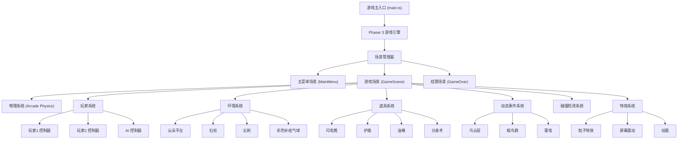

## 1. 架构设计



## 2. 技术描述

- **前端框架**: Phaser 3.70.0 + TypeScript 5.3
- **构建工具**: Vite 5.0
- **物理引擎**: Phaser Arcade Physics (自定义重力和推力模拟)
- **状态管理**: Phaser Scene 原生状态管理 + 简单数据对象
- **样式方案**: 纯Canvas绘制，无CSS样式文件
- **音频**: Web Audio API (Phaser Sound Manager)
- **输入设备**: 键盘输入 + 手柄支持 (Phaser Input)

### 2.1 核心技术要点

1. **自定义物理模拟**
   - Arcade Physics 每帧手动施加向上推力模拟充气上升
   - 配置阻尼系数和最大速度约束手感
   - 松开按键后应用自然重力下落

2. **充气量系统**
   - 数值条管理，按键消耗，不按时缓慢恢复
   - 冷却机制：气量耗尽后短暂锁死
   - 道具可修改恢复速率和最大气量

3. **碰撞检测**
   - 玩家vs玩家：检测身体碰撞，高位置玩家攻击低位置玩家气球
   - 玩家vs环境：尖刺直接爆球，云朵平台提供支撑
   - 玩家vs道具：拾取触发效果
   - 碰撞体比视觉略小，提供操作宽容度

4. **动态事件系统**
   - 定时器触发随机事件
   - 乌云层：半透明遮罩，隐藏玩家位置
   - 候鸟群：横向飞过，触碰爆球
   - 雷电：随机位置劈下，预警后击中

## 3. 目录结构

```
balloonfight/
├── src/
│   ├── main.ts                    # 游戏入口
│   ├── config/
│   │   └── GameConfig.ts          # 游戏配置常量
│   ├── scenes/
│   │   ├── MainMenu.ts            # 主菜单场景
│   │   ├── GameScene.ts           # 核心游戏场景
│   │   └── GameOver.ts            # 结算场景
│   ├── game/
│   │   ├── Player.ts              # 玩家类
│   │   ├── PlayerController.ts    # 玩家控制器
│   │   ├── AIController.ts        # AI控制器
│   │   ├── InflationSystem.ts     # 充气量系统
│   │   ├── CollisionManager.ts    # 碰撞管理器
│   │   └── GameStats.ts           # 游戏统计数据
│   ├── environment/
│   │   ├── Cloud.ts               # 云朵平台
│   │   ├── Pillar.ts              # 石柱
│   │   ├── Spike.ts               # 尖刺
│   │   └── ColorBalloon.ts        # 彩色补给气球
│   ├── powerups/
│   │   ├── PowerUp.ts             # 道具基类
│   │   ├── LightningBoots.ts      # 闪电靴
│   │   ├── Shield.ts              # 护盾
│   │   ├── OilBarrel.ts           # 油桶
│   │   └── Clone.ts               # 分身术
│   ├── events/
│   │   ├── DarkClouds.ts          # 乌云层事件
│   │   ├── MigratoryBirds.ts      # 候鸟群事件
│   │   └── Lightning.ts           # 雷电事件
│   └── utils/
│       ├── PhysicsHelper.ts       # 物理辅助函数
│       ├── AnimationHelper.ts     # 动画辅助函数
│       └── ParticleEffects.ts     # 粒子特效
├── public/
│   └── assets/                    # 静态资源（如需要）
├── index.html
├── package.json
├── tsconfig.json
├── vite.config.ts
└── tailwind.config.js
```

## 4. 核心类定义

### 4.1 Player 类

```typescript
class Player {
  id: number;
  x: number;
  y: number;
  velocityX: number;
  velocityY: number;
  color: number;
  isAlive: boolean;
  balloon: Balloon;
  inflation: InflationSystem;
  powerUps: PowerUp[];
  isDying: boolean;
  deathAnimation: Phaser.Tweens.Tween;
  
  inflate(): void;
  moveLeft(): void;
  moveRight(): void;
  update(delta: number): void;
  takeDamage(attacker: Player): boolean;
  applyPowerUp(powerUp: PowerUp): void;
  startDeathAnimation(): void;
}
```

### 4.2 InflationSystem 类

```typescript
class InflationSystem {
  current: number;
  max: number;
  drainRate: number;
  recoverRate: number;
  isCoolingDown: boolean;
  cooldownTimer: number;
  
  drain(amount: number): boolean;
  recover(delta: number): void;
  refill(): void;
  canInflate(): boolean;
}
```

### 4.3 GameConfig 配置

```typescript
const GameConfig = {
  WIDTH: 960,
  HEIGHT: 640,
  GRAVITY: 500,
  INFLATE_THRUST: -800,
  MAX_FALL_SPEED: 400,
  MOVE_SPEED: 200,
  AIR_RESISTANCE: 0.98,
  INFLATION_DRAIN_RATE: 30,
  INFLATION_RECOVER_RATE: 15,
  INFLATION_COOLDOWN: 1000,
  BALLOON_RADIUS: 24,
  PLAYER_BODY_RADIUS: 16,
  CLOUD_LIFETIME: 5000,
  POWERUP_DURATION: 5000,
  EVENT_INTERVAL: 15000,
};
```

## 5. 游戏状态定义

### 5.1 游戏状态枚举

```typescript
enum GameState {
  MENU = 'menu',
  PLAYING = 'playing',
  PAUSED = 'paused',
  GAME_OVER = 'game_over',
}

enum GameMode {
  SINGLE_PLAYER = 'single',
  TWO_PLAYER = 'two_player',
  TEAM_MODE = 'team_mode',
}
```

### 5.2 游戏统计数据

```typescript
interface GameStats {
  player1Stats: PlayerStats;
  player2Stats: PlayerStats;
  matchTime: number;
  highlights: Highlight[];
}

interface PlayerStats {
  kills: number;
  survivalTime: number;
  deaths: number;
  powerUpsCollected: number;
  fallKills: number;
}

interface Highlight {
  time: number;
  type: 'kill' | 'death' | 'powerup' | 'event' | 'fall_kill';
  description: string;
}
```

## 6. 输入控制映射

| 玩家 | 左移 | 右移 | 充气 |
|------|------|------|------|
| 玩家1 | A | D | 空格 |
| 玩家2 | ← | → | 回车 |

## 7. 性能优化策略

1. **对象池**：复用粒子特效、候鸟等频繁创建销毁的对象
2. **空间分区**：碰撞检测只处理邻近对象
3. **固定帧率**：游戏逻辑固定60fps更新，渲染可插值
4. **Canvas绘制优化**：尽量减少绘制调用，使用离屏Canvas缓存静态元素
5. **内存管理**：场景切换时清理所有资源，避免内存泄漏
