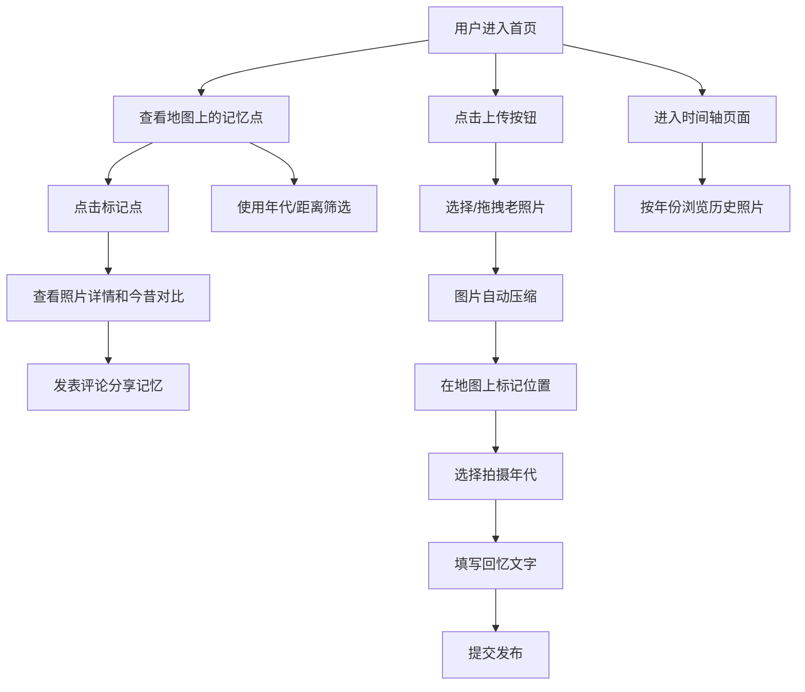

## 1. 产品概述

"城市记忆"是一个让用户在地图上分享城市老照片、对比今昔变化的网页应用。用户可以上传老照片，标记拍摄位置和年代，分享回忆故事，形成一个围绕城市历史的互动社区。

- 核心价值：通过地图可视化和今昔对比，唤起城市记忆，连接过去与现在
- 目标用户：城市居民、历史爱好者、摄影爱好者、怀旧人群

## 2. 核心功能

### 2.1 用户角色
| 角色 | 注册方式 | 核心权限 |
|------|----------|----------|
| 普通用户 | 无需注册（匿名上传/浏览） | 上传照片、浏览记忆点、发表评论 |

### 2.2 功能模块
1. **首页（地图浏览）**：地图展示、标记点聚合、年代筛选、距离筛选
2. **照片详情**：老照片展示、今昔对比（分屏）、回忆文字、评论区
3. **上传照片**：图片上传、位置标记、年代选择、回忆文字编辑
4. **时间轴**：按年份排列所有照片，历史画册式浏览

### 2.3 页面详情
| 页面名称 | 模块名称 | 功能描述 |
|---------|---------|----------|
| 首页 | 地图区域 | 高德地图展示，标记点聚合显示，点击标记点查看详情 |
| 首页 | 筛选栏 | 按年代筛选（80年代/90年代/00年代/全部），按距离筛选 |
| 首页 | 导航栏 | Logo、导航链接（地图/时间轴/上传） |
| 详情页 | 照片展示 | 老照片大图、拍摄信息、年代标签 |
| 详情页 | 今昔对比 | 分屏对比：左侧老照片，右侧当前街景/地图 |
| 详情页 | 回忆故事 | 用户分享的回忆文字 |
| 详情页 | 评论区 | 查看和发表评论 |
| 上传页 | 图片上传 | 拖拽/选择上传、图片预览、大小限制、自动压缩 |
| 上传页 | 信息填写 | 位置标记、年代选择、回忆文字 |
| 时间轴 | 年份导航 | 按年份排列的照片列表，滚动浏览 |

## 3. 核心流程

## 4. 用户界面设计

### 4.1 设计风格
- **主色调**：怀旧米黄色 (#F5EFE0) 作为底色，深褐色 (#4A3728) 作为主文字，暖橙色 (#D4702C) 作为强调色
- **辅助色**：报纸质感的深灰色 (#6B5D50)，照片边框的古铜色 (#8B7355)
- **按钮风格**：圆角矩形，微微凸起的复古按钮效果，悬停时有按压反馈
- **字体**：标题使用具有复古感的宋体/衬线字体，正文使用清晰易读的无衬线字体
- **布局风格**：卡片式设计，带有轻微的纸张纹理阴影，模拟老照片/报纸质感
- **图标风格**：线性复古风格图标，颜色与主题协调

### 4.2 页面设计概述
| 页面名称 | 模块名称 | UI 元素 |
|---------|---------|---------|
| 首页 | 地图区域 | 全屏地图、聚合标记点（不同年代不同颜色）、怀旧边框 |
| 首页 | 筛选栏 | 年代标签按钮组、下拉选择器、淡入淡出动画 |
| 首页 | 导航栏 | 复古报纸标题样式、导航链接悬停下划线效果 |
| 详情页 | 对比区域 | 分屏滑块、老照片做旧效果、当前地图街景 |
| 详情页 | 评论区 | 便签式评论卡片、时间戳、昵称 |
| 上传页 | 上传区域 | 虚线边框拖拽区、图片预览缩略图、进度条 |
| 时间轴 | 时间线 | 垂直时间线、年份标记、照片卡片交错排列 |

### 4.3 响应式
- 桌面端优先，移动端自适应
- 地图在移动端保持全屏，筛选栏转为底部抽屉
- 详情页分屏在移动端转为上下布局
- 触摸优化：增大点击区域，支持手势缩放

### 4.4 动效设计
- 页面加载：照片卡片 staggered 淡入效果
- 标记点：弹跳出现动画
- 悬停：卡片微微上浮、阴影加深
- 转场：页面切换使用淡入淡出 + 轻微位移
