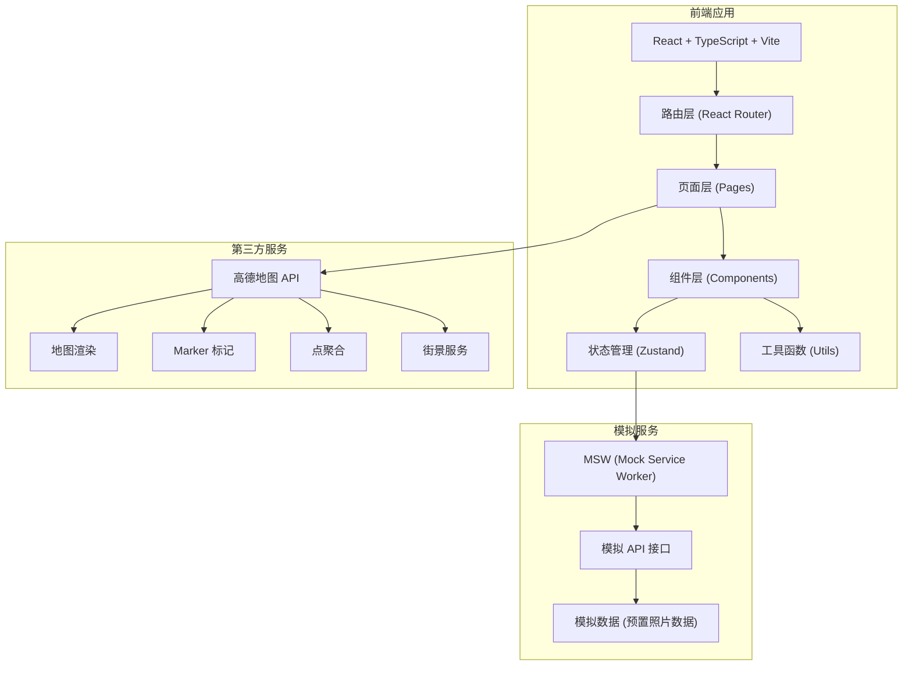
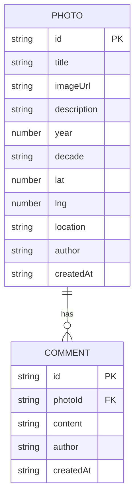

## 1. 架构设计



## 2. 技术描述

- **前端框架**：React@18 + TypeScript@5 + Vite@5
- **构建工具**：Vite
- **样式方案**：TailwindCSS@3
- **状态管理**：Zustand
- **路由管理**：React Router DOM@6
- **模拟服务**：MSW@2 (Mock Service Worker)
- **地图服务**：高德地图 JS API
- **图标库**：Lucide React
- **图片处理**：浏览器原生 Canvas API (压缩图片)

## 3. 路由定义

| 路由 | 页面 | 功能 |
|------|------|------|
| `/` | 首页 (MapPage) | 地图浏览、标记点展示、筛选 |
| `/photo/:id` | 详情页 (PhotoDetailPage) | 照片详情、今昔对比、评论 |
| `/upload` | 上传页 (UploadPage) | 照片上传、位置标记、信息填写 |
| `/timeline` | 时间轴 (TimelinePage) | 按年份浏览照片 |

## 4. 数据模型

### 4.1 实体关系图



### 4.2 TypeScript 类型定义

```typescript
// 照片实体
interface Photo {
  id: string;
  title: string;
  imageUrl: string;
  description: string;
  year: number;
  decade: '1970s' | '1980s' | '1990s' | '2000s' | '2010s' | '2020s';
  lat: number;
  lng: number;
  location: string;
  author: string;
  createdAt: string;
}

// 评论实体
interface Comment {
  id: string;
  photoId: string;
  content: string;
  author: string;
  createdAt: string;
}

// 筛选条件
interface FilterOptions {
  decade?: string;
  radius?: number;
  centerLat?: number;
  centerLng?: number;
}
```

## 5. 目录结构

```
src/
├── components/          # 可复用组件
│   ├── Map/            # 地图相关组件
│   ├── Photo/          # 照片相关组件
│   ├── UI/             # 基础UI组件
│   └── Layout/         # 布局组件
├── pages/              # 页面组件
│   ├── MapPage.tsx
│   ├── PhotoDetailPage.tsx
│   ├── UploadPage.tsx
│   └── TimelinePage.tsx
├── hooks/              # 自定义Hooks
│   ├── useMap.ts
│   └── usePhotos.ts
├── store/              # Zustand状态管理
│   └── photoStore.ts
├── utils/              # 工具函数
│   ├── imageCompress.ts
│   └── dateFormat.ts
├── types/              # TypeScript类型定义
│   └── index.ts
├── mocks/              # MSW模拟数据
│   ├── browser.ts
│   ├── handlers.ts
│   └── data/
│       └── photos.ts
├── styles/             # 全局样式
│   └── globals.css
├── App.tsx
├── main.tsx
└── router.tsx
```

## 6. 核心功能实现要点

### 6.1 地图集成
- 使用高德地图 JS API v2.0
- 实现 Marker 标记点，不同年代使用不同颜色
- 使用 AMap.MarkerClusterer 实现点聚合
- 街景功能使用 AMap.StreetView

### 6.2 图片上传与压缩
- 支持拖拽上传和文件选择
- 使用 Canvas API 进行前端压缩，限制最大 2MB
- 支持预览功能

### 6.3 模拟数据
- 使用 MSW 在浏览器层面拦截 API 请求
- 预置 15-20 张有故事的老照片数据（以上海/北京地标为例）
- 模拟照片列表、详情、评论、上传等接口

### 6.4 年代筛选
- 按 decades 分组：1970s, 1980s, 1990s, 2000s, 2010s, 2020s
- 前端筛选实现，点击年代按钮即时过滤地图上的标记点
