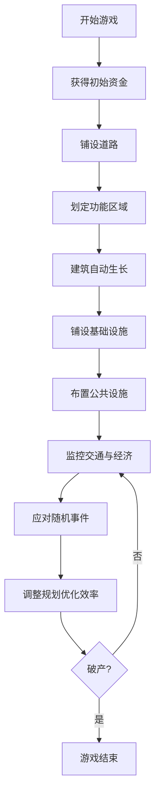

## 1. 产品概述

等角视角2D城市建造经营游戏，聚焦街区规模的城市规划与管理。玩家通过规划道路、划定功能区域、铺设基础设施、布置公共设施来发展城市，同时应对交通拥堵、随机事件和经济平衡挑战。

- 核心玩法：城市规划、资源管理、交通仿真、事件应对
- 目标用户：模拟经营游戏爱好者、策略游戏玩家
- 市场价值：提供深度的城市规划体验，兼具教育性与娱乐性

## 2. 核心功能

### 2.1 用户角色

| 角色 | 注册方式 | 核心权限 |
|------|----------|----------|
| 玩家 | 本地存档 | 完整游戏体验、存档管理 |

### 2.2 功能模块

1. **游戏主界面**：等角地图渲染、工具选择栏、信息面板、状态栏
2. **建造系统**：道路铺设、区域划定、建筑放置、基础设施（水管/电线）
3. **交通仿真**：市民出行模拟、车辆路径规划、拥堵计算、公共交通
4. **经济系统**：税收、支出、维护费、预算平衡
5. **事件系统**：随机事件（火灾、犯罪、瘟疫）、市民满意度、抗议机制
6. **数据面板**：统计图表、热力图、顾问报告（ECharts可视化）
7. **存档系统**：保存/加载游戏状态

### 2.3 页面详情

| 页面名称 | 模块名称 | 功能描述 |
|----------|----------|----------|
| 游戏主界面 | 等角地图画布 | 支持滚屏、缩放、建筑放置拾取 |
| 游戏主界面 | 工具栏 | 道路工具、区域工具、建筑工具、拆除工具、信息工具 |
| 游戏主界面 | 状态栏 | 显示资金、人口、满意度、日期时间 |
| 顾问面板 | 数据统计 | 人口增长曲线、地价热力图、通勤时间分布、污染指数 |
| 顾问面板 | 图表展示 | ECharts绘制各类数据分析图表 |
| 事件通知 | 弹窗系统 | 显示随机事件、市民诉求、警告信息 |
| 设置菜单 | 游戏控制 | 暂停/播放、速度调节、存档管理 |

## 3. 核心流程

玩家进入游戏后，首先看到起始资金和一片空地。通过铺设道路划定街区，然后划定住宅区、商业区、工业区。建筑会根据需求和地价自动生长。玩家需要铺设水管电线，布置公共设施提升满意度。持续监控交通状况，调整规划缓解拥堵。平衡税收和支出，避免破产。应对随机事件，满足市民诉求。

## 4. 界面设计

### 4.1 设计风格

- **主色调**：深蓝 (#1e3a5f) 作为主色，代表专业和信任感
- **强调色**：橙色 (#ff9500) 用于交互元素和重要提示
- **成功色**：绿色 (#34c759) 表示正面状态
- **警告色**：红色 (#ff3b30) 表示危险和负面状态
- **地图配色**：采用写实但偏卡通的配色，草地使用渐变绿色，道路深灰色
- **按钮风格**：微立体圆角按钮，悬停时有轻微上浮效果
- **字体**：主要使用 'Segoe UI' 系统字体，数字使用等宽字体增强可读性
- **布局**：侧边工具栏 + 底部状态栏 + 右侧信息面板的经典策略游戏布局
- **图标**：线性风格图标，保持简洁现代

### 4.2 页面设计概览

| 页面名称 | 模块名称 | UI元素 |
|----------|----------|--------|
| 游戏主界面 | 等角地图 | Canvas渲染，支持鼠标拖拽平移、滚轮缩放 |
| 游戏主界面 | 左侧工具栏 | 垂直排列工具按钮，选中状态高亮 |
| 游戏主界面 | 底部状态栏 | 半透明背景，显示关键数值图标和数字 |
| 游戏主界面 | 右侧信息面板 | 可折叠，显示选中建筑/地块详情 |
| 顾问面板 | 图表区域 | 标签页切换不同图表，ECharts响应式渲染 |
| 事件通知 | 通知系统 | 右上角滑入式通知，支持多种级别样式 |

### 4.3 响应式设计

采用桌面端优先设计，针对不同屏幕尺寸适配：
- 大屏（≥1440px）：完整侧边栏展开，信息面板常驻
- 中屏（1024-1440px）：默认布局，可折叠面板
- 小屏（<1024px）：工具栏转为图标模式，面板悬浮显示

### 4.4 性能优化

- **渲染**：Canvas分层渲染，静态地图层和动态实体层分离
- **视口裁剪**：只渲染可视区域内的建筑和实体
- **动画**：使用 requestAnimationFrame 进行高效渲染
- **路径缓存**：交通路径计算结果缓存，减少重复计算
