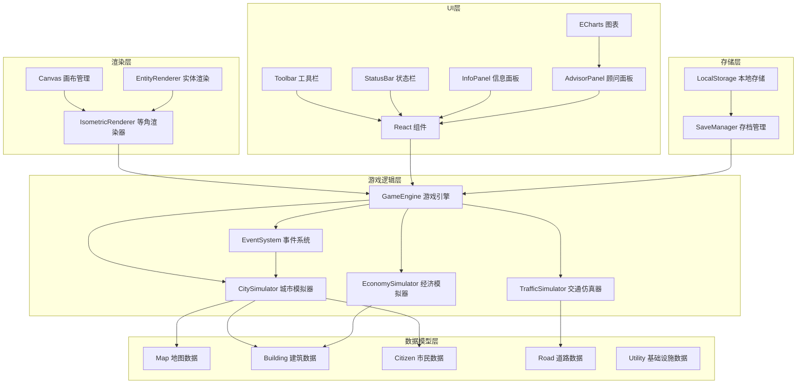
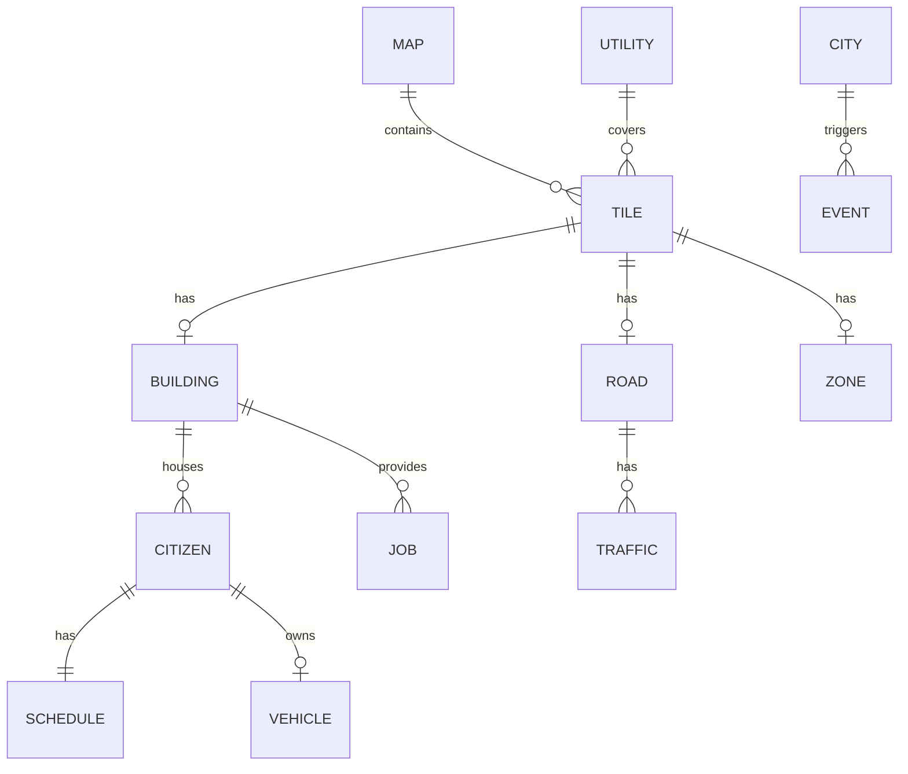

## 1. 架构设计



## 2. 技术说明

- **前端框架**：React@18 + TypeScript
- **构建工具**：Vite
- **样式方案**：TailwindCSS@3
- **图表库**：ECharts@5
- **状态管理**：React Context + useReducer
- **渲染引擎**：Canvas 2D API
- **数据持久化**：LocalStorage + JSON序列化

## 3. 目录结构

```
src/
├── components/          # React组件
│   ├── Toolbar.tsx      # 工具栏
│   ├── StatusBar.tsx    # 状态栏
│   ├── InfoPanel.tsx    # 信息面板
│   ├── AdvisorPanel.tsx # 顾问面板
│   ├── GameCanvas.tsx   # 游戏画布
│   └── Notification.tsx # 通知组件
├── game/                # 游戏核心逻辑
│   ├── engine/          # 游戏引擎
│   ├── simulation/      # 模拟器
│   ├── rendering/       # 渲染系统
│   └── models/          # 数据模型
├── utils/               # 工具函数
│   ├── pathfinding.ts   # 路径寻路
│   ├── isometric.ts     # 等角坐标转换
│   └── save.ts          # 存档管理
├── hooks/               # React Hooks
├── types/               # TypeScript类型定义
├── App.tsx
├── main.tsx
└── index.css
```

## 4. 核心数据模型

### 4.1 数据模型定义



### 4.2 核心类型定义

```typescript
// 坐标系统
interface Position {
  x: number;
  y: number;
}

interface IsoPosition {
  isoX: number;
  isoY: number;
}

// 地块类型
enum TileType {
  EMPTY = 'empty',
  ROAD = 'road',
  ZONE_RESIDENTIAL = 'residential',
  ZONE_COMMERCIAL = 'commercial',
  ZONE_INDUSTRIAL = 'industrial',
  WATER = 'water',
  ELECTRICITY = 'electricity'
}

// 建筑类型
enum BuildingType {
  HOUSE_LOW = 'house_low',
  HOUSE_MED = 'house_med',
  APARTMENT = 'apartment',
  SHOP_SMALL = 'shop_small',
  SHOP_LARGE = 'shop_large',
  OFFICE = 'office',
  FACTORY_SMALL = 'factory_small',
  FACTORY_LARGE = 'factory_large',
  POLICE = 'police',
  FIRE_STATION = 'fire_station',
  SCHOOL = 'school',
  HOSPITAL = 'hospital',
  PARK = 'park'
}

// 建筑状态
interface Building {
  id: string;
  type: BuildingType;
  position: Position;
  level: number;
  health: number;
  population: number;
  maxPopulation: number;
  hasWater: boolean;
  hasElectricity: boolean;
  satisfaction: number;
  growthProgress: number;
}

// 市民
interface Citizen {
  id: string;
  homeBuildingId: string;
  workBuildingId: string | null;
  position: Position;
  schedule: Schedule;
  satisfaction: number;
  commuteTime: number;
}

// 日程安排
interface Schedule {
  wakeUp: number;
  leaveHome: number;
  startWork: number;
  endWork: number;
  arriveHome: number;
  sleep: number;
  currentActivity: ActivityType;
}

enum ActivityType {
  SLEEPING = 'sleeping',
  AT_HOME = 'at_home',
  COMMUTING_TO_WORK = 'commuting_to_work',
  WORKING = 'working',
  COMMUTING_HOME = 'commuting_home',
  SHOPPING = 'shopping',
  LEISURE = 'leisure'
}

// 道路
interface Road {
  position: Position;
  type: RoadType;
  capacity: number;
  congestion: number;
  connections: Position[];
}

enum RoadType {
  STREET = 'street',
  AVENUE = 'avenue',
  HIGHWAY = 'highway'
}

// 游戏状态
interface GameState {
  money: number;
  population: number;
  date: GameDate;
  speed: number;
  isPaused: boolean;
  selectedTool: ToolType;
  map: Tile[][];
  buildings: Map<string, Building>;
  citizens: Citizen[];
  roads: Road[];
  statistics: Statistics;
}

// 统计数据
interface Statistics {
  populationHistory: number[];
  moneyHistory: number[];
  satisfactionHistory: number[];
  landValueMap: number[][];
  commuteTimeDistribution: number[];
  pollutionMap: number[][];
}
```

## 5. 核心算法

### 5.1 等角坐标转换

```typescript
// 网格坐标转等角坐标
function gridToIso(gridX: number, gridY: number): IsoPosition {
  const isoX = (gridX - gridY) * TILE_WIDTH / 2;
  const isoY = (gridX + gridY) * TILE_HEIGHT / 2;
  return { isoX, isoY };
}

// 等角坐标转网格坐标
function isoToGrid(isoX: number, isoY: number): Position {
  const x = (isoX / (TILE_WIDTH / 2) + isoY / (TILE_HEIGHT / 2)) / 2;
  const y = (isoY / (TILE_HEIGHT / 2) - isoX / (TILE_WIDTH / 2)) / 2;
  return { x: Math.floor(x), y: Math.floor(y) };
}
```

### 5.2 A*路径寻路

用于交通仿真中的车辆和行人路径规划

### 5.3 土地价值计算

综合考虑：
- 道路可达性
- 公共设施覆盖
- 污染程度
- 周边建筑类型

## 6. 性能优化策略

1. **空间分区**：使用网格分区管理实体，减少碰撞检测范围
2. **对象池**：复用频繁创建销毁的对象（车辆、行人）
3. **增量更新**：只更新视野内和附近的实体
4. **渲染分层**：静态层预渲染到离屏Canvas
5. **时间切片**：将复杂计算分散到多个帧执行
