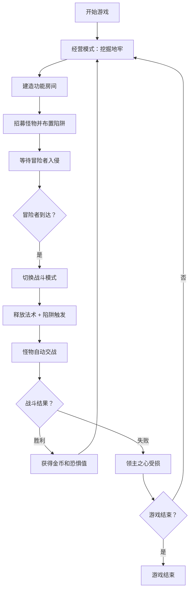

## 1. 产品概述

地下城邪恶领主是一款俯视角网格策略游戏，玩家扮演邪恶领主，通过挖掘扩展地牢、建造功能房间、招募怪物、布置陷阱来抵御冒险者的入侵。保护最深处的领主之心，积累恐惧值解锁更强大的科技。

- **核心玩法**：经营模拟 + 即时塔防 + 策略RPG
- **目标用户**：策略游戏爱好者、塔防玩家、模拟经营玩家

## 2. 核心功能

### 2.1 游戏模式

| 模式 | 描述 | 核心玩法 |
|------|------|----------|
| 经营模式 | 地牢建设与管理 | 挖掘岩石、建造房间、招募怪物、布置陷阱 |
| 战斗模式 | 抵御冒险者入侵 | 实时战斗、释放法术、操控怪物 |

### 2.2 功能模块

1. **地牢编辑器**：网格地图挖掘、房间放置、陷阱布置、撤销功能
2. **怪物系统**：怪物招募、巡逻AI、心情值、等级提升、喂食发薪
3. **冒险者系统**：职业系统（战士/法师/盗贼）、探索AI、战斗AI、逃跑机制
4. **陷阱系统**：尖刺、毒气、落石、压力板、触发链传播
5. **法术系统**：火球、闪电链、群体治疗
6. **经济系统**：金币、药水生产、恐惧值科技树
7. **战斗系统**：实时交战、数值计算、技能释放

### 2.3 页面详情

| 页面名称 | 模块名称 | 功能描述 |
|-----------|-------------|---------------------|
| 游戏主界面 | Canvas地图渲染 | 俯视角网格地牢、实体渲染、动画效果 |
| 游戏主界面 | 顶部状态栏 | 金币、恐惧值、领主之心血量、波次信息 |
| 游戏主界面 | 左侧工具栏 | 挖掘工具、房间建造、怪物招募、陷阱布置 |
| 游戏主界面 | 右侧信息面板 | 选中实体详情、怪物列表、冒险者预警 |
| 游戏主界面 | 底部法术栏 | 全局法术释放按钮、冷却显示 |
| 游戏主界面 | 模式切换 | 经营/战斗模式切换按钮 |

## 3. 核心流程

## 4. 用户界面设计

### 4.1 设计风格

- **主色调**：深紫黑色（#1a0a2e）作为背景，暗血红色（#8b0000）作为强调色，金色（#ffd700）作为高亮色
- **按钮风格**：暗黑哥特式，带有轻微的3D浮雕效果，圆角4px
- **字体**：标题使用Cinzel（哥特式衬线），正文使用Roboto Mono（等宽 monospace）
- **布局风格**：中央Canvas游戏区域，四周环绕UI面板，采用深色半透明背景
- **视觉特效**：魔法粒子效果、血液飞溅、地牢阴影、发光边框

### 4.2 页面设计概览

| 页面名称 | 模块名称 | UI元素 |
|-----------|-------------|-------------|
| 游戏主界面 | Canvas地图 | 网格瓦片、岩石纹理、房间图标、怪物/冒险者精灵、陷阱动画 |
| 游戏主界面 | 顶部状态栏 | 金币图标、恐惧值进度条、心形血量图标、波次倒计时 |
| 游戏主界面 | 左侧工具栏 | 工具按钮（镐子/房间/怪物/陷阱）、选中高亮、数量显示 |
| 游戏主界面 | 右侧面板 | 实体属性卡、技能列表、状态效果图标 |
| 游戏主界面 | 法术栏 | 圆形法术按钮、冷却遮罩、法力消耗 |

### 4.3 响应性

- 桌面端优先设计，最低分辨率1280x720
- Canvas区域自适应窗口大小，保持1:1像素比例
- 侧边面板可折叠，为小屏幕提供更多游戏空间

## 5. 游戏数值与平衡

### 5.1 怪物属性

| 怪物类型 | 血量 | 攻击 | 速度 | 工资 | 心情消耗 |
|----------|------|------|------|------|----------|
| 小恶魔 | 50 | 8 | 2 | 10金/分钟 | 2/分钟 |
| 骷髅兵 | 80 | 12 | 1.5 | 15金/分钟 | 1.5/分钟 |
| 暗影刺客 | 40 | 20 | 3 | 25金/分钟 | 3/分钟 |

### 5.2 冒险者职业

| 职业 | 血量 | 攻击 | 速度 | 特性 |
|------|------|------|------|------|
| 战士 | 150 | 15 | 1 | 高防御，优先攻击怪物 |
| 法师 | 80 | 25 | 1.2 | 远程攻击，优先攻击宝箱 |
| 盗贼 | 60 | 12 | 2.5 | 高闪避，优先开宝箱和逃跑 |

### 5.3 陷阱效果

| 陷阱 | 伤害 | 效果 | 触发范围 | 冷却 |
|------|------|------|----------|------|
| 尖刺 | 30 | 物理伤害 | 1格 | 5秒 |
| 毒气 | 10/秒 | 持续毒伤5秒 | 2格 | 10秒 |
| 落石 | 80 | 眩晕2秒 | 1格 | 15秒 |
