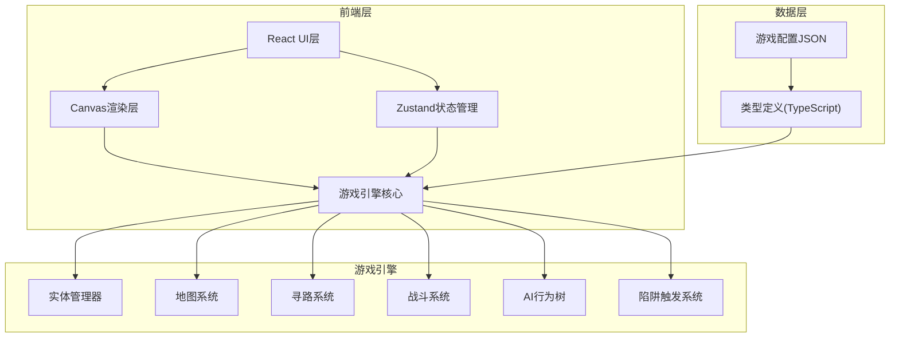

## 1. 架构设计



## 2. 技术描述

- **前端框架**: React@18 + TypeScript
- **构建工具**: Vite@5
- **样式方案**: TailwindCSS@3
- **状态管理**: Zustand@4
- **游戏渲染**: HTML5 Canvas 2D
- **图标库**: Lucide React

## 3. 项目结构

```
src/
├── components/          # React组件
│   ├── GameCanvas.tsx   # Canvas游戏渲染
│   ├── Toolbar.tsx      # 左侧工具栏
│   ├── StatusBar.tsx    # 顶部状态栏
│   ├── InfoPanel.tsx    # 右侧信息面板
│   └── SpellBar.tsx     # 底部法术栏
├── game/                # 游戏核心逻辑
│   ├── engine.ts        # 游戏引擎
│   ├── map.ts           # 地图系统
│   ├── pathfinding.ts   # A*寻路算法
│   ├── entity/          # 实体定义
│   │   ├── Entity.ts    # 实体基类
│   │   ├── Monster.ts   # 怪物
│   │   ├── Adventurer.ts# 冒险者
│   │   └── Trap.ts      # 陷阱
│   ├── systems/         # 系统
│   │   ├── CombatSystem.ts    # 战斗系统
│   │   ├── AISystem.ts        # AI系统
│   │   └── TrapSystem.ts      # 陷阱系统
│   └── config/          # 游戏配置
│       ├── monsters.ts  # 怪物配置
│       ├── adventurers.ts # 冒险者配置
│       └── traps.ts     # 陷阱配置
├── store/               # Zustand状态
│   └── useGameStore.ts
├── types/               # TypeScript类型
│   └── game.ts
├── utils/               # 工具函数
│   └── math.ts
├── App.tsx
├── main.tsx
└── index.css
```

## 4. 核心数据模型

### 4.1 瓦片地图

```typescript
type TileType = 'rock' | 'floor' | 'wall' | 'room' | 'entrance' | 'heart';

interface Tile {
  type: TileType;
  roomId?: string;
  trapId?: string;
  passable: boolean;
  explored: boolean;
}

interface GameMap {
  width: number;
  height: number;
  tiles: Tile[][];
  rooms: Room[];
}
```

### 4.2 实体系统

```typescript
interface Entity {
  id: string;
  type: 'monster' | 'adventurer' | 'trap';
  x: number;
  y: number;
  health: number;
  maxHealth: number;
  speed: number;
}

interface Monster extends Entity {
  monsterType: 'imp' | 'skeleton' | 'assassin';
  level: number;
  mood: number;
  attack: number;
  salary: number;
  target?: Entity;
  patrolPath: Point[];
}

interface Adventurer extends Entity {
  class: 'warrior' | 'mage' | 'thief';
  attack: number;
  state: 'exploring' | 'fighting' | 'fleeing' | 'looting';
  path: Point[];
}
```

### 4.3 陷阱系统

```typescript
interface Trap {
  id: string;
  trapType: 'spike' | 'gas' | 'boulder' | 'pressure_plate';
  x: number;
  y: number;
  cooldown: number;
  maxCooldown: number;
  damage: number;
  linkedTraps: string[];
  triggered: boolean;
}
```

## 5. 核心算法

### 5.1 A*寻路算法

```typescript
function findPath(
  map: GameMap,
  start: Point,
  end: Point,
  passableCheck: (tile: Tile) => boolean
): Point[];
```

- 使用曼哈顿距离作为启发函数
- 支持动态更新地图后的路径重计算
- 每帧最多执行N次寻路请求，避免性能问题

### 5.2 行为树AI

```
Selector
├── Sequence (战斗)
│   ├── CheckEnemyNearby
│   └── AttackEnemy
├── Sequence (逃跑)
│   ├── CheckHealthLow
│   └── FleeToEntrance
├── Sequence (探索)
│   ├── ChooseRandomTarget
│   └── MoveToTarget
└── Sequence (巡逻)
    ├── FollowPatrolPath
    └── Idle
```

### 5.3 陷阱触发链

```typescript
interface TrapTriggerEvent {
  trapId: string;
  targetEntity: Entity;
  timestamp: number;
}

function processTrapTrigger(
  trap: Trap,
  entity: Entity,
  trapSystem: TrapSystem
): TrapTriggerEvent[];
```

- 压力板触发时，激活所有关联陷阱
- 支持延迟触发和链式传播
- 因果记录用于游戏回放和调试

## 6. 性能优化

- **实体裁剪**: 只渲染视口内的实体
- **空间分区**: 网格空间划分，加速碰撞检测
- **对象池**: 复用频繁创建销毁的实体
- **帧间隔**: AI和寻路计算分散到不同帧
- **WebWorker**: 将重型计算移至后台线程（后续优化）
