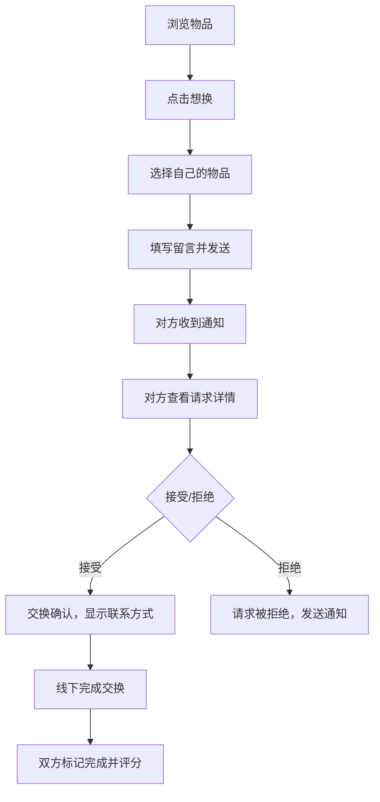

## 1. 产品概述
换享是一个帮助邻里之间交换闲置物品的轻量平台，让用户通过物物交换的方式，将家里的闲置物品重新利用起来，促进社区互动，减少资源浪费。

## 2. 核心功能

### 2.1 用户角色
| 角色 | 注册方式 | 核心权限 |
|------|----------|----------|
| 普通用户 | 模拟登录 | 发布物品、浏览物品、发起交换请求、管理消息、评价对方 |

### 2.2 功能模块
1. **首页**: 社区物品列表、分类筛选、搜索、下拉刷新、无限滚动
2. **发布页**: 拍照上传物品、填写描述、选择分类、填写期望交换物品
3. **物品详情页**: 物品信息展示、想换按钮、查看用户信息
4. **消息中心**: 交换请求列表、未读消息红点提示
5. **个人中心**: 已发布物品管理、发出/收到的请求、信誉评分

### 2.3 页面详情
| 页面名称 | 模块名称 | 功能描述 |
|---------|---------|----------|
| 首页 | 社区物品列表 | 卡片式展示附近物品，按社区分组，下拉刷新，无限滚动加载 |
| 首页 | 分类筛选 | 书籍、家居、数码、衣物等分类，点击筛选对应物品 |
| 首页 | 搜索功能 | 关键词搜索物品名称和描述 |
| 发布页 | 图片上传 | 拍照或选择图片，本地压缩预览 |
| 发布页 | 物品信息 | 填写名称、描述、选择分类、期望交换类型 |
| 物品详情页 | 物品信息 | 展示图片、描述、发布者、发布时间 |
| 物品详情页 | 交换请求 | 点击"想换"选择自己的物品发起请求，附留言 |
| 消息中心 | 请求列表 | 展示收到和发出的交换请求，未读带红点 |
| 消息中心 | 请求处理 | 查看详情、接受/拒绝请求、查看联系方式 |
| 个人中心 | 我的物品 | 管理已发布的物品，编辑/下架 |
| 个人中心 | 信誉评分 | 展示用户评分，完成交换后可给对方打分 |

## 3. 核心流程

## 4. 用户界面设计

### 4.1 设计风格
- **主色调**: 暖橙色 (#FF8C42) - 传达温暖、生活气息
- **辅助色**: 草绿色 (#6BCB77) - 代表环保、分享
- **背景色**: 米白色 (#FFFBF5) - 温馨、舒适
- **文字色**: 深灰色 (#333333) - 易读
- **按钮风格**: 圆角矩形，轻微阴影，点击有按压效果
- **字体**: 使用系统字体，标题加粗，正文清晰
- **布局风格**: 卡片式布局，留白适中，移动端优先
- **图标风格**: 线性图标，简洁友好，带生活气息

### 4.2 页面设计概述
| 页面名称 | 模块名称 | UI元素 |
|---------|---------|--------|
| 首页 | 顶部导航 | 搜索框、消息图标(带红点)、个人中心入口 |
| 首页 | 分类标签 | 横向滚动标签，选中高亮 |
| 首页 | 物品卡片 | 图片、标题、分类标签、发布者、距离 |
| 发布页 | 图片区域 | 拖拽/点击上传，预览网格，删除按钮 |
| 发布页 | 表单 | 输入框、下拉选择、提交按钮 |
| 物品详情页 | 图片轮播 | 多图展示，手势滑动 |
| 物品详情页 | 操作区域 | 想换按钮、收藏按钮 |
| 消息中心 | 消息列表 | 头像、名称、消息摘要、时间、未读红点 |
| 个人中心 | 用户信息 | 头像、昵称、信誉分、交换次数 |

### 4.3 响应式
- 移动端优先设计，基于 375px 宽度
- 适配主流手机尺寸 (320px - 430px)
- 触摸优化：按钮最小高度 44px，触控区域足够大
- 下拉刷新、上拉加载等移动端交互

