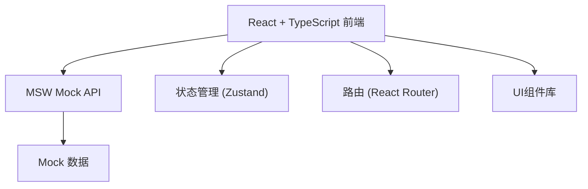
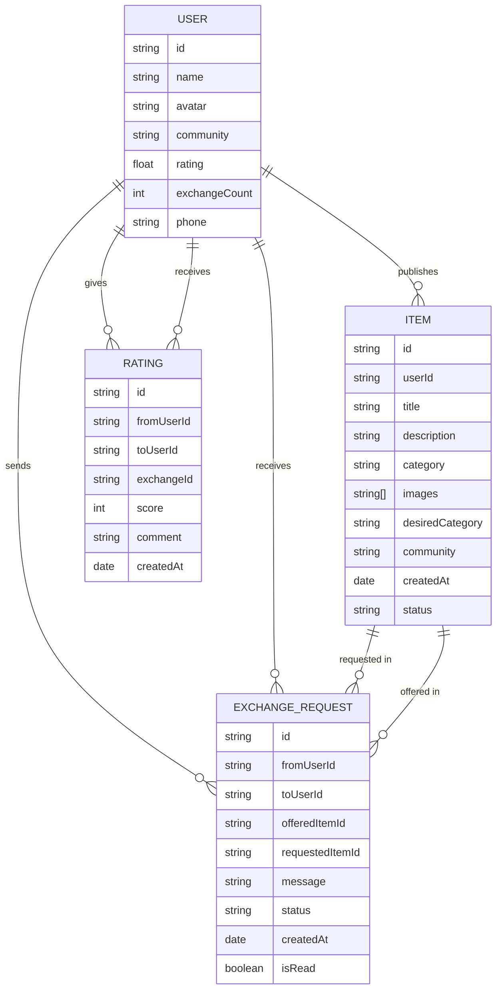

## 1. 架构设计



## 2. 技术说明
- **前端**: React@18 + TypeScript + Vite
- **样式**: TailwindCSS@3
- **状态管理**: Zustand (轻量级状态管理)
- **路由**: React Router v6
- **Mock**: MSW (Mock Service Worker)
- **图标**: Lucide React
- **图片处理**: Canvas API 本地压缩

## 3. 路由定义
| 路由 | 页面 | 说明 |
|------|------|------|
| / | 首页 | 社区物品列表、分类筛选、搜索 |
| /publish | 发布页 | 上传物品图片、填写信息 |
| /item/:id | 物品详情页 | 物品信息、发起交换请求 |
| /messages | 消息中心 | 交换请求列表、未读提示 |
| /messages/:id | 消息详情 | 处理交换请求 |
| /profile | 个人中心 | 用户信息、我的物品、请求管理 |
| /profile/items | 我的物品 | 管理已发布物品 |
| /profile/ratings | 信誉评分 | 查看和管理评分 |

## 4. 数据模型

### 4.1 数据模型定义



### 4.2 TypeScript 类型定义

```typescript
interface User {
  id: string;
  name: string;
  avatar: string;
  community: string;
  rating: number;
  exchangeCount: number;
  phone: string;
}

interface Item {
  id: string;
  userId: string;
  title: string;
  description: string;
  category: Category;
  images: string[];
  desiredCategory: string;
  community: string;
  createdAt: string;
  status: 'active' | 'exchanged' | 'offline';
}

type Category = 'books' | 'home' | 'digital' | 'clothing' | 'toys' | 'sports' | 'other';

interface ExchangeRequest {
  id: string;
  fromUserId: string;
  toUserId: string;
  offeredItemId: string;
  requestedItemId: string;
  message: string;
  status: 'pending' | 'accepted' | 'rejected' | 'completed';
  createdAt: string;
  isRead: boolean;
}

interface Rating {
  id: string;
  fromUserId: string;
  toUserId: string;
  exchangeId: string;
  score: number;
  comment: string;
  createdAt: string;
}
```

## 5. API 接口定义

### 5.1 物品相关
- `GET /api/items` - 获取物品列表 (支持分页、分类、搜索)
- `GET /api/items/:id` - 获取物品详情
- `POST /api/items` - 发布新物品
- `PUT /api/items/:id` - 更新物品信息
- `DELETE /api/items/:id` - 删除/下架物品

### 5.2 用户相关
- `GET /api/user` - 获取当前用户信息
- `GET /api/users/:id` - 获取用户详情
- `GET /api/users/:id/items` - 获取用户发布的物品

### 5.3 交换请求相关
- `GET /api/exchange-requests` - 获取交换请求列表
- `POST /api/exchange-requests` - 发起交换请求
- `PUT /api/exchange-requests/:id` - 处理交换请求 (接受/拒绝/完成)
- `PUT /api/exchange-requests/:id/read` - 标记已读

### 5.4 评分相关
- `GET /api/ratings/:userId` - 获取用户评分
- `POST /api/ratings` - 提交评分

