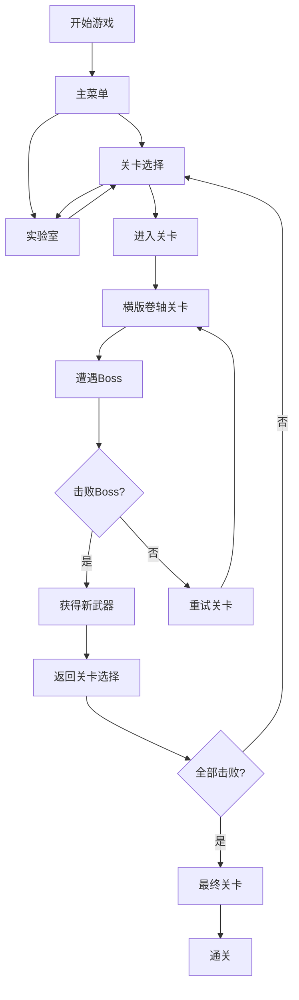

## 1. 产品概述

一款致敬《洛克人》系列的像素风格平台跳跃射击游戏。玩家操控可变身机器人，在八个不同主题的关卡中自由选择挑战顺序，击败Boss夺取其核心能力，利用属性克制关系征战后续关卡。

- 核心玩法：平台跳跃 + 射击 + 武器切换 + 属性克制
- 目标用户：复古游戏爱好者、洛克人系列粉丝、平台跳跃游戏玩家
- 产品价值：提供经典洛克人风格的游戏体验，结合创新的武器克制和探索玩法

## 2. 核心功能

### 2.1 用户角色

| 角色 | 注册方式 | 核心权限 |
|------|----------|----------|
| 玩家 | 无需注册 | 完整游戏体验 |

### 2.2 功能模块

1. **主菜单**：关卡选择、实验室、游戏开始、设置
2. **关卡选择**：八个Boss关卡选择界面
3. **游戏主场景**：横版卷轴平台跳跃射击
4. **Boss战**：多阶段Boss战斗
5. **实验室**：角色强化系统
6. **武器系统**：八种属性武器，各有战斗和探索用途

### 2.3 页面详情

| 页面名称 | 模块名称 | 功能描述 |
|---------|---------|----------|
| 主菜单 | 标题界面 | 游戏标题、开始游戏、关卡选择、实验室、设置按钮 |
| 关卡选择 | 八边形Boss选择 | 展示八个不同主题关卡，显示已击败状态和属性信息 |
| 游戏场景 | 横版卷轴 | 平台跳跃、射击、武器切换、敌人战斗 |
| Boss战 | Boss战斗 | 多阶段攻击模式、弱点武器克制、特殊攻击躲避 |
| 实验室 | 强化系统 | 齿轮货币消费、血量上限、能量槽、蓄力时间强化 |
| 暂停菜单 | 暂停界面 | 继续、重新开始、返回主菜单 |

## 3. 核心流程

## 4. 用户界面设计

### 4.1 设计风格

- **主色调**：深蓝色 (#000033) 作为背景，配合各属性鲜明配色
- **属性配色**：
  - 火焰：橙红色 (#FF4400)
  - 寒冰：青蓝色 (#00DDFF)
  - 雷电：亮黄色 (#FFFF00)
  - 重力：紫色 (#AA00FF)
  - 时间：墨绿色 (#00AA66)
  - 暗影：深灰色 (#333333)
  - 毒素：酸绿色 (#88FF00)
- **像素风格**：FC 时代像素艺术，16x16 像素格
- **字体**：像素风格字体，清晰可辨
- **布局**：居中游戏画布，HUD 信息分布在四角

### 4.2 页面设计概览

| 页面名称 | 模块名称 | UI 元素 |
|---------|---------|----------|
| 主菜单 | 标题界面 | 像素风格大标题、闪烁光标、像素按钮 |
| 关卡选择 | 八边形界面 | 八个Boss头像环形排列、属性图标、状态标记 |
| 游戏场景 | 游戏画布 | 玩家角色、敌人、平台、特效、HUD |
| Boss战 | 战斗界面 | Boss血条、多阶段变换、攻击特效 |
| 实验室 | 商店界面 | 齿轮货币显示、强化项目列表、预览效果 |

### 4.3 响应性

- 桌面端优先，画布固定分辨率 960x540 像素
- 支持键盘操作（WASD/方向键移动，J攻击，K跳跃，数字键1-8切换武器
- 暂停菜单支持鼠标点击操作

### 4.4 游戏画面指导

- **像素渲染**：Canvas 2D 像素风格，禁用平滑插值
- **动画效果**：角色行走、跳跃、射击、受击、死亡动画
- **特效**：武器射击特效、爆炸效果、属性克制闪光
- **HUD**：左上角血量条、能量条、过载槽、当前武器图标
