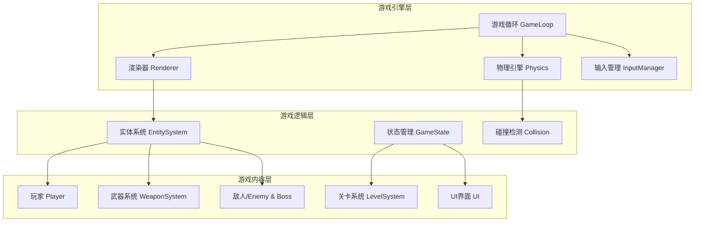
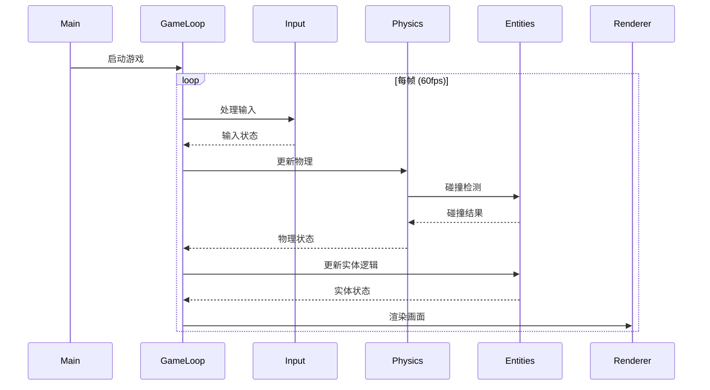

## 1. 架构设计



## 2. 技术描述

- **前端技术栈**: TypeScript + Vite + Canvas 2D API
- **构建工具**: Vite 5.x
- **代码规范**: ESLint + Prettier
- **像素渲染**: Canvas 2D 禁用平滑，使用 image-rendering: pixelated

## 3. 目录结构

```
src/
├── core/                    # 核心引擎
│   ├── Game.ts             # 游戏主类
│   ├── GameLoop.ts         # 游戏循环
│   ├── Renderer.ts         # 渲染器
│   ├── Physics.ts          # 物理引擎
│   ├── Input.ts            # 输入管理
│   └── Entity.ts           # 实体基类
├── game/                    # 游戏逻辑
│   ├── Player.ts           # 玩家
│   ├── weapons/            # 武器系统
│   │   ├── Weapon.ts       # 武器基类
│   │   ├── Buster.ts       # 普通射击
│   │   ├── FlameCannon.ts  # 火焰炮
│   │   ├── IceRay.ts       # 冰冻射线
│   │   ├── EMPulse.ts      # 电磁脉冲
│   │   ├── GravityBomb.ts  # 重力炸弹
│   │   ├── TimeSlow.ts     # 时间迟缓
│   │   ├── ShadowStrike.ts # 暗影突袭
│   │   ├── SonicWave.ts    # 声波
│   │   └── ToxicCloud.ts   # 毒素云
│   ├── enemies/            # 敌人
│   │   ├── Enemy.ts        # 敌人基类
│   │   ├── PatrolBot.ts    # 巡逻机器人
│   │   ├── Turret.ts       # 炮台
│   │   ├── Drone.ts        # 无人机
│   │   └── HeavySoldier.ts # 重装兵
│   └── bosses/             # Boss系统
│       ├── Boss.ts         # Boss基类
│       ├── FlameMan.ts     # 火焰人
│       ├── IceMan.ts       # 寒冰人
│       ├── ThunderMan.ts   # 雷电人
│       ├── GravityMan.ts   # 重力人
│       ├── TimeMan.ts      # 时间人
│       ├── ShadowMan.ts    # 暗影人
│       ├── SonicMan.ts     # 声波人
│       └── ToxicMan.ts     # 毒素人
├── levels/                  # 关卡系统
│   ├── Level.ts            # 关卡基类
│   ├── LevelData.ts        # 关卡数据
│   └── platforms/          # 平台元素
├── ui/                      # UI界面
│   ├── MainMenu.ts         # 主菜单
│   ├── LevelSelect.ts      # 关卡选择
│   ├── Lab.ts              # 实验室
│   ├── HUD.ts              # 游戏HUD
│   └── PauseMenu.ts        # 暂停菜单
├── utils/                   # 工具函数
│   ├── constants.ts        # 常量定义
│   ├── types.ts            # 类型定义
│   └── helpers.ts          # 辅助函数
└── main.ts                  # 入口文件
```

## 4. 核心类型定义

```typescript
// 属性类型
enum ElementType {
  NEUTRAL = 'neutral',
  FIRE = 'fire',
  ICE = 'ice',
  THUNDER = 'thunder',
  GRAVITY = 'gravity',
  TIME = 'time',
  SHADOW = 'shadow',
  SONIC = 'sonic',
  TOXIC = 'toxic'
}

// 属性克制关系
const ELEMENT_WEAKNESS: Record<ElementType, ElementType> = {
  [ElementType.FIRE]: ElementType.ICE,
  [ElementType.ICE]: ElementType.THUNDER,
  [ElementType.THUNDER]: ElementType.GRAVITY,
  [ElementType.GRAVITY]: ElementType.TIME,
  [ElementType.TIME]: ElementType.SHADOW,
  [ElementType.SHADOW]: ElementType.SONIC,
  [ElementType.SONIC]: ElementType.TOXIC,
  [ElementType.TOXIC]: ElementType.FIRE,
  [ElementType.NEUTRAL]: ElementType.NEUTRAL
};

// 玩家状态
interface PlayerState {
  health: number;
  maxHealth: number;
  energy: number;
  maxEnergy: number;
  gears: number;
  overload: number;
  currentWeapon: ElementType;
  unlockedWeapons: ElementType[];
  position: Vector2;
  velocity: Vector2;
  isJumping: boolean;
  isShooting: boolean;
  isInvincible: boolean;
  chargeTime: number;
}

// 武器接口
interface Weapon {
  type: ElementType;
  damage: number;
  energyCost: number;
  cooldown: number;
  shoot(player: Player): Projectile;
  specialEffect(level: Level): void;
}

// Boss状态
interface BossState {
  health: number;
  maxHealth: number;
  phase: number;
  maxPhase: number;
  element: ElementType;
  weakness: ElementType;
  currentAttack: string;
  attackCooldown: number;
  patterns: BossPattern[];
}

// Boss攻击模式
interface BossPattern {
  name: string;
  minPhase: number;
  cooldown: number;
  execute(boss: Boss, player: Player): void;
}
```

## 5. 游戏循环架构



## 6. 物理引擎架构

- **AABB碰撞检测**: 轴对齐包围盒用于平台和实体碰撞
- **重力系统**: 恒定重力加速度，可被重力武器影响
- **平台物理**: 站立、跳跃、斜坡、传送带
- **精确碰撞**: 像素级碰撞检测用于子弹和敌人

## 7. 状态管理

使用简单状态机管理游戏状态：

```typescript
enum GameScreen {
  MAIN_MENU = 'main_menu',
  LEVEL_SELECT = 'level_select',
  LAB = 'lab',
  PLAYING = 'playing',
  PAUSED = 'paused',
  BOSS_FIGHT = 'boss_fight',
  VICTORY = 'victory',
  GAME_OVER = 'game_over'
}
```

## 8. 性能优化策略

1. **对象池**: 子弹和粒子效果使用对象池复用
2. **视口剔除**: 只渲染屏幕可见区域的实体
3. **空间分区**: 网格空间分区优化碰撞检测
4. **帧率控制**: 固定时间步长更新物理，可变渲染帧率
