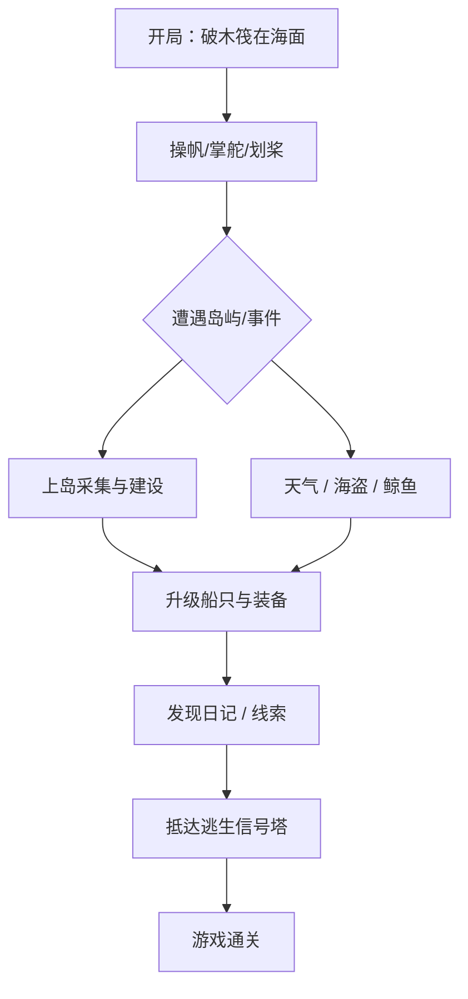

## 1. 产品概述

一款基于 Canvas 2D 的俯视视角海洋生存冒险游戏。玩家独自漂流在程序生成的广阔海洋上，通过操帆、掌舵、捕鱼、探索岛屿与升级船只来求生，并最终找到逃生信号塔返回文明。

- 目标用户：喜欢沙盒生存、开放世界探索的单机玩家。
- 核心价值：一人一舟的孤寂感 + 程序化探索的自由度 + 多系统耦合的生存张力。

## 2. 核心特性

### 2.1 用户角色

| 角色 | 注册方式 | 核心权限 |
|------|----------|----------|
| 漂流者 | 单机本地开局 | 完整游玩、存档、读档、退出 |

### 2.2 功能模块

1. **游戏主界面（Canvas）**：渲染海洋、波浪、船只、岛屿、天气。
2. **船只操作**：掌舵、收/升帆、橹桨加速、抛锚。
3. **生存系统**：饥饿、口渴、体温、体力、船体耐久。
4. **天气系统**：晴/雨/暴风雨/浓雾；动态云层与海浪。
5. **岛屿生态**：棕榈树岛、火山岛、暗礁、浮冰山、沉船、瞭望塔。
6. **船只升级**：桅杆、帆、船壳、引擎、渔网、冷冻舱、无线电。
7. **战斗与事件**：海盗巡逻、鲸鱼群、礁石撞击、救援信号。
8. **存档系统**：保存探索过的世界、资源消耗、建造改动。

### 2.3 页面细节

| 页面名称 | 模块名称 | 功能描述 |
|----------|----------|----------|
| 开始页 | 标题与入口 | 显示游戏标题、开始游戏、继续游戏、设置 |
| 游戏主界面 | Canvas 渲染层 | 俯视视角动态海洋、船只、岛屿、天气 |
| 游戏主界面 | HUD 面板 | 显示生存指标、天气、装备、迷你雷达 |
| 游戏主界面 | 背包/升级面板 | 物资栏、船只升级选项、操作日志 |
| 游戏主界面 | 岛屿交互面板 | 上岛采集、建造、烹饪、阅读日记 |

## 3. 核心流程

玩家从破木筏开局，驾驶船只在海洋上探索，采集资源、升级船只、躲避恶劣天气与海盗，最终拼凑线索抵达逃生点。

## 4. 用户界面设计

### 4.1 设计风格

- 主色：深海蓝 `#0a2540`，海泡沫 `#4cc9f0`，落日橙 `#ff8c42`，警示红 `#ef476f`。
- 按钮：带高光描边的圆角矩形，按压下沉效果。
- 字体：标题使用等宽等航海感字体 `Courier New`，正文使用系统无衬线字体。
- 布局：Canvas 全屏；HUD 左上、右上、底部三区域；弹出面板半透明毛玻璃。
- 图标：使用 `lucide-react` 线性图标。

### 4.2 页面设计概览

| 页面名称 | 模块名称 | UI 元素 |
|----------|----------|---------|
| 开始页 | 标题 | 动态波纹背景、发光标题、按钮 |
| 游戏主界面 | HUD | 条形进度、图标、日志框、迷你雷达 |
| 游戏主界面 | 背包面板 | 格子布局、分类 Tab、升级卡片 |
| 游戏主界面 | 岛屿面板 | 资源列表、操作按钮、日记区 |

### 4.3 响应式

桌面优先，最小 1024×640；Canvas 自适应窗口；移动端不强制支持。
