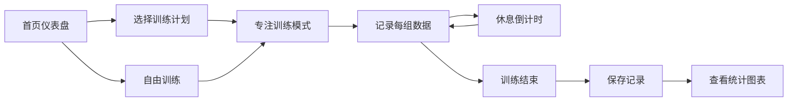

## 1. 产品概述

FitTrack 是一款面向健身新手的训练记录工具，帮助用户记录每一次训练的重量、次数和组数，通过可视化数据追踪进步，建立持久的健身习惯。

- 核心目的：降低健身记录门槛，用数据激励用户坚持训练
- 目标用户：健身新手、想要系统化记录训练的爱好者
- 产品价值：简单易用的记录方式 + 可视化进步追踪 + 即时成就感反馈

## 2. 核心功能

### 2.1 用户角色
| 角色 | 注册方式 | 核心权限 |
|------|----------|----------|
| 普通用户 | 无需注册（本地存储） | 记录训练、查看统计、管理训练计划 |

### 2.2 功能模块
1. **首页仪表盘**：今日训练概览、每周目标进度、快速开始训练
2. **动作库**：内置基础动作分类展示，支持查看动作详情
3. **训练计划**：创建自定义训练计划，组合动作、设定组次
4. **专注训练模式**：简洁大按钮界面、组间休息倒计时、实时记录
5. **数据统计**：最大重量折线图、训练热力图、历史记录查询
6. **个人设置**：每周目标设定、数据导出/导入

### 2.3 页面详情
| 页面名称 | 模块名称 | 功能描述 |
|----------|----------|----------|
| 首页仪表盘 | 每周目标进度 | 环形进度条展示本周训练完成度 |
| 首页仪表盘 | 快捷操作 | 快速开始训练、查看历史记录 |
| 首页仪表盘 | 最近记录 | 展示最近几次训练的摘要信息 |
| 动作库 | 动作分类 | 按肌群/训练类型筛选动作 |
| 动作库 | 动作卡片 | 展示动作名称、目标肌群、训练类型 |
| 训练计划 | 计划列表 | 展示已创建的训练计划卡片 |
| 训练计划 | 创建计划 | 组合动作、设置每组次数、组间休息 |
| 专注训练 | 实时记录 | 大按钮记录每组完成情况 |
| 专注训练 | 休息计时 | 自动倒计时、结束时轻声提醒 |
| 专注训练 | PR 庆祝 | 打破个人纪录时显示庆祝动画 |
| 数据统计 | 折线图表 | 展示近几个月某动作最大重量变化 |
| 数据统计 | 热力图 | 展示本月训练天数分布 |
| 个人设置 | 目标设置 | 设定每周训练次数目标 |
| 个人设置 | 数据管理 | 导出/导入训练数据 |

## 3. 核心流程

### 用户主要操作流程
1. 用户打开应用，在首页查看本周训练进度
2. 用户选择训练计划或直接开始自由训练
3. 进入专注训练模式，依次完成每组动作
4. 完成一组后点击记录，自动启动休息倒计时
5. 训练结束后自动保存记录
6. 在统计页面查看训练数据可视化图表

### 流程图

## 4. 用户界面设计

### 4.1 设计风格
- **主色调**：深黑色背景 (#0f0f0f)、霓虹绿点缀 (#10b981)
- **辅助色**：橙色警示 (#f59e0b)、红色强调 (#ef4444)、蓝色信息 (#3b82f6)
- **按钮风格**：大圆角、微立体、悬停有轻微上浮动画
- **字体**：Inter 无衬线字体，标题粗体、正文常规字重
- **布局风格**：卡片式布局、深色主题、高对比度
- **图标风格**：简洁线性图标、统一 24px 尺寸

### 4.2 页面设计概览
| 页面名称 | 模块名称 | UI 元素 |
|----------|----------|----------|
| 首页仪表盘 | 环形进度条 | 霓虹绿渐变、中心显示百分比 |
| 首页仪表盘 | 快捷按钮 | 大尺寸卡片、图标+文字、点击波纹效果 |
| 专注训练 | 记录按钮 | 超大圆形按钮、霓虹绿发光效果 |
| 专注训练 | 计时器 | 大号数字显示、结束时脉冲动画 |
| 专注训练 | PR 庆祝 | 全屏五彩纸屑动画、成就徽章 |
| 数据统计 | 折线图 | 霓虹绿线条、平滑曲线、数据点高亮 |
| 数据统计 | 热力图 | 绿色渐变深浅表示训练强度 |

### 4.3 响应式
- 移动端优先设计，适配 375px ~ 768px 屏幕
- 触摸目标尺寸不小于 48px
- 关键操作按钮放置在屏幕下半部分便于单手操作
- 平板及桌面端采用网格布局优化空间利用

### 4.4 动效设计
- 页面切换采用淡入淡出过渡
- 按钮点击有缩放反馈
- 计时器结束有脉冲震动效果
- PR 庆祝时播放五彩纸屑动画
- 数据加载采用骨架屏占位
