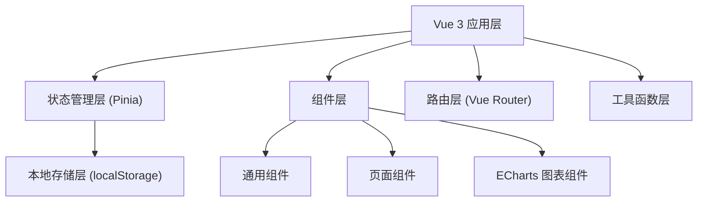
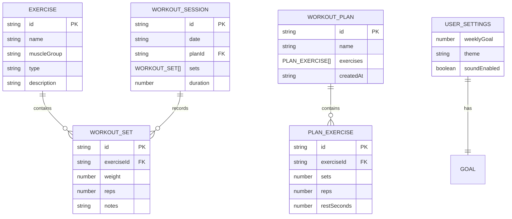

## 1. 架构设计



## 2. 技术描述

- **前端框架**: Vue 3 + TypeScript + Composition API
- **构建工具**: Vite
- **状态管理**: Pinia
- **路由**: Vue Router 4
- **图表库**: ECharts 5
- **CSS 方案**: Tailwind CSS 3
- **图标**: Lucide Vue
- **数据存储**: localStorage（无后端）

## 3. 路由定义

| 路由路径 | 页面名称 | 说明 |
|----------|----------|------|
| / | 首页仪表盘 | 展示训练进度、快捷操作 |
| /exercises | 动作库 | 浏览内置动作列表 |
| /plans | 训练计划 | 管理训练计划列表 |
| /plans/create | 创建计划 | 创建新的训练计划 |
| /workout | 专注训练 | 训练进行中的专注模式 |
| /stats | 数据统计 | 查看训练图表和历史数据 |
| /settings | 个人设置 | 目标设定和数据管理 |

## 4. 数据模型

### 4.1 数据模型定义



### 4.2 TypeScript 类型定义

```typescript
// 动作类型
interface Exercise {
  id: string;
  name: string;
  muscleGroup: string;
  type: 'strength' | 'cardio' | 'flexibility';
  description?: string;
}

// 训练计划中的动作
interface PlanExercise {
  id: string;
  exerciseId: string;
  sets: number;
  reps: number;
  restSeconds: number;
}

// 训练计划
interface WorkoutPlan {
  id: string;
  name: string;
  exercises: PlanExercise[];
  createdAt: string;
}

// 训练组记录
interface WorkoutSet {
  id: string;
  exerciseId: string;
  weight: number;
  reps: number;
  isPR?: boolean;
  notes?: string;
}

// 训练会话
interface WorkoutSession {
  id: string;
  date: string;
  planId?: string;
  sets: WorkoutSet[];
  duration: number;
  startTime: string;
  endTime: string;
}

// 用户设置
interface UserSettings {
  weeklyGoal: number;
  theme: 'dark' | 'light';
  soundEnabled: boolean;
}
```

## 5. 项目目录结构

```
src/
├── assets/              # 静态资源
├── components/          # 通用组件
│   ├── charts/         # ECharts 图表组件
│   ├── ui/             # 基础 UI 组件
│   └── workout/        # 训练相关组件
├── composables/         # 组合式函数
│   ├── useTimer.ts     # 计时器逻辑
│   ├── useStorage.ts   # 本地存储
│   └── usePR.ts        # PR 检测逻辑
├── stores/              # Pinia 状态管理
│   ├── exercises.ts    # 动作库
│   ├── plans.ts        # 训练计划
│   ├── workout.ts      # 当前训练
│   ├── history.ts      # 历史记录
│   └── settings.ts     # 用户设置
├── types/               # TypeScript 类型定义
├── utils/               # 工具函数
├── views/               # 页面组件
├── router/              # 路由配置
├── App.vue
└── main.ts
```

## 6. 关键技术方案

### 6.1 计时器后台时间校正

```typescript
// 核心思路：记录开始时间戳，每次回到前台时重新计算剩余时间
const useTimer = () => {
  const startTime = ref<number>(0);
  const totalSeconds = ref(0);
  const remainingSeconds = ref(0);
  
  const start = (seconds: number) => {
    startTime.value = Date.now();
    totalSeconds.value = seconds;
    remainingSeconds.value = seconds;
  };
  
  const handleVisibilityChange = () => {
    if (!document.hidden && startTime.value > 0) {
      const elapsed = Math.floor((Date.now() - startTime.value) / 1000);
      remainingSeconds.value = Math.max(0, totalSeconds.value - elapsed);
    }
  };
};
```

### 6.2 localStorage 数据持久化

- 使用 Pinia 插件自动持久化状态
- 初始化时从 localStorage 读取数据
- 状态变化时自动保存到 localStorage

### 6.3 ECharts 组件封装

- 封装可复用的折线图和热力图组件
- 支持响应式调整大小
- 深色主题适配

### 6.4 PR 检测算法

- 对比当前重量与该动作历史最大重量
- 如果超过历史最大值，标记为 PR
- 触发庆祝动画和音效
