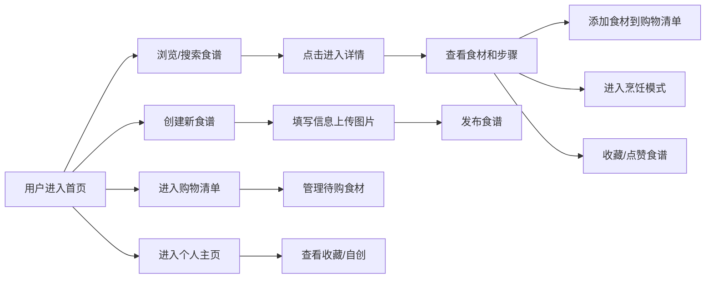

## 1. 产品概述
"食记"是一个美食食谱分享社区平台，用户可以浏览、搜索、收藏、创建食谱，并管理购物清单。
- 解决美食爱好者查找食谱、管理食材采购、记录烹饪过程的需求
- 为用户提供一站式的烹饪辅助体验，包括智能购物清单和烹饪模式

## 2. 核心功能

### 2.1 用户角色
| 角色 | 注册方式 | 核心权限 |
|------|----------|----------|
| 普通用户 | 本地模拟用户 | 浏览食谱、搜索筛选、管理购物清单、创建和收藏食谱 |

### 2.2 功能模块
1. **首页**：食谱瀑布流展示、分类筛选、关键词搜索
2. **食谱详情页**：食谱信息展示、食材清单、烹饪步骤、添加到购物清单
3. **创建食谱页**：表单填写、图片上传、动态食材/步骤编辑
4. **购物清单页**：待购食材管理、勾选已购、编辑数量
5. **个人主页**：收藏的食谱、自创食谱、个人信息
6. **烹饪模式**：全屏步骤展示、计时器、滑动切换

### 2.3 页面详情
| 页面名称 | 模块名称 | 功能描述 |
|-----------|-------------|---------------------|
| 首页 | 导航栏 | Logo、搜索框、分类筛选、用户入口 |
| 首页 | 瀑布流卡片 | 封面图、标题、作者、烹饪时间、难度、点赞数 |
| 食谱详情页 | 头部区域 | 大图、标题、作者信息、操作按钮（收藏、点赞、烹饪模式） |
| 食谱详情页 | 食材清单 | 可勾选已备、一键添加到购物清单 |
| 食谱详情页 | 步骤说明 | 带序号和图片的烹饪步骤 |
| 创建食谱页 | 基础信息 | 菜名、简介、分类、难度、烹饪时间 |
| 创建食谱页 | 食材列表 | 动态增删行、自动提示常用食材 |
| 创建食谱页 | 步骤编辑 | 动态增删步骤、每步可附图片 |
| 购物清单页 | 食材列表 | 勾选已购、编辑数量、清空已完成 |
| 个人主页 | Tab切换 | 收藏的食谱、自创食谱 |
| 烹饪模式 | 全屏展示 | 大字体步骤说明、左右滑动切换 |
| 烹饪模式 | 计时器 | 用户设定分钟提醒 |

## 3. 核心流程

## 4. 用户界面设计

### 4.1 设计风格
- **主色调**：温暖的橙红色系（#FF6B35），传递美食的热情
- **辅助色**：清新的绿色（#4CAF50）代表健康，米白色（#FFF8E1）作为背景
- **按钮风格**：圆润的胶囊型按钮，带有柔和阴影
- **字体**：标题使用「Noto Serif SC」衬线字体，正文使用「Noto Sans SC」无衬线字体
- **布局风格**：卡片式设计，瀑布流布局，大量留白营造呼吸感
- **图标风格**：线性图标，搭配圆润边角

### 4.2 页面设计概述
| 页面名称 | 模块名称 | UI 元素 |
|-----------|-------------|----------|
| 首页 | 导航栏 | 渐变色背景、毛玻璃效果、响应式折叠 |
| 首页 | 瀑布流卡片 | 圆角设计、悬停放大效果、渐变占位图 |
| 食谱详情页 | 头部区域 | 大图背景、文字叠加、模糊遮罩 |
| 食谱详情页 | 食材清单 | 复选框动画、数量标签、添加按钮 |
| 购物清单页 | 食材列表 | 滑动删除、已购样式、数量计数器 |
| 烹饪模式 | 全屏展示 | 深色背景、大号字体、左右指示箭头 |

### 4.3 响应式
- 桌面端优先，适配平板和移动端
- 食谱详情在桌面端为双栏布局（左侧图片，右侧内容），移动端为单列
- 导航栏在移动端折叠为汉堡菜单
- 瀑布流列数响应式调整（桌面3列，平板2列，手机1列）
- 烹饪模式专为移动端优化，支持触控滑动

### 4.4 交互动效
- 图片懒加载，淡入效果
- 卡片悬停轻微上浮和阴影加深
- 食材勾选动画效果
- 页面切换过渡动画
- 烹饪模式步骤切换滑入效果
