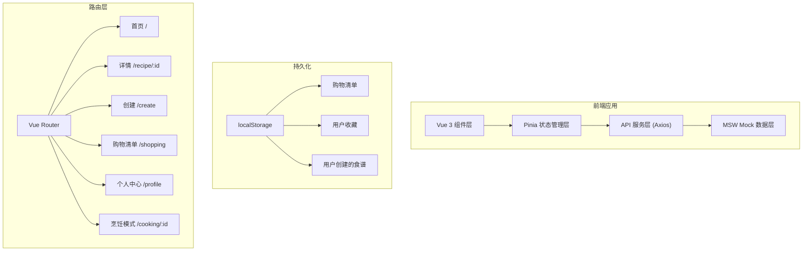

## 1. 架构设计



## 2. 技术描述

- **前端框架**：Vue 3 + TypeScript
- **构建工具**：Vite 5
- **状态管理**：Pinia
- **路由管理**：Vue Router 4
- **HTTP 客户端**：Axios
- **CSS 框架**：Tailwind CSS 3
- **Mock 方案**：MSW (Mock Service Worker)
- **图片处理**：Canvas API (前端压缩)
- **持久化**：localStorage

## 3. 路由定义

| 路由路径 | 页面名称 | 说明 |
|----------|----------|------|
| `/` | 首页 | 食谱瀑布流、搜索、分类筛选 |
| `/recipe/:id` | 食谱详情 | 展示完整食谱信息、食材、步骤 |
| `/create` | 创建食谱 | 表单填写、图片上传 |
| `/shopping` | 购物清单 | 管理待购食材 |
| `/profile` | 个人中心 | 收藏、自创食谱 |
| `/cooking/:id` | 烹饪模式 | 全屏步骤展示、计时器 |

## 4. 数据模型

### 4.1 核心类型定义

```typescript
// 食谱分类
type RecipeCategory = 'home-cooking' | 'baking' | 'vegetarian' | 'soup' | 'dessert' | 'seafood' | 'staple-food';

// 难度等级
type DifficultyLevel = 'easy' | 'medium' | 'hard';

// 食材项
interface Ingredient {
  id: string;
  name: string;
  quantity: string;
  unit: string;
  checked?: boolean;
}

// 烹饪步骤
interface CookingStep {
  id: string;
  order: number;
  description: string;
  image?: string;
  duration?: number; // 分钟
}

// 食谱
interface Recipe {
  id: string;
  title: string;
  description: string;
  coverImage: string;
  author: {
    id: string;
    name: string;
    avatar: string;
  };
  category: RecipeCategory;
  difficulty: DifficultyLevel;
  cookTime: number; // 分钟
  servings: number;
  ingredients: Ingredient[];
  steps: CookingStep[];
  likes: number;
  isLiked?: boolean;
  isFavorite?: boolean;
  createdAt: string;
  isUserCreated?: boolean;
}

// 购物清单项
interface ShoppingItem {
  id: string;
  name: string;
  quantity: number;
  unit: string;
  checked: boolean;
  addedAt: string;
}

// 用户信息
interface User {
  id: string;
  name: string;
  avatar: string;
  favorites: string[]; // 收藏的食谱ID
}
```

### 4.2 Store 结构

- **useRecipeStore**: 食谱列表、筛选条件、搜索关键词
- **useUserStore**: 用户信息、收藏列表、创建的食谱
- **useShoppingStore**: 购物清单（持久化到 localStorage）

## 5. Mock API 接口

| 方法 | 路径 | 说明 |
|------|------|------|
| GET | `/api/recipes` | 获取食谱列表，支持筛选和搜索 |
| GET | `/api/recipes/:id` | 获取单个食谱详情 |
| GET | `/api/recipes/categories` | 获取分类列表 |
| POST | `/api/recipes` | 创建新食谱 |
| POST | `/api/recipes/:id/like` | 点赞食谱 |
| POST | `/api/recipes/:id/favorite` | 收藏/取消收藏 |
| GET | `/api/ingredients/suggestions` | 获取食材建议列表 |

## 6. 目录结构

```
src/
├── assets/              # 静态资源
├── components/          # 通用组件
│   ├── RecipeCard.vue
│   ├── IngredientList.vue
│   ├── StepList.vue
│   └── Navbar.vue
├── views/               # 页面组件
│   ├── Home.vue
│   ├── RecipeDetail.vue
│   ├── CreateRecipe.vue
│   ├── ShoppingList.vue
│   ├── Profile.vue
│   └── CookingMode.vue
├── stores/              # Pinia stores
│   ├── recipe.ts
│   ├── user.ts
│   └── shopping.ts
├── router/              # 路由配置
│   └── index.ts
├── api/                 # API 接口
│   └── recipes.ts
├── types/               # TypeScript 类型
│   └── index.ts
├── utils/               # 工具函数
│   ├── image.ts         # 图片压缩
│   └── storage.ts       # 本地存储
├── mocks/               # MSW mock 数据
│   ├── handlers.ts
│   └── browser.ts
├── App.vue
└── main.ts
```
