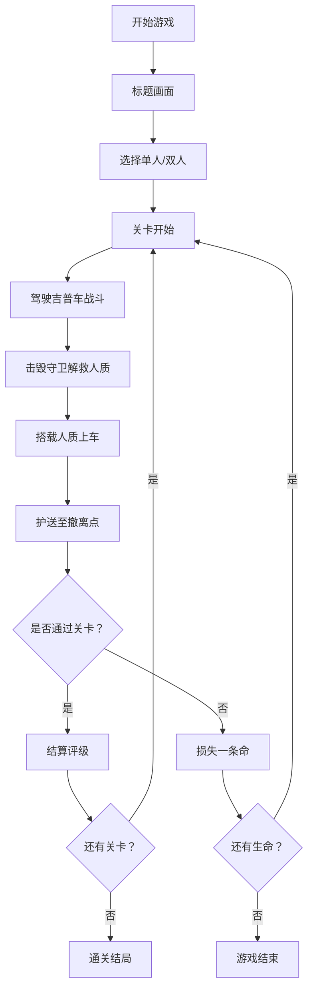

## 1. 产品概述

致敬《赤色要塞》《古巴战士》的俯视角军事射击游戏。玩家驾驶武装吉普车深入敌后，炸毁敌军设施，解救人质并护送至安全撤离点。

- **核心玩法**：俯视角8方向移动射击，人质解救护送，武器升级系统
- **目标用户**：复古射击游戏爱好者，双人合作游戏玩家
- **市场价值**：重现经典FC游戏玩法，融合现代游戏机制，提供紧张刺激的单人/双人合作体验

## 2. 核心功能

### 2.1 用户角色

| 角色 | 进入方式 | 核心权限 |
|------|----------|----------|
| 玩家1 | 键盘控制 | 完整游戏体验 |
| 玩家2 | 第二套键盘控制 | 双人合作模式 |

### 2.2 功能模块

1. **游戏主界面**：标题画面，开始游戏，操作说明
2. **游戏核心**：玩家控制，武器系统，敌人AI，人质系统
3. **关卡系统**：横版/纵版卷轴，多种地形，Boss战
4. **UI界面**：HUD信息，暂停菜单，结算评级
5. **剧情系统**：情报解锁，关卡叙事

### 2.3 页面详情

| 页面名称 | 模块名称 | 功能描述 |
|---------|----------|----------|
| 标题画面 | 主菜单 | 游戏Logo，开始按钮，操作说明入口，像素风格动画 |
| 游戏画面 | 核心玩法 | Canvas渲染游戏场景，吉普车控制，射击，敌人，人质，爆炸效果 |
| HUD界面 | 状态显示 | 生命值，弹药数，人质数量，武器类型，分数，副武器冷却 |
| 暂停菜单 | 游戏控制 | 暂停/继续，重新开始，返回主菜单 |
| 结算画面 | 评级系统 | 人质营救率，破坏率，综合评级，剧情情报解锁 |

## 3. 核心流程

## 4. 用户界面设计

### 4.1 设计风格

- **主色调**：军绿色 (#2D5A27) 为基底，土黄色 (#C4A35A) 沙漠色，配合爆炸橙红 (#FF6B35)
- **像素风格**：8-bit/16-bit 复古像素艺术，块状精灵，扫描线效果
- **字体**：像素风格等宽字体，模仿老式街机显示
- **布局**：顶部HUD状态栏，中央游戏画面，底部可选控制提示
- **特效**：屏幕震动，闪光效果，粒子爆炸，像素颗粒

### 4.2 页面设计概览

| 页面名称 | 模块名称 | UI元素 |
|---------|----------|--------|
| 标题画面 | 主菜单 | 像素Logo闪烁动画，滚动军车背景，霓虹灯效果菜单按钮 |
| 游戏画面 | 核心玩法 | 俯视视角，像素化地形，吉普车精灵，子弹轨迹，爆炸粒子，人质跟随 |
| HUD界面 | 状态显示 | 左侧生命条，中间人质计数，右侧弹药/武器，底部分数显示 |
| 结算画面 | 评级系统 | 统计数据表格，S/A/B/C/D评级，像素勋章，解锁的情报文字 |

### 4.3 响应式

- **桌面优先**：固定Canvas尺寸 (800x600)，保持像素比例
- **全屏模式**：等比例缩放，保持像素清晰度
- **控制优化**：键盘热键提示，双人键位清晰区分

### 4.4 视觉特效指导

- **环境氛围**：动态云层阴影，地形纹理变化，天气效果（雨/雪）
- **光照**：爆炸时全屏闪光，枪口火焰照亮周围
- **镜头**：Boss战时轻微缩放，击中时屏幕震动
- **粒子**：爆炸碎片，烟雾效果，子弹拖尾
- **后处理**：CRT扫描线效果，轻微色彩分离
