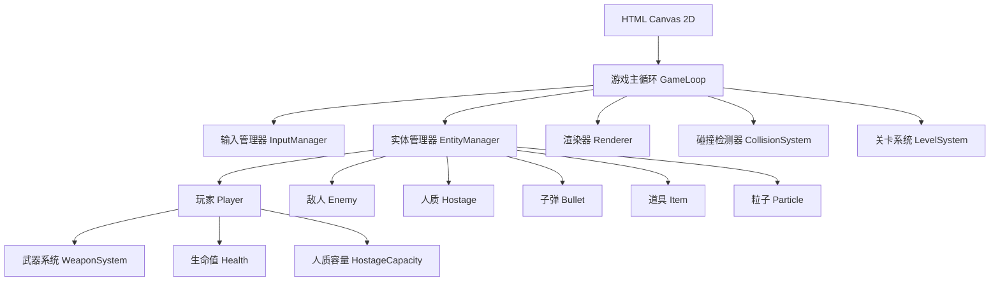

## 1. 架构设计



## 2. 技术描述

- **前端**：原生 TypeScript + Canvas 2D API，无额外框架
- **构建工具**：Vite (用于TypeScript编译和热更新)
- **渲染方式**：Canvas 2D 像素渲染，imageSmoothingEnabled = false
- **状态管理**：有限状态机 (FSM) 管理游戏状态
- **无后端**：纯前端游戏，使用 localStorage 存档

## 3. 核心模块清单

| 模块 | 文件路径 | 功能描述 |
|------|----------|----------|
| 游戏主类 | src/Game.ts | 游戏主循环，状态管理，初始化 |
| 输入管理 | src/InputManager.ts | 键盘输入，按键映射，双人控制 |
| 实体基类 | src/entities/Entity.ts | 所有游戏实体的基类 |
| 玩家 | src/entities/Player.ts | 吉普车控制，武器切换，人质搭载 |
| 敌人 | src/entities/Enemy.ts | 敌人AI，多种敌人类型 |
| 人质 | src/entities/Hostage.ts | 人质AI，跟随，上车，求救 |
| 子弹 | src/entities/Bullet.ts | 弹道计算，伤害判定 |
| 武器系统 | src/weapons/Weapon.ts | 机枪/榴弹/火焰/导弹实现 |
| 碰撞系统 | src/systems/CollisionSystem.ts | AABB碰撞，空间分区优化 |
| 粒子系统 | src/systems/ParticleSystem.ts | 爆炸，烟雾，火焰效果 |
| 关卡系统 | src/levels/Level.ts | 地图数据，卷轴，事件触发 |
| 渲染器 | src/renderer/Renderer.ts | Canvas绘制，像素风格处理 |
| UI系统 | src/ui/HUD.ts | 血条，弹药，人质计数显示 |
| 音效管理 | src/audio/AudioManager.ts | Web Audio API 音效 |

## 4. 核心数据结构

### 4.1 Vector2 (向量)
```typescript
interface Vector2 {
  x: number;
  y: number;
}
```

### 4.2 Entity (实体基类)
```typescript
abstract class Entity {
  id: string;
  position: Vector2;
  velocity: Vector2;
  size: Vector2;
  health: number;
  maxHealth: number;
  active: boolean;
  
  abstract update(deltaTime: number): void;
  abstract render(ctx: CanvasRenderingContext2D): void;
}
```

### 4.3 Player (玩家)
```typescript
class Player extends Entity {
  playerIndex: number;
  speed: number;
  weapon: Weapon;
  secondaryWeapon: Weapon;
  hostages: Hostage[];
  maxHostages: number;
  lives: number;
  score: number;
  invincible: boolean;
  invincibleTimer: number;
}
```

### 4.4 Weapon (武器)
```typescript
interface Weapon {
  type: 'machinegun' | 'grenade' | 'flame' | 'missile';
  name: string;
  damage: number;
  fireRate: number;
  lastFired: number;
  ammo: number;
  maxAmmo: number;
  spread: number;
  projectileSpeed: number;
}
```

### 4.5 EnemyType (敌人类型)
```typescript
type EnemyType = 'infantry' | 'rocketeer' | 'bunker' | 'tank' | 'helicopter' | 'boss';
```

### 4.6 GameState (游戏状态)
```typescript
type GameState = 'menu' | 'playing' | 'paused' | 'gameover' | 'victory' | 'levelComplete';
```

## 5. 性能优化策略

### 5.1 碰撞检测优化
- **空间分区**：Grid-based spatial partitioning
- **Broad Phase**：AABB 快速剔除
- **Narrow Phase**：精确碰撞检测

### 5.2 渲染优化
- **离屏Canvas**：静态地图元素预渲染
- **视锥剔除**：只渲染屏幕内实体
- **对象池**：子弹/粒子重用，减少GC

### 5.3 帧率控制
- **固定时间步**：物理更新与渲染分离
- **Delta时间**：确保不同设备速度一致

## 6. 操作控制定义

### 玩家1 (WASD + 空格)
| 按键 | 功能 |
|------|------|
| W | 向上移动 |
| A | 向左移动 |
| S | 向下移动 |
| D | 向右移动 |
| J | 射击主武器 |
| K | 副武器(手雷) |
| L | 切换武器 |

### 玩家2 (方向键 + 小键盘)
| 按键 | 功能 |
|------|------|
| ↑ | 向上移动 |
| ← | 向左移动 |
| ↓ | 向下移动 |
| → | 向右移动 |
| 1 | 射击主武器 |
| 2 | 副武器(手雷) |
| 3 | 切换武器 |

### 全局按键
| 按键 | 功能 |
|------|------|
| ESC | 暂停/继续 |
| P | 暂停 |
| R | 重新开始(暂停时) |

## 7. 关卡数据格式

```typescript
interface LevelData {
  id: number;
  name: string;
  type: 'horizontal' | 'vertical';
  width: number;
  height: number;
  scrollSpeed: number;
  theme: 'jungle' | 'desert' | 'snow' | 'base';
  tiles: number[][];
  enemies: EnemySpawn[];
  hostages: HostageSpawn[];
  items: ItemSpawn[];
  events: LevelEvent[];
  bossData?: BossData;
}
```
