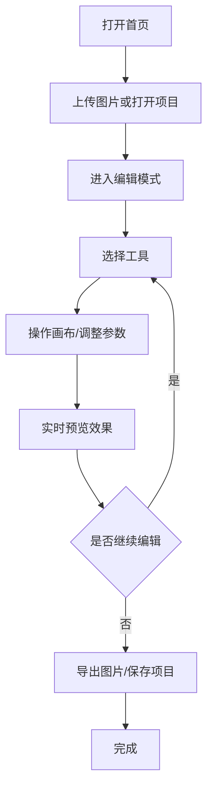

## 1. 产品概述
PixelCake 是一款轻量级但功能扎实的在线图像编辑器，类似"像素蛋糕"和 Photopea。所有图像处理都在浏览器端完成，无需后端支持。

- 主要用途：满足用户日常图片编辑需求，包括修图、调色、绘图、文字添加等
- 目标用户：设计师、摄影师、内容创作者、普通用户
- 核心价值：无需安装、免费使用、功能专业、操作流畅

## 2. 核心功能

### 2.1 功能模块
1. **首页/上传页**：图片上传入口、项目文件打开、示例图片加载
2. **编辑主界面**：三栏布局 - 图层面板（左）、画布区域（中）、属性调整（右）
3. **工具栏**：选择、裁剪、绘图、文字等工具选择
4. **图层面板**：图层管理、排序、编组、锁定、隐藏
5. **滤镜面板**：亮度、对比度、饱和度等多滤镜实时调节
6. **选区工具**：矩形、椭圆、套索、魔法棒选区
7. **绘图工具**：画笔、橡皮擦、图章、渐变填充
8. **文字工具**：文字添加与编辑，支持 Google Fonts
9. **历史记录**：撤销/重做，支持跳转到任意步骤
10. **导出功能**：PNG/JPEG/WebP 导出，项目文件保存与恢复

### 2.2 页面详情
| 页面名称 | 模块名称 | 功能描述 |
|---------|---------|----------|
| 首页 | 上传区域 | 拖拽上传、点击上传、打开项目文件 |
| 首页 | 示例画廊 | 快速加载示例图片体验功能 |
| 编辑页 | 顶部菜单栏 | 文件操作、编辑操作、视图切换 |
| 编辑页 | 左侧面板 | 图层列表、图层操作按钮、效果链 |
| 编辑页 | 中央画布 | 可缩放平移、多图层渲染、选区高亮 |
| 编辑页 | 右侧面板 | 属性调整、滤镜参数、工具设置 |
| 编辑页 | 底部状态栏 | 缩放控制、画布尺寸、历史记录 |
| 导出弹窗 | 格式选择 | PNG/JPEG/WebP 格式切换 |
| 导出弹窗 | 质量调节 | 导出质量、尺寸缩放、文件大小预估 |

## 3. 核心流程

## 4. 用户界面设计

### 4.1 设计风格
- **主色调**：深灰色 (#1a1a2e) 作为背景，营造专业修图氛围
- **强调色**：珊瑚橙 (#ff6b6b) 用于选中状态和操作按钮
- **辅助色**：蓝绿色 (#4ecdc4) 用于高亮和成功状态
- **字体**：标题使用 Poppins，正文使用 Inter，营造现代感
- **布局风格**：三栏式专业工具布局，深色主题，减少视觉干扰
- **图标风格**：线性图标，简洁明了，与深色背景形成对比
- **按钮风格**：轻微圆角，悬停有缩放和颜色变化反馈

### 4.2 页面设计概述
| 页面名称 | 模块名称 | UI 元素 |
|---------|---------|---------|
| 首页 | 上传区域 | 大尺寸拖拽框、虚线边框、悬停动画、渐变背景 |
| 编辑页 | 左侧面板 | 可折叠面板、图层缩略图、拖拽排序、右键菜单 |
| 编辑页 | 中央画布 | 网格背景、变换控制点、选区高亮、缩放动画 |
| 编辑页 | 右侧面板 | 滑块控件、数值输入、颜色选择器、预设按钮 |
| 编辑页 | 工具栏 | 图标按钮、工具提示、选中状态高亮 |
| 导出弹窗 | 预览区域 | 实时预览、文件信息、格式切换标签 |

### 4.3 响应式设计
- **桌面端**：三栏完整布局，所有功能可见
- **平板端**：左右面板可折叠，工具栏横向排列
- **移动端**：工具栏折叠为底部抽屉，双指手势缩放拖拽，简化功能
- **触摸优化**：增大点击区域，支持手势操作

### 4.4 动效设计
- 页面加载：画布淡入、面板滑入的组合动画
- 图层操作：添加/删除图层有缩放动效，拖拽有跟随效果
- 工具切换：平滑过渡动画
- 滑块调节：实时预览反馈
- 按钮交互：悬停缩放、点击按压效果
