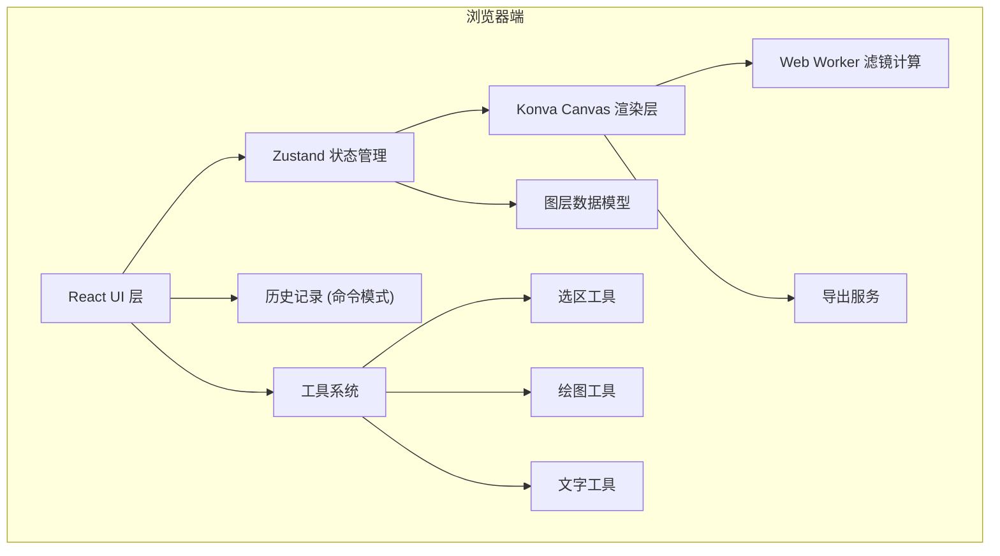
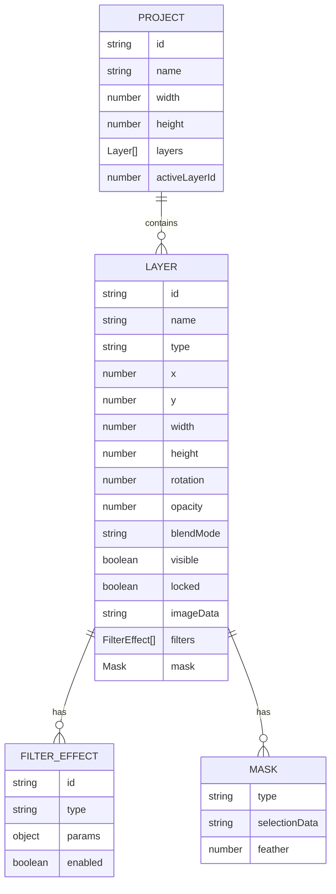

## 1. 架构设计



## 2. 技术选型

| 分类 | 技术栈 | 说明 |
|------|--------|------|
| 前端框架 | React 18 + TypeScript 5 | 类型安全，组件化开发 |
| 构建工具 | Vite 5 | 快速开发，热更新 |
| 样式方案 | TailwindCSS 3 | 原子化 CSS，快速开发 |
| 画布渲染 | Konva 9.x | 图层管理、变换、事件系统 |
| 状态管理 | Zustand 4 | 轻量、高性能、高频更新优化 |
| 图标库 | Lucide React | 现代线性图标 |
| 动画库 | Framer Motion | 流畅的 UI 动画 |
| 颜色处理 | chroma-js | 颜色转换和计算 |
| 外部字体 | Google Fonts | 丰富的字体选择 |

## 3. 目录结构

```
src/
├── components/          # React 组件
│   ├── layout/         # 布局组件
│   │   ├── Header.tsx
│   │   ├── LeftPanel.tsx
│   │   ├── RightPanel.tsx
│   │   └── StatusBar.tsx
│   ├── canvas/         # 画布相关
│   │   ├── CanvasView.tsx
│   │   ├── LayerRenderer.tsx
│   │   └── TransformControls.tsx
│   ├── layers/         # 图层面板
│   │   ├── LayerList.tsx
│   │   ├── LayerItem.tsx
│   │   └── LayerActions.tsx
│   ├── tools/          # 工具组件
│   │   ├── Toolbar.tsx
│   │   ├── SelectTool.tsx
│   │   ├── CropTool.tsx
│   │   ├── BrushTool.tsx
│   │   ├── EraserTool.tsx
│   │   ├── StampTool.tsx
│   │   └── TextTool.tsx
│   ├── filters/        # 滤镜面板
│   │   ├── FilterPanel.tsx
│   │   └── FilterSlider.tsx
│   ├── selection/      # 选区工具
│   │   ├── RectSelect.tsx
│   │   ├── EllipseSelect.tsx
│   │   ├── LassoSelect.tsx
│   │   └── MagicWand.tsx
│   ├── history/        # 历史记录
│   │   └── HistoryPanel.tsx
│   └── modals/         # 弹窗组件
│       ├── ExportModal.tsx
│       └── ImportModal.tsx
├── store/              # Zustand 状态
│   ├── useEditorStore.ts
│   ├── useHistoryStore.ts
│   └── useToolStore.ts
├── types/              # TypeScript 类型
│   ├── layer.ts
│   ├── filter.ts
│   ├── tool.ts
│   └── selection.ts
├── hooks/              # 自定义 Hooks
│   ├── useCanvas.ts
│   ├── useKeyboard.ts
│   └── useExport.ts
├── utils/              # 工具函数
│   ├── canvas/         # Canvas 操作
│   │   ├── filters.ts
│   │   ├── transform.ts
│   │   └── blendModes.ts
│   ├── export.ts
│   └── project.ts
├── workers/            # Web Workers
│   └── filter.worker.ts
├── commands/           # 命令模式 (撤销/重做)
│   ├── Command.ts
│   ├── LayerCommands.ts
│   ├── FilterCommands.ts
│   └── DrawingCommands.ts
├── pages/              # 页面
│   ├── Home.tsx
│   └── Editor.tsx
└── App.tsx
```

## 4. 核心数据模型

### 4.1 图层数据模型



### 4.2 TypeScript 类型定义

```typescript
// 图层类型
type LayerType = 'image' | 'text' | 'shape' | 'adjustment' | 'group';

// 混合模式
type BlendMode = 'normal' | 'multiply' | 'screen' | 'overlay' | 'darken' | 
  'lighten' | 'color-dodge' | 'color-burn' | 'hard-light' | 'soft-light';

// 滤镜类型
type FilterType = 'brightness' | 'contrast' | 'saturation' | 'hue' | 
  'temperature' | 'tint' | 'blur' | 'sharpen' | 'noise' | 'vignette' | 'sepia';

interface Layer {
  id: string;
  name: string;
  type: LayerType;
  x: number;
  y: number;
  width: number;
  height: number;
  rotation: number;
  scaleX: number;
  scaleY: number;
  opacity: number;
  blendMode: BlendMode;
  visible: boolean;
  locked: boolean;
  parentId?: string;
  imageSource?: string;
  filters: FilterEffect[];
  mask?: LayerMask;
  textProps?: TextProperties;
}

interface FilterEffect {
  id: string;
  type: FilterType;
  params: Record<string, number>;
  enabled: boolean;
}

interface ToolState {
  currentTool: ToolType;
  brush: BrushSettings;
  eraser: EraserSettings;
  text: TextSettings;
}
```

## 5. 状态管理设计

### 5.1 Editor Store (主状态)

```typescript
interface EditorState {
  project: Project | null;
  canvas: {
    zoom: number;
    panX: number;
    panY: number;
  };
  selection: Selection | null;
  actions: {
    createProject: (width: number, height: number) => void;
    addLayer: (layer: Omit<Layer, 'id'>) => void;
    removeLayer: (layerId: string) => void;
    updateLayer: (layerId: string, updates: Partial<Layer>) => void;
    reorderLayers: (layerIds: string[]) => void;
    setActiveLayer: (layerId: string) => void;
    addFilter: (layerId: string, filter: FilterEffect) => void;
    updateFilter: (layerId: string, filterId: string, params: any) => void;
    removeFilter: (layerId: string, filterId: string) => void;
    setZoom: (zoom: number) => void;
    setPan: (x: number, y: number) => void;
    setSelection: (selection: Selection | null) => void;
  };
}
```

### 5.2 History Store (历史记录)

```typescript
interface HistoryState {
  past: Command[];
  future: Command[];
  currentIndex: number;
  actions: {
    execute: (command: Command) => void;
    undo: () => void;
    redo: () => void;
    jumpTo: (index: number) => void;
    clear: () => void;
  };
}
```

## 6. 核心模块设计

### 6.1 命令模式 (撤销/重做)

```typescript
interface Command {
  id: string;
  name: string;
  timestamp: number;
  execute(): void;
  undo(): void;
}

class AddLayerCommand implements Command {
  constructor(private layer: Layer, private store: EditorStore) {}
  execute() { this.store.addLayer(this.layer); }
  undo() { this.store.removeLayer(this.layer.id); }
}

class UpdateFilterCommand implements Command {
  constructor(
    private layerId: string,
    private filterId: string,
    private oldParams: any,
    private newParams: any,
    private store: EditorStore
  ) {}
  execute() { this.store.updateFilter(this.layerId, this.filterId, this.newParams); }
  undo() { this.store.updateFilter(this.layerId, this.filterId, this.oldParams); }
}
```

### 6.2 滤镜系统 (Web Worker)

```typescript
// filter.worker.ts
self.onmessage = (e) => {
  const { imageData, filters } = e.data;
  let result = imageData;
  for (const filter of filters) {
    result = applyFilter(result, filter);
  }
  self.postMessage({ result });
};

function applyFilter(imageData: ImageData, filter: FilterEffect): ImageData {
  switch (filter.type) {
    case 'brightness': return adjustBrightness(imageData, filter.params.value);
    case 'contrast': return adjustContrast(imageData, filter.params.value);
    case 'blur': return applyGaussianBlur(imageData, filter.params.radius);
    // ... 其他滤镜
  }
}
```

### 6.3 选区系统

```typescript
interface Selection {
  type: 'rect' | 'ellipse' | 'polygon' | 'magic';
  data: any;
  feather: number;
  inverted: boolean;
  
  contains(x: number, y: number): boolean;
  getMask(): Uint8ClampedArray;
}

class MagicWandSelection implements Selection {
  constructor(
    private startX: number,
    private startY: number,
    private tolerance: number,
    private imageData: ImageData
  ) {}
  
  contains(x: number, y: number): boolean {
    // 颜色容差算法
    return colorDistance(this.getColor(x, y), this.startColor) <= this.tolerance;
  }
}
```

## 7. 路由定义

| 路由 | 页面 | 说明 |
|------|------|------|
| `/` | Home 首页 | 图片上传、项目打开、示例展示 |
| `/editor` | Editor 编辑页 | 主编辑界面，包含所有功能 |

## 8. 性能优化策略

1. **图层渲染优化**
   - 使用 Konva 的缓存机制 (cache())
   - 可见性判断，只渲染视口内图层
   - 滤镜计算放入 Web Worker

2. **状态更新优化**
   - Zustand 选择器模式，避免不必要重渲染
   - 批量更新减少重绘次数
   - useShallow 浅比较优化

3. **内存管理**
   - 及时释放不需要的 ImageData
   - 图层缩略图缓存池
   - 历史记录上限控制

4. **导出优化**
   - 分块处理大图片
   - 进度回调显示
   - Web Worker 压缩处理
