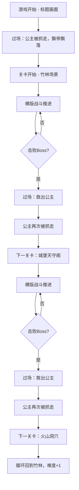

## 1. 产品概述

《影子传说》是一款横版动作游戏，以夜晚和风的像素美学为视觉风格——圆月当空、松枝剪影、枫叶飘落。玩家操控忍者，在横向卷轴场景中穿梭战斗，体验"影子掠过月光下战场"的快节奏动作感。

- 核心体验：快节奏横版动作，独特飘浮跳跃机制，双武器系统（刀 + 手里剑），上下两层场景穿梭
- 目标用户：喜爱经典横版动作游戏、复古像素风格的玩家

## 2. 核心功能

### 2.1 功能模块

1. **游戏主界面**：标题画面、开始游戏、操作说明
2. **游戏关卡场景**：横向卷轴场景、上下双层地图、敌人配置、Boss战
3. **HUD界面**：生命值、手里剑数量、当前关卡、得分

### 2.2 页面详情

| 页面名称 | 模块名称 | 功能描述 |
|---------|---------|---------|
| 游戏主界面 | 标题画面 | 显示游戏标题"影子传说"，圆月与松枝剪影背景，枫叶粒子飘落，按任意键开始 |
| 游戏主界面 | 操作说明 | 显示操作键位：方向键移动、Z跳跃(按住飘浮)、X刀攻击、C手里剑 |
| 游戏关卡 | 横向卷轴场景 | 手写卷轴滚动逻辑，场景随玩家移动自动滚动，视差背景层 |
| 游戏关卡 | 上下双层地图 | 地面层和树冠/屋顶层，通过跳跃高度和碰撞体切换所在平面 |
| 游戏关卡 | 敌人系统 | 武士(近战冲锋)、忍者(保持距离投掷)、飞镖手(树上埋伏)、火焰弹(河面出现) |
| 游戏关卡 | Boss战 | 巨大僧侣(范围攻击)、忍者头目(分身术)、术士(火焰召唤)，多阶段状态机 |
| 游戏关卡 | 道具系统 | 白色球(加速)、红色球(攻击力)、绿色球(回血)、隐藏卷轴(解锁手里剑类型) |
| 游戏关卡 | HUD | 生命值条、手里剑计数、当前关卡/循环轮次、Boss血条 |
| 游戏关卡 | 过场动画 | 公主被抓走飘带场景，眺望圆月标志性画面 |

## 3. 核心流程

玩家从飘带旁出发，在横版卷轴场景中向右推进。场景分上下两层，玩家可在地面与树冠间切换。途中遭遇各类敌人，需要用刀和手里剑战斗。击败关底Boss后救出公主，但公主随即被新敌人抓走，进入下一关卡。场景从竹林→城堡天守阁→火山洞穴循环，每次循环敌人配置变化、难度递增。圆月随关卡推进从新月变为满月。

## 4. 用户界面设计

### 4.1 设计风格

- **主色调**：深夜蓝黑(#0a0a1a)为底，月光银白(#e8e0d0)为高亮，枫叶赤红(#c0392b)为强调色
- **像素风格**：16x16基础精灵尺寸，放大2-3倍显示，像素锐利无模糊
- **字体**：像素风8bit字体，日式毛笔风格标题
- **布局**：全屏Canvas游戏画面，HUD叠加在画面上方
- **图标风格**：简洁像素图标，手里剑、刀、心形等

### 4.2 页面设计概览

| 页面名称 | 模块名称 | UI元素 |
|---------|---------|--------|
| 游戏主界面 | 标题画面 | 大字标题居中，圆月背景，松枝剪影前景，枫叶粒子，闪烁提示文字 |
| 游戏关卡 | 战斗场景 | 全屏Canvas，视差滚动背景(远山/圆月→竹林/建筑→地面)，上下层平台，敌人精灵 |
| 游戏关卡 | HUD叠加 | 左上角心形生命条，右上角手里剑图标+数字，顶部Boss血条(仅Boss战) |
| 游戏关卡 | 过场画面 | 全屏像素画，飘带飘落动画，忍者眺望圆月剪影 |

### 4.3 响应式

- 桌面优先设计，Canvas以固定分辨率(480x320)渲染，CSS缩放适配窗口
- 键盘操作为主，方向键 + ZXC键位
- 支持画面比例锁定，窗口调整时保持像素清晰度

## 5. 核心玩法机制详细设计

### 5.1 角色操控

- **移动**：左右方向键，跑步有加速过程，最高速度适中
- **跳跃**：Z键按下起跳，按住Z键在空中滞留并缓慢飘落(浮空约2秒)，松开Z键快速下落。此机制是核心手感
- **刀攻击**：X键，出手快(约8帧)，攻击距离短(约32像素)，有短暂硬直
- **手里剑**：C键，飞越半屏距离，数量有限(初始5枚)，敌人掉落补充

### 5.2 敌人AI

- **武士**：发现玩家后直线冲锋，挥刀攻击，正面格挡需绕背
- **忍者**：保持中距离，投掷手里剑，被接近时后撤
- **飞镖手**：固定在树上，定时投掷飞镖，需要跳跃到树冠层击杀
- **格挡敌人**：正面攻击被格挡，需要从背后攻击或用手里剑

### 5.3 Boss设计

- **巨大僧侣**：大范围横扫攻击，弱点在头部跳跃攻击，3阶段(血量越低攻击越快)
- **忍者头目**：分身术制造3个幻影，只有真身受伤，幻影消散后短暂硬直
- **术士**：召唤火焰弹从地面升起，需在施法间隙攻击，2阶段开始追踪火焰

### 5.4 关卡设计

| 关卡 | 场景主题 | 地面层特点 | 上层特点 | Boss |
|------|---------|-----------|---------|------|
| 第1关 | 竹林 | 竹林地面，河流(火焰弹) | 竹枝平台 | 巨大僧侣 |
| 第2关 | 城堡天守阁 | 城廊地面，走廊 | 屋顶瓦片，横梁 | 忍者头目 |
| 第3关 | 火山洞穴 | 岩浆地面(伤害区域) | 悬浮岩石平台 | 术士 |

### 5.5 道具与收集

- **白色发光球**：移动速度提升50%，持续10秒
- **红色发光球**：攻击力翻倍，持续15秒
- **绿色发光球**：恢复1点生命值
- **隐藏卷轴**：需精准跳跃到达高处收集
  - 钢镖卷轴：手里剑可穿透敌人
  - 散镖卷轴：手里剑分裂为3枚
