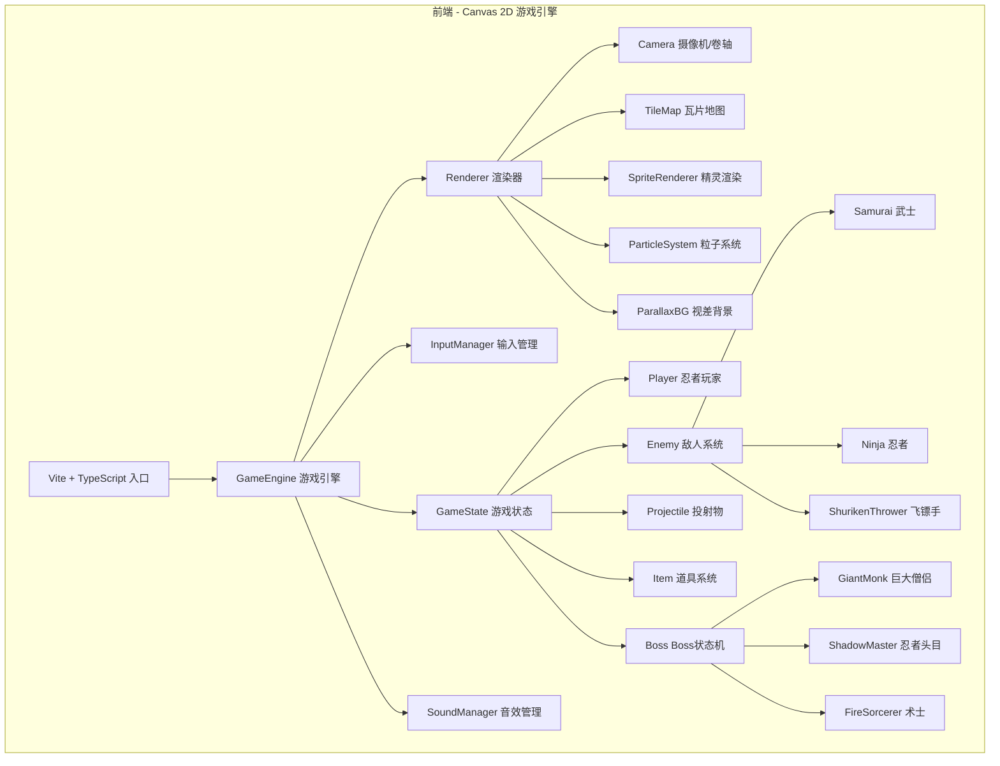

## 1. 架构设计



## 2. 技术说明

- **前端框架**：Canvas 2D + TypeScript + Vite（纯前端，无后端）
- **构建工具**：Vite
- **语言**：TypeScript (ES2020)
- **渲染**：Canvas 2D API，手写像素精灵渲染
- **音效**：Web Audio API，程序化生成音效
- **无外部游戏引擎依赖**，全部手写实现
- **初始化工具**：vite-init (vanilla-ts模板)

## 3. 目录结构

| 路径 | 用途 |
|------|------|
| /src/main.ts | 游戏入口，初始化Canvas和引擎 |
| /src/engine/ | 游戏引擎核心：GameEngine, Renderer, Camera, InputManager |
| /src/entities/ | 实体类：Player, Enemy, Boss, Projectile, Item |
| /src/entities/player/ | 玩家相关：Player, PlayerState, Weapon |
| /src/entities/enemies/ | 敌人相关：Samurai, Ninja, ShurikenThrower |
| /src/entities/bosses/ | Boss相关：GiantMonk, ShadowMaster, FireSorcerer |
| /src/maps/ | 地图数据与瓦片系统：TileMap, LevelData |
| /src/graphics/ | 渲染相关：SpriteSheet, Animation, ParticleSystem, ParallaxBG |
| /src/audio/ | 音效系统：SoundManager, 程序化音效生成 |
| /src/utils/ | 工具函数：碰撞检测、向量运算、常量定义 |
| /src/data/ | 游戏数据：关卡配置、敌人配置、道具配置 |
| /public/assets/ | 静态资源（如有外部图片/音频） |

## 4. 核心模块设计

### 4.1 游戏引擎 (GameEngine)

```
GameEngine
├── canvas: HTMLCanvasElement (480x320 内部分辨率)
├── renderer: Renderer
├── inputManager: InputManager
├── camera: Camera (卷轴滚动控制)
├── gameState: GameState (场景/关卡/实体管理)
├── soundManager: SoundManager
└── gameLoop(): void (requestAnimationFrame 驱动)
    ├── update(dt): 更新逻辑
    └── render(): 渲染逻辑
```

### 4.2 输入管理 (InputManager)

- 监听键盘事件，维护按键状态映射
- 支持"按下瞬间"和"持续按住"两种检测模式
- 跳跃键的按住/松开检测用于飘浮机制

### 4.3 摄像机/卷轴 (Camera)

- 跟随玩家X轴位置，平滑滚动
- 上下层切换时Y轴偏移
- 场景边界限制
- 视差滚动：远景(月亮/远山)慢速，中景(竹林/建筑)中速，近景(地面)1:1

### 4.4 碰撞系统

- AABB碰撞检测用于平台和实体
- 近战碰撞：刀攻击时在玩家前方生成矩形判定区域(短距宽)
- 远程碰撞：手里剑作为移动投射物，与敌人AABB碰撞
- 平台碰撞：区分地面层和上层平台，根据玩家当前层级决定碰撞响应

### 4.5 Boss状态机

```
BossFSM
├── states: Map<string, BossState>
├── currentState: BossState
├── transition(condition): void
└── update(dt): void

BossState
├── enter(): void
├── update(dt): void
├── exit(): void
└── transitions: Map<string, Function> (条件→目标状态)
```

每个Boss有独立的状态转换逻辑，例如巨大僧侣：
- idle → windup (距离玩家近时)
- windup → attack (蓄力完成)
- attack → recovery (攻击动画结束)
- recovery → idle (恢复完成)
- any → stagger (血量低于阈值时转换阶段)

### 4.6 粒子系统

- 残影效果：记录玩家历史位置，以递减透明度渲染
- 樱花散落：敌人死亡时生成粉色花瓣粒子
- 火星迸发：攻击命中时生成橙色火花粒子
- 枫叶飘落：背景装饰粒子，持续生成
- 飘带飘落：剧情过场中的飘带粒子

### 4.7 精灵渲染

- 所有角色使用程序化像素绘制（无需外部图片资源）
- 每个精灵由像素数组定义，通过Canvas逐像素绘制
- 动画帧切换：根据动作状态(站立/跑动/跳跃/攻击/受伤)切换帧
- 衣袂飘动：跳跃时附加布料物理模拟的简单版本

### 4.8 音效系统

- 使用Web Audio API程序化生成所有音效
- 刀剑交击：短促高频+噪声混合
- 手里剑飞行：高频正弦波滑音
- 敌人击败：尺八音色(低频正弦波+泛音)
- 背景鼓点：低频脉冲+节奏模式
- 和风旋律：五声音阶正弦波组合

## 5. 数据模型

### 5.1 关卡配置

```typescript
interface LevelConfig {
  id: string
  theme: 'bamboo' | 'castle' | 'volcano'
  tileMap: number[][]
  upperPlatforms: Platform[]
  enemies: EnemySpawn[]
  boss: BossType
  items: ItemSpawn[]
  scrollLocations: ScrollSpawn[]
  bgLayers: BGLayerConfig[]
  moonPhase: number
}
```

### 5.2 实体基础

```typescript
interface Entity {
  x: number
  y: number
  width: number
  height: number
  velocityX: number
  velocityY: number
  layer: 'ground' | 'upper'
  active: boolean
}
```

## 6. 渲染管线

```
1. 清空画布 (深蓝黑底色)
2. 绘制视差背景 (远山 → 中景 → 月亮)
3. 绘制上层平台/树冠 (若摄像机可见)
4. 绘制地面层瓦片地图
5. 绘制道具和收集品
6. 绘制敌人精灵
7. 绘制玩家精灵 (含残影)
8. 绘制投射物 (手里剑、飞镖、火焰弹)
9. 绘制粒子效果 (樱花、火星、枫叶)
10. 绘制HUD叠加层
```
