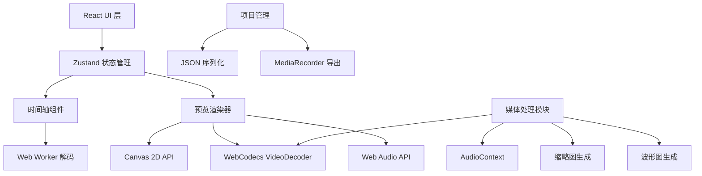

## 1. 架构设计



## 2. 技术选型

- **前端框架**: React 18 + TypeScript
- **构建工具**: Vite
- **样式方案**: Tailwind CSS 3
- **状态管理**: Zustand
- **图标库**: Lucide React
- **媒体处理**: 
  - WebCodecs API (视频解码)
  - Web Audio API (音频处理/混音)
  - Canvas 2D API (帧合成/渲染)
  - Web Worker (后台解码)
  - MediaRecorder (视频导出)

## 3. 目录结构

```
src/
├── components/
│   ├── Timeline/          # 时间轴组件
│   │   ├── Timeline.tsx
│   │   ├── Track.tsx
│   │   ├── Clip.tsx
│   │   └── Playhead.tsx
│   ├── Preview/           # 预览画布
│   │   ├── PreviewCanvas.tsx
│   │   └── PlaybackControls.tsx
│   ├── MediaLibrary/      # 媒体库
│   │   └── MediaLibrary.tsx
│   ├── TextOverlay/       # 文字叠加
│   │   └── TextOverlayEditor.tsx
│   └── Toolbar/           # 工具栏
│       └── Toolbar.tsx
├── hooks/
│   ├── useVideoDecoder.ts  # WebCodecs 解码 Hook
│   ├── useAudioMixer.ts    # 音频混音 Hook
│   ├── useTimeline.ts      # 时间轴操作 Hook
│   └── useMediaAnalysis.ts # 媒体分析 Hook
├── store/
│   └── useEditorStore.ts   # Zustand 状态管理
├── utils/
│   ├── videoDecoder.ts     # WebCodecs 封装
│   ├── audioProcessor.ts   # 音频处理工具
│   ├── thumbnail.ts        # 缩略图生成
│   ├── waveform.ts         # 波形图生成
│   └── timecode.ts         # 时间码格式化
├── workers/
│   └── decode.worker.ts    # 解码 Web Worker
├── types/
│   └── index.ts            # 类型定义
└── App.tsx
```

## 4. 核心类型定义

```typescript
// 媒体资源
interface MediaAsset {
  id: string;
  name: string;
  file: File;
  duration: number;
  width: number;
  height: number;
  thumbnailUrl: string;
  waveformData: number[];
  videoTrack: VideoTrackInfo;
  audioTrack: AudioTrackInfo;
}

// 时间轴片段
interface Clip {
  id: string;
  assetId: string;
  trackId: string;
  startTime: number;      // 在时间轴上的开始时间
  duration: number;       // 片段持续时间
  sourceStart: number;    // 源媒体的入点
  sourceEnd: number;      // 源媒体的出点
  volume: number;         // 音量 0-1
}

// 轨道
interface Track {
  id: string;
  type: 'video' | 'audio';
  name: string;
  muted: boolean;
  locked: boolean;
  height: number;
}

// 文字叠加
interface TextOverlay {
  id: string;
  text: string;
  startTime: number;
  endTime: number;
  x: number;
  y: number;
  fontSize: number;
  fontFamily: string;
  color: string;
  textAlign: 'left' | 'center' | 'right';
}

// 项目状态
interface ProjectState {
  assets: MediaAsset[];
  tracks: Track[];
  clips: Clip[];
  textOverlays: TextOverlay[];
  currentTime: number;
  isPlaying: boolean;
  zoom: number;
  selectedClipId: string | null;
  selectedTextId: string | null;
}
```

## 5. 渲染管线

### 5.1 视频渲染流程
1. **帧调度**: `requestAnimationFrame` 触发渲染循环
2. **时间同步**: 根据当前播放时间计算需要显示的帧
3. **帧解码**: 通过 WebCodecs `VideoDecoder` 解码对应时间戳的帧
4. **帧缓存**: 使用 LRU 缓存最近解码的帧以提升性能
5. **图层合成**: 在 Canvas 上按顺序绘制：
   - 背景填充
   - 最底层视频轨道片段
   - 上层视频轨道片段
   - 文字叠加层

### 5.2 音频渲染流程
1. 使用 Web Audio API 的 `AudioContext` 创建音频图
2. 每个音频片段创建 `BufferSourceNode`
3. 通过 `GainNode` 控制每个片段的音量
4. 所有音频连接到 `ChannelMergerNode` 进行混音
5. 最终输出到 `destination` (扬声器)

## 6. 性能优化策略

1. **Web Worker 解码**: 视频帧解码在 Worker 中进行，避免阻塞主线程
2. **帧预解码**: 预判播放方向，提前解码接下来几帧
3. **帧缓存池**: 复用 `VideoFrame` 对象，减少 GC 压力
4. **缩略图缓存**: 生成的缩略图和波形图缓存到 IndexedDB
5. **虚拟渲染**: 时间轴只渲染可视区域内的片段
6. **防抖节流**: 缩放和拖拽操作使用防抖优化

